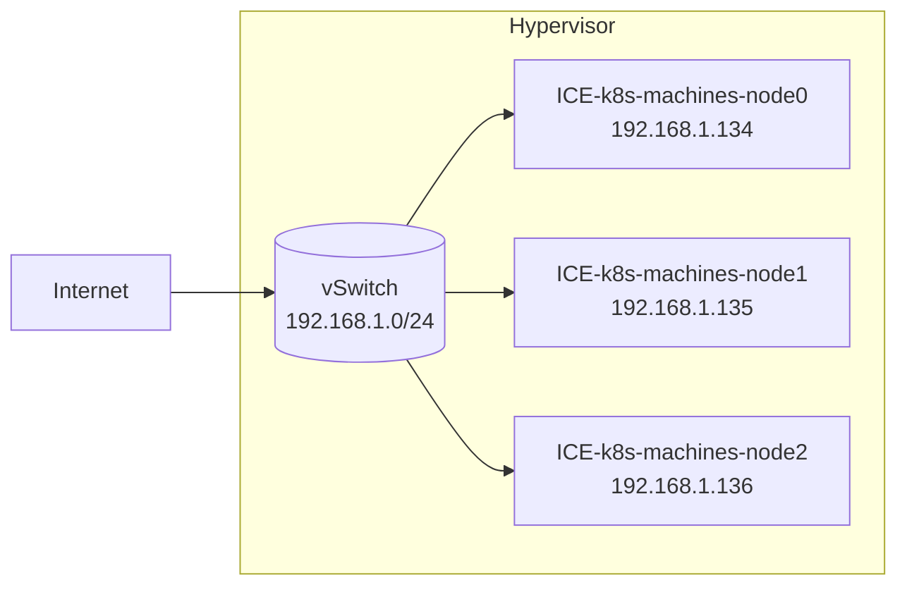
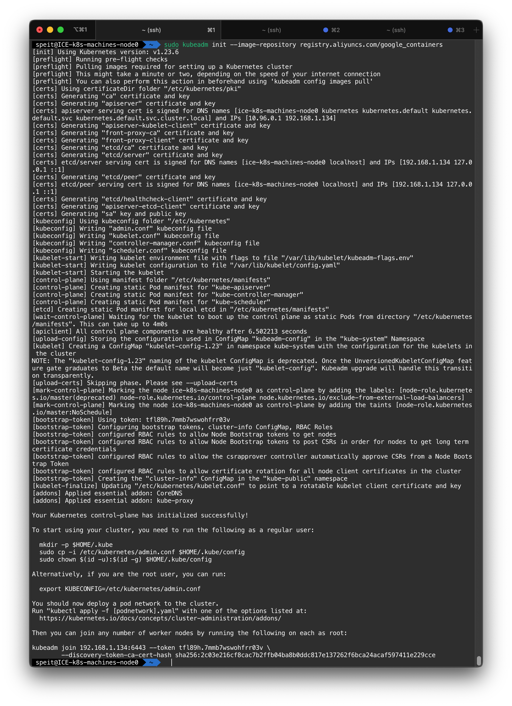
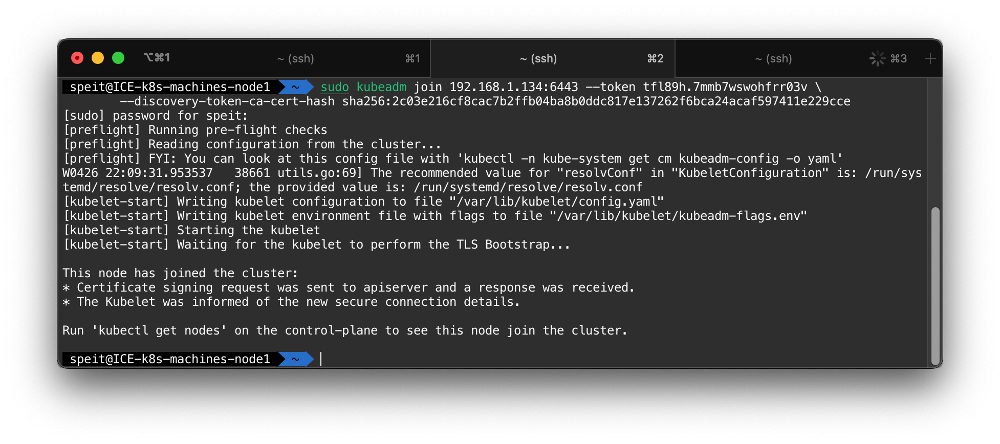
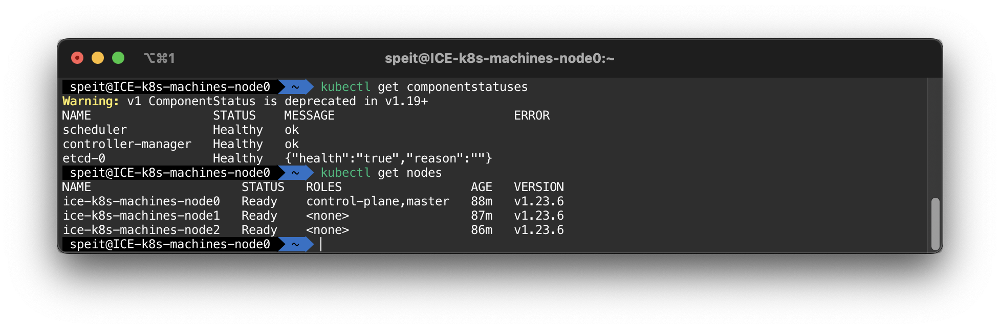
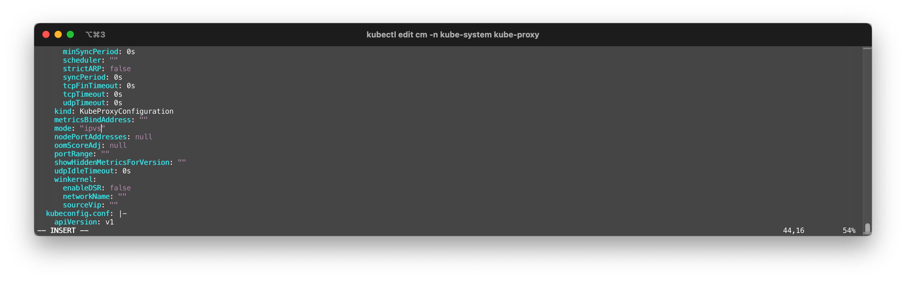
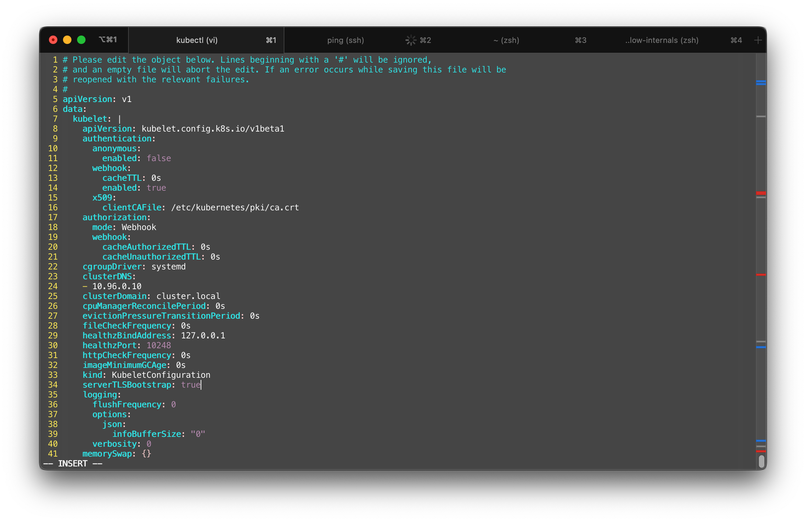
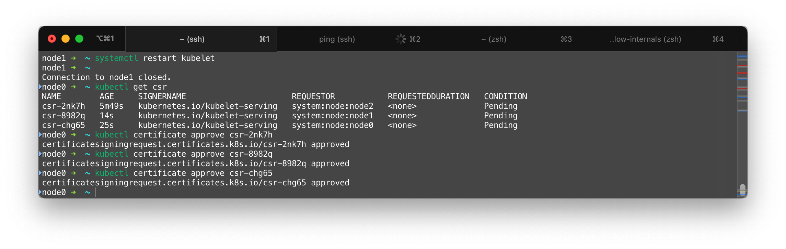

# 创建高可用的K8S集群

本章节记录了一个有3个节点的K8S集群的配置过程

## 总结

> 对于K8S这个快速发展的项目，如果不注意参考资料的版本，是要吃大亏的

| Component      | Verison | Ref |
| -------------- | ------- | --- |
| kubeadm        | 1.23.6  | --- |
| kubectl        | 1.23.6  | --- |
| kubelet        | 1.23.6  | --- |
| metrics-server | 0.6.1   | --- |
| calico         | 3.22.2  | --- |

## 确保服务器资源

本小节描述了集群资源的情况

### 服务器配置

我们假设有三台互相连接的节点，这些节点在一个交换机域下。三个节点的主机名、IP地址描述如下



```yaml
nodes:
  - node0:
      hostname: 'ICE-k8s-machines-node0'
      address: '192.168.1.134'
  - node1:
      hostname: 'ICE-k8s-machines-node1'
      address: '192.168.1.135'
  - node2:
      hostname: 'ICE-k8s-machines-node2'
      address: '192.168.1.136'
```

三台节点均为x86虚拟机，安装Ubuntu 20.04.3 LTS操作系统，配置了2GB内存。`node0`将作为控制平面所在的节点

!!! note
    必须确保`product_uuid`的唯一性，可以用`sudo cat /sys/class/dmi/id/product_uuid`检查
!!! tip
    `hostnamectl` 可以修改主机名
!!! note
    为了访问节点，我们在所有节点上部署统一的基于公私钥的免密登陆，命令参考:

    ```shell
    [speit@node0] $ ssh-keygen
    [speit@node0] $ ssh-copy-id -i .ssh/id_rsa.pub speit@node1
    ```

### 令服务器互相连接

我们编辑节点的`/etc/hosts` 来让它们能够通过主机名互相访问。节点0上的配置如下：

```text title="/etc/hosts"
127.0.0.1       localhost
127.0.1.1       ICE-k8s-machines-node0

192.168.1.134   ICE-k8s-machines-node0
192.168.1.135   ICE-k8s-machines-node1
192.168.1.136   ICE-k8s-machines-node2
```

!!! tip
    可以通过`ping`命令来测试主机间的连通性
!!! tip
    应当使用`ifconfig`配置static IP，并使得节点间可以通过默认路由通讯
!!! note
    确保`br_netfilter`模块已经加载。可以通过`lsmod | grep br_netfilter`检查。使用`sudo modprobe br_netfilter`主动加载

    ```shell
    $ lsmod | grep br_netfilter
    br_netfilter           28672  0
    bridge                249856  1 br_netfilter
    ```
!!! warning
    如果是复制的虚拟机，则必须确保三台主机的MAC地址的唯一性，可以用`ip link`或者`ifconfig -a`获取mac地址。

### 安装Docker

我们在所有节点安装Docker。这一部分参照[github.com/davidliyutong/ICE6405P-260-M01](https://github.com/davidliyutong/ICE6405P-260-M01/blob/main/scripts/ubuntu/20.04/setup-docker.sh)

```shell
[speit@all] $ curl -fsSL https://get.docker.com -o get-docker.sh
[speit@all] $ sudo sh get-docker.sh
[speit@all] $ sudo usermod -aG docker $USER
[speit@all] $ newgrp docker
[speit@all] $ sudo systemctl restart docker
```

### 关闭防火墙和swap

关闭`ufw`、`SELinux`等所有的防火墙，但是不要关闭`iptables`，因为`iptables`会被用来作流量转发

!!! tip
    使用`sudo ufw disable`关闭`ufw`防火墙

修改`/etc/stab`，将`/swap`有关的配置注释从而关闭swap。

```shell
[speit@all] $ sudo vim /etc/fstab
```

!!! note

    - `swapoff -a` 可以临时做到这一点
    - `6443`端口被用来作集群间通讯，需要确保不被占用。使用`lsof -i | grep 6443`确认，如果没有结果则为不占用

## 安装相关工具

我们需要安装以下工具：

- `cfssl`/`cfssljson`: Cloudflare's SSL tool
- `kubectl`: 用来与集群通信的命令行工具
- `kubeadm`: 用来初始化集群的指令
- `kubelet`: 在集群中的每个节点上用来启动 Pod 和容器等

### cfssl/cfssljson

[cloudflare/cfssl](https://github.com/cloudflare/cfssl/releases)仓库提供了编译好的二进制下载。以安装`v1.6.1`为例：

```shell
[speit@node0] $ wget https://github.com/cloudflare/cfssl/releases/download/v1.6.1/cfssl_1.6.1_linux_amd64 \
                     -O cfssl
[speit@node0] $ wget https://github.com/cloudflare/cfssl/releases/download/v1.6.1/cfssljson_1.6.1_linux_amd64 \
                     -O cfssljson
```

!!! warning
    这里下载的是针对linux/amd64平台的二进制工具，如果平台不同则需要修改

使用install命令安装这些工具

```shell
[speit@all] $ sudo install ./cfssl /usr/local/bin/
[speit@all] $ sudo install ./cfssljson /usr/local/bin/
```

!!! note

    这些工具可以不必安装在集群的节点上，而是可以部署在本地。证书生成后，再将其上传

### kubectl / kubeadm / kubelete

安装必要的工具（理论上kubectl只需要在主节点/控制平面所在节点进行）

```shell
[speit@all] $ sudo apt-get update
[speit@all] $ sudo apt-get install -y apt-transport-https ca-certificates curl
```

添加仓库签名密钥

```shell
[speit@all] $ sudo curl -fsSLo /usr/share/keyrings/kubernetes-archive-keyring.gpg \
                        https://mirrors.aliyun.com/kubernetes/apt/doc/apt-key.gpg 
```

!!! tip

    删除`/usr/share/keyrings/kubernetes-archive-keyring.gpg`可以删除该密钥

添加仓库

```shell
[speit@all] $ echo "deb [signed-by=/usr/share/keyrings/kubernetes-archive-keyring.gpg] https://mirrors.aliyun.com/kubernetes/apt/ kubernetes-xenial main" | sudo tee /etc/apt/sources.list.d/kubernetes.list
```

!!! tip

    删除`/etc/apt/sources.list.d/kubernetes.list`文件可以删除该仓库

```shell
[speit@all] $ sudo apt-get update
[speit@all] $ sudo apt-get install -y kubelet kubeadm kubectl
[speit@all] $ sudo apt-mark hold kubelet kubeadm kubectl
```

指定版本

```shell
[speit@all] $ sudo apt-get install -y kubelet=1.23.6-00 kubeadm=1.23.6-00  kubectl=1.23.6-00 
```

!!! note

    锁定版本可以避免一些兼容性问题

### 二进制安装工具

!!! note
    这不等同于二进制安装集群

也可以用二进制安装kubeadm、kubectl和kubelet的指定版本。参考[install-kubeadm](https://kubernetes.io/docs/setup/production-environment/tools/kubeadm/install-kubeadm/)

## 安装集群

本小节描述了安装集群的情况

### 安装控制平面/主节点

由于网络建设的原因，`k8s.gcr.io`在国内访问速度极慢，需要配置镜像加速。

```shell
sudo kubeadm init --image-repository registry.aliyuncs.com/google_containers \
                  --apiserver-advertise-address $IP \
                  --pod-network-cidr=10.233.0.0/16 \
```

!!! note

    `registry.aliyuncs.com/google_containers `这个Repo其实是一个用户同步的。本人也同步了部分google的镜像源于`registry.hub.docker.com/davidliyutong`，可以使用这个源替换

- `--apiserver-advertise-address` 为证书IP，最好设成节点的公网IP以便远程访问
- `--pod-network-cidr` 为Pod分配`CIDR`，不能和主机的任何子网冲突

!!! tip

    `kubeadm config images pull --image-repository registry.aliyuncs.com/google_containers`可以提前拉取镜像

!!! note

    如果出现报错：cgroup不一致，则需要添加`"exec-opts": ["native.cgroupdriver=systemd"]`到`/etc/docker/daemon.json`

    ```json
    {
        "":"",
        "exec-opts": ["native.cgroupdriver=systemd"],
        "":""
    }
    ```

    令Docker以systemd为cgroup driver（kubelete的默认设置）

!!! warning

    如果安装中出现错误，则需要执行`kubeadm reset`重置集群



### 添加其他节点

在其他节点上运行kubeadm加入集群

```shell
sudo kubeadm join 192.168.1.134:6443 --token $TOKEN \
        --discovery-token-ca-cert-hash $HASH
```

- `192.168.1.134`为主节点IP
- `6443`为默认端口
- `$TOKEN`为之前主节点初始化后输出的token
- `$HASH`为之前主节点初始化后输出的hash

!!! note

    token会在24小时后过期，因此需要及时执行节点加入操作，超时则需要重新生成token

    生成token的命令

    ```shell
    [speit@node0] $ kubeadm token create
    ```

    生成cat-cert-hash的命令（需要在控制平面节点执行）

    ```shell
    [speit@node0] $ openssl x509 -pubkey -in /etc/kubernetes/pki/ca.crt | openssl rsa -pubin -outform der 2>/dev/null | \
    [speit@node0] $ openssl dgst -sha256 -hex | sed 's/^.* //'
    ```



根据提示，如果要以普通用户的身份使用集群，需要执行下列函数将`admin.conf`拷贝到用户的当前目录下，**并赋予正确的权限**

```shell
[speit@node0] $ mkdir -p $HOME/.kube
[speit@node0] $ sudo cp -i /etc/kubernetes/admin.conf $HOME/.kube/config
[speit@node0] $ sudo chown $(id -u):$(id -g) $HOME/.kube/config
[speit@node0] $ echo "export KUBECONFIG=$HOME/.kube/config" >> $PROFILE
```

!!! note

    `$PROFILE`为终端的配置文件，例如ZSH的配置文件为`$HOME/.zshrc`

如果是root用户，则需要执行以下命令

```shell
[root@node0] $ export KUBECONFIG=/etc/kubernetes/admin.conf
```

### 配置网络

本次安装的calico版本是v3.22.2

现在，`kubectl get nodes`应该能看到所有的node，但他们没有Ready，这是因为没有配置网路插件

下载并应用calico网络插件

```shell
[speit@node0] $ wget https://docs.projectcalico.org/manifests/calico.yaml -O
```

!!! note

    网上有各种参考[Installing Calico for policy and networking](https://projectcalico.docs.tigera.io/archive/v3.7/getting-started/kubernetes/installation/calico)的博客认为需要执行`sed -i -e "s?192.168.0.0/16?$POD_CIDR?g" calico.yaml`将IP替换，实测最新版是不需要的。只要在kubeadm初始化的时候指定了`--pod-network-cidr=x.x.x.x/y`

```shell
[speit@node0] $ kubectl apply -f calico.yaml
```

可以安装`calicoctl`这个二进制工具

```shell
[speit@node0] $ curl -L https://github.com/projectcalico/calico/releases/download/v3.22.2/calicoctl-linux-amd64 -o calicoctl
[speit@node0] $ sudo install calicoctl /usr/local/bin
```

`calicoctl node status`可以查看节点的状态

```shell
[speit@node0] $ calicoctl node status
Calico process is running.

IPv4 BGP status
+--------------+-------------------+-------+----------+-------------+
| PEER ADDRESS |     PEER TYPE     | STATE |  SINCE   |    INFO     |
+--------------+-------------------+-------+----------+-------------+
| 10.64.13.11  | node-to-node mesh | up    | 07:39:33 | Established |
| 10.64.13.12  | node-to-node mesh | up    | 07:39:32 | Established |
+--------------+-------------------+-------+----------+-------------+

IPv6 BGP status
No IPv6 peers found.
```

!!! warning

    如果系统中有NetworkManager（例如Ubuntu），需要配置NetworkManager以免对calico产生干扰。最佳实践是使用`apt-get remove network-manager`卸载

!!! note

    删除calico需要以下步骤

    - `kubectl  delete -f calico.yaml`可以删除calico的部署
    - 删除节点的tunl0设备`modprobe -r ipip`
    - 删除`/etc/cni/net.d/`下所有calico相关的文件，这是删除CNI插件
    - 所有节点重启kubelet，`systemctl restart kubelet`
    - 删除coredns的pod，`kubectl delete pod coredns-xxxxxxxxx-xxxxx`

### 测试

```shell
[speit@node0] $ kubectl get 
[speit@node0] $ kubectl get nodes
```

  

## 其他的实用配置

### RBAC

使用kubeadm搭建的集群默认开启RBAC

### 使用配置文件初始化

`kubeadm config print init-defaults > configfile.yaml`可以讲kubeadm的默认配置保存到一个`configfile.yaml`。修改这个文件，然后从配置文件初始化集群，可以加入很多自定义的配置

### 开启IPVS

官方文档说明，IPVS能够支持更大的K8S规模，带来更低的网络延时。

首先，确保有关的内核模块已经加载

```shell
sudo lsmod | grep ip_vs
```

确保结果中存在 `ip_vs`、`ip_vs_rr`、`ip_vs_wrr`、`ip_vs_sh`、`nf_conntrack`

如果没有，则加载相关模块

```shell
sudo modprobe -- ip_vs
sudo modprobe -- ip_vs_rr
sudo modprobe -- ip_vs_wrr
sudo modprobe -- ip_vs_sh
sudo modprobe -- nf_conntrack
```

!!! note

    将这些`modprobe`mingling添加进`/etc/rc.local`以使能开机加载
    新版内核默认加载这些模块

!!! warning

    早期的kube-proxy对`nf_conntrack_ipv4`有强制要求

安装`ipvsadm`和`ipset`

```shell
sudo apt-get install ipvsadm ipset
```

```shell
kubectl edit cm -n kube-system  kube-proxy
```

修改`mode`的值为`ipvs`

  

获取kube-proxy的Pod

```shell
kubectl get pods -n kube-system | grep proxy
kube-proxy-4cwj7                          1/1     Running   1 (156m ago)    27h
kube-proxy-7pkpb                          1/1     Running   1 (156m ago)    27h
kube-proxy-9r4hn                          1/1     Running   1 (156m ago)    27h
```

通过删除Pod，令其自动重启（kube-proxy并不会被真正删除）

```shell
kubectl delete  pod -n kube-system  kube-proxy-4cwj7
kubectl delete  pod -n kube-system  kube-proxy-7pkpb
kubectl delete  pod -n kube-system  kube-proxy-9r4hn
```

重启后，kube-proxy会自动侦测K8S集群的配置模式，并工作在IPVS模式下

### 启用TLSBootstrap

安装metrics-server时候可能会遇到metrics-server启动但是不可用的问题，这是因为metrics-server默认会检查worker节点的InternalIP是否与节点证书匹配，而节点签发证书的时候只包含了自身的主机名。解决方法就是启用`TLSBootstrap`

参考[证书签名请求](https://kubernetes.io/zh/docs/reference/access-authn-authz/certificate-signing-requests/)我们需要修改kubeadm的ConfigMap，使用`kubectl get cm -n kube-system`获取`kube-system`命名空间下的ConfigMap

```shell
[node0] $ kubectl get cm -n kube-system
NAME                                 DATA   AGE
calico-config                        4      8h
coredns                              1      9h
extension-apiserver-authentication   6      9h
kube-proxy                           2      9h
kube-root-ca.crt                     1      9h
kubeadm-config                       1      9h
kubelet-config-1.23                  1      9h
```

修改ConfigMap

```shell
kubectl edit cm kubelet-config-1.23 -n kube-system
```

将会打开一个VI编辑器供修改

  

在`data.kubelet`下，添加`serverTLSBootstrap: true`键值对

修改**所有**节点的`/var/lib/kubelet/config.yaml`，进行同样的改动，然后重启kubelet

```shell
[all] $ vim /var/lib/kubelet/config.yaml
[all] $ systemctl restart kubelet
```

在控制平面节点上，使用`kubectl get csr`查看APIServer得到的CSR申请

```shell
[node0] $ kubectl get csr
NAME        AGE     SIGNERNAME                      REQUESTOR           REQUESTEDDURATION   CONDITION
csr-2nk7h   5m49s   kubernetes.io/kubelet-serving   system:node:node2   <none>              Pending
csr-8982q   14s     kubernetes.io/kubelet-serving   system:node:node1   <none>              Pending
csr-chg65   25s     kubernetes.io/kubelet-serving   system:node:node0   <none>              Pending
```

使用`kubectl certificate approve` 命令批准每一个证书

```shell
kubectl certificate approve csr-xxxxx
```



### 添加命令补全

如果想为kubectl添加终端的自动补全，根据使用的Shell不同可以执行如下命令

=== "Bash"

    ```shell
    [speit@host] $ echo 'source <(kubectl completion bash)' >>~/.bashrc
    ```

=== "Zsh"

    ```shell
    [speit@host] $ echo 'source <(kubectl completion zsh)' >>~/.zshrc
    ```

### 安装Helm

Helm是一种K8S包管理工具

=== "Linux"

    ```shell
    curl -fsSL -o get_helm.sh https://raw.githubusercontent.com/helm/helm/main/scripts/get-helm-3
    bash get_helm.sh

    ```

    > 这会安装最新版本的Helm

=== "Linux Binary"

    ```shell
    curl -LO https://get.helm.sh/helm-v3.8.0-linux-amd64.tar.gz # 3.8.0为版本号, amd64为架构
    tar -xvf helm-v3.8.0-linux-amd64.tar.gz
    sudo install ./linux-amd64/helm /usr/local/bin/helm
    ```

    > 这会安装指定架构和版本的Helm

=== "MacOS"

    ```shell
    brew install helm
    # brew install helm@3.8.0
    ```
    > 这会安装指定版本的Helm

如果想为helm添加终端的自动补全，根据使用的Shell不同可以执行如下命令

=== "Bash"

    ```shell
    [speit@host] $ echo 'source <(helm completion bash)' >>~/.bashrc
    ```

=== "Zsh"

    ```shell
    [speit@host] $ echo 'source <(helm completion zsh)' >>~/.zshrc
    ```

Helm不一定要安装在集群的节点上。它可以被安装在遥控集群的节点上

### 安装MetalLB

MetalLB为私有云搭建的K8S集群提供LoadBalance能力

首先，由于我们的集群工作在IPVS模式下，需要编辑configmap文件开启strictARP。[INSTALLATION](https://metallb.universe.tf/installation/)

```shell
$ kubectl edit configmap -n kube-system kube-proxy
apiVersion: kubeproxy.config.k8s.io/v1alpha1
kind: KubeProxyConfiguration
mode: "ipvs"
ipvs:
  strictARP: true
```

```shell
wget https://raw.githubusercontent.com/metallb/metallb/v0.12.1/manifests/namespace.yaml -O namespace.yaml
wget https://raw.githubusercontent.com/metallb/metallb/v0.12.1/manifests/metallb.yaml -O metallb.yaml
```

```shell
kubectl apply -f namespace.yaml
kubectl apply -f metallb.yaml
```

```yaml title="metallbcm.yaml"
apiVersion: v1
kind: ConfigMap
metadata:
  namespace: metallb-system
  name: config
data:
  config: |
    address-pools:
    - name: default
      protocol: layer2
      addresses:
      - 172.42.42.100-172.42.42.120 # Change to IP
```

!!! note
    172.42.42.100-172.42.42.120 需要修改成实际的IP

```shell
kubectl apply -f metallbcm.yaml
```

### 珍爱生命，远离交大云

有四个坑很关键，都是和网络有关的。

1. JCloud中，克隆的虚拟机内编辑`/etc/network/interface`修改为固定IP后，需要卸载网卡重新安装，并在安装时固定IP，否则无法联网
2. 必须给每个虚拟机都绑定一个浮动IP，校园网就行，不然容器无法访问外网（下载都不行）
3. 最纸张的一点，克隆虚拟机的时候，产生的虚拟机默认安全组是default，也就是默认的一套规则，并不是源虚拟机选择的规则（这会导致calico等依赖iptables的组件直接失效）。**一定要检查虚拟机安全组**
4. JCloud会莫名其妙组织虚拟机联网，导致SSH挂掉、`kubectl`连不上。这时候需要重启虚拟机

## References

[kubernets.io](https://kubernetes.io/zh/docs/setup/production-environment/tools/)
