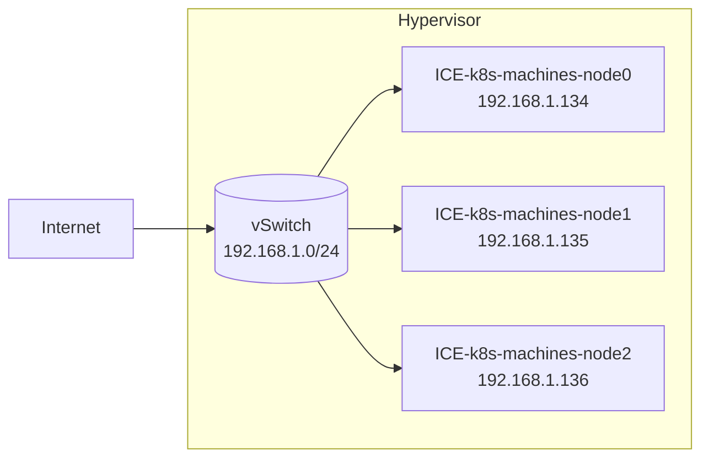

# 创建高可用的K8S集群

本章节记录了一个有3个节点的K8S集群的配置过程

## 确保服务器资源

本小节描述了集群资源的情况

### 服务器配置

我们假设有三台互相连接的节点，这些节点在一个交换机域下。三个节点的主机名、IP地址描述如下



```yaml
nodes:
  - node0:
      hostname: 'ICE-k8s-machines-node0'
      address: '192.168.1.134'
  - node1:
      hostname: 'ICE-k8s-machines-node1'
      address: '192.168.1.135'
  - node2:
      hostname: 'ICE-k8s-machines-node2'
      address: '192.168.1.136'
```

三台节点均为x86虚拟机，安装Ubuntu 20.04.3 LTS操作系统，配置了2GB内存

!!! note
    必须确保`product_uuid`的唯一性，可以用`sudo cat /sys/class/dmi/id/product_uuid`检查
!!! tip
    `hostnamectl` 可以修改主机名
!!! note
    为了访问节点，我们在所有节点上部署统一的基于公私钥的免密登陆，命令参考:

    ```shell
    [speit@node0] $ ssh-keygen
    [speit@node0] $ ssh-copy-id -i .ssh/id_rsa.pub speit@node1
    ```

### 令服务器互相连接

我们编辑节点的`/etc/hosts` 来让它们能够通过主机名互相访问。节点0上的配置如下：

```text title="/etc/hosts"
127.0.0.1       localhost
127.0.1.1       ICE-k8s-machines-node0

192.168.1.134   ICE-k8s-machines-node0
192.168.1.135   ICE-k8s-machines-node1
192.168.1.136   ICE-k8s-machines-node2
```

!!! tip
    可以通过`ping`命令来测试主机间的连通性
!!! tip
    应当使用`ifconfig`配置static IP，并使得节点间可以通过默认路由通讯
!!! note
    确保`br_netfilter`模块已经加载。可以通过`lsmod | grep br_netfilter`检查。使用`sudo modprobe br_netfilter`主动加载

    ```shell
    $ lsmod | grep br_netfilter
    br_netfilter           28672  0
    bridge                249856  1 br_netfilter
    ```
!!! warning
    如果是复制的虚拟机，则必须确保三台主机的MAC地址的唯一性，可以用`ip link`或者`ifconfig -a`获取mac地址。

### 安装Docker

我们在所有节点安装Docker。这一部分参照[github.com/davidliyutong/ICE6405P-260-M01](https://github.com/davidliyutong/ICE6405P-260-M01/blob/main/scripts/ubuntu/20.04/setup-docker.sh)

```shell
[speit@all] $ curl -fsSL https://get.docker.com -o get-docker.sh
[speit@all] $ sudo sh get-docker.sh
[speit@all] $ sudo usermod -aG docker $USER
[speit@all] $ newgrp docker
[speit@all] $ sudo systemctl restart docker
```

### 关闭防火墙和swap

关闭`ufw`、`SELinux`等所有的防火墙，但是不要关闭`iptables`，因为`iptables`会被用来作流量转发

!!! tip
    使用`sudo ufw disable`关闭`ufw`防火墙

修改`/etc/stab`，将`/swap`有关的配置注释从而关闭swap。

```shell
[speit@all] $ sudo vim /etc/fstab
```

!!! note
    - `swapoff -a` 可以临时做到这一点
    - `6443`端口被用来作集群间通讯，需要确保不被占用。使用`lsof -i | grep 6443`确认，如果没有结果则为不占用

## 安装相关工具

我们需要安装以下工具：

- `cfssl`/`cfssljson`: Cloudflare's SSL tool
- `kubectl`: 用来与集群通信的命令行工具
- `kubeadm`: 用来初始化集群的指令
- `kubelet`: 在集群中的每个节点上用来启动 Pod 和容器等

### kubectl / kubeadm / kubelete

安装必要的工具（只需要在主节点进行）

```shell
[speit@node0] $ sudo apt-get update
[speit@node0] $ sudo apt-get install -y apt-transport-https ca-certificates curl
```

添加仓库签名密钥

```shell
[speit@node0] $ sudo curl -fsSLo /usr/share/keyrings/kubernetes-archive-keyring.gpg https://mirrors.aliyun.com/kubernetes/apt/doc/apt-key.gpg 
```

!!! tip
    删除`/usr/share/keyrings/kubernetes-archive-keyring.gpg`可以删除该密钥

添加仓库

```shell
[speit@node0] $ echo "deb [signed-by=/usr/share/keyrings/kubernetes-archive-keyring.gpg] https://mirrors.aliyun.com/kubernetes/apt/ kubernetes-xenial main" | sudo tee /etc/apt/sources.list.d/kubernetes.list
```

!!! tip
    删除`/etc/apt/sources.list.d/kubernetes.list`文件可以删除该仓库

```shell
[speit@node0] $ sudo apt-get update
[speit@node0] $ sudo apt-get install -y kubelet kubeadm kubectl
[speit@node0] $ sudo apt-mark hold kubelet kubeadm kubectl
```

!!! note
    锁定版本可以避免一些兼容性问题

## 安装集群

本小节描述了安装集群的情况

### 安装控制平面/主节点

由于网络建设的原因，`k8s.gcr.io`在国内访问速度极慢，需要配置镜像加速。

```shell
sudo kubeadm init --image-repository registry.aliyuncs.com/google_containers
```

!!! tip
    `kubeadm config images pull --image-repository registry.aliyuncs.com/google_containers`可以提前拉取镜像
!!! note
    如果出现报错：cgroup不一致，则需要添加`"exec-opts": ["native.cgroupdriver=systemd"]`到`/etc/docker/daemon.json`

    ```json
    {
        "":"",
        "exec-opts": ["native.cgroupdriver=systemd"],
        "":""
    }
    ```

!!! warn
    如果安装中出现错误，则需要执行`kubeadm reset`重置集群


### 添加其他节点

在其他节点上运行kubeadm加入集群

```shell
sudo kubeadm join 192.168.1.134:6443 --token $TOKEN \
        --discovery-token-ca-cert-hash $HASH
```

- `192.168.1.134`为主节点IP
- `6443`为默认端口
- `$TOKEN`为之前主节点初始化后输出的token
- `$HASH`为之前主节点初始化后输出的hash

!!! note
    token会在24小时后过期，因此需要及时执行节点加入操作，超时则需要重新生成token

    生成token的命令

    ```shell
    [speit@node0] $ kubeadm token create
    ```

    生成cat-cert-hash的命令（需要在控制平面节点执行）

    ```shell
    [speit@node0] $ openssl x509 -pubkey -in /etc/kubernetes/pki/ca.crt | openssl rsa -pubin -outform der 2>/dev/null | \
    [speit@node0] $ openssl dgst -sha256 -hex | sed 's/^.* //'
    ```


根据提示，如果要以普通用户的身份使用集群，需要执行下列函数将`admin.conf`拷贝到用户的当前目录下

```shell
[speit@node0] $ mkdir -p $HOME/.kube
[speit@node0] $ sudo cp -i /etc/kubernetes/admin.conf $HOME/.kube/config
[speit@node0] $ sudo chown $(id -u):$(id -g) $HOME/.kube/config
[speit@node0] $ echo "export KUBECONFIG=$HOME/.kube/config" >> $PROFILE
```

!!! note
    `$PROFILE`为终端的配置文件，例如ZSH的配置文件为`$HOME/.zshrc`

如果是root用户，则需要执行以下命令

```shell
[root@node0] $ export KUBECONFIG=/etc/kubernetes/admin.conf
```

下载并应用calico网络插件

```shell
[speit@node0] $ wget https://docs.projectcalico.org/manifests/calico.yaml
[speit@node0] $ kubectl apply -f calico.yaml
```

### 测试

```shell
[speit@node0] $ kubectl get 
[speit@node0] $ kubectl get nodes
```

  

### 添加命令补全

如果想为kubectl添加终端的自动补全，可以执行如下命令

=== "Bash"

    ```shell
    [speit@host] $ echo 'source <(kubectl completion bash)' >>~/.bashrc
    ```

=== "Zsh"

    ```shell
    [speit@host] $ echo 'source <(kubectl completion zsh)' >>~/.zshrc
    ```

## References

[kubernets.io](https://kubernetes.io/zh/docs/setup/production-environment/tools/)
