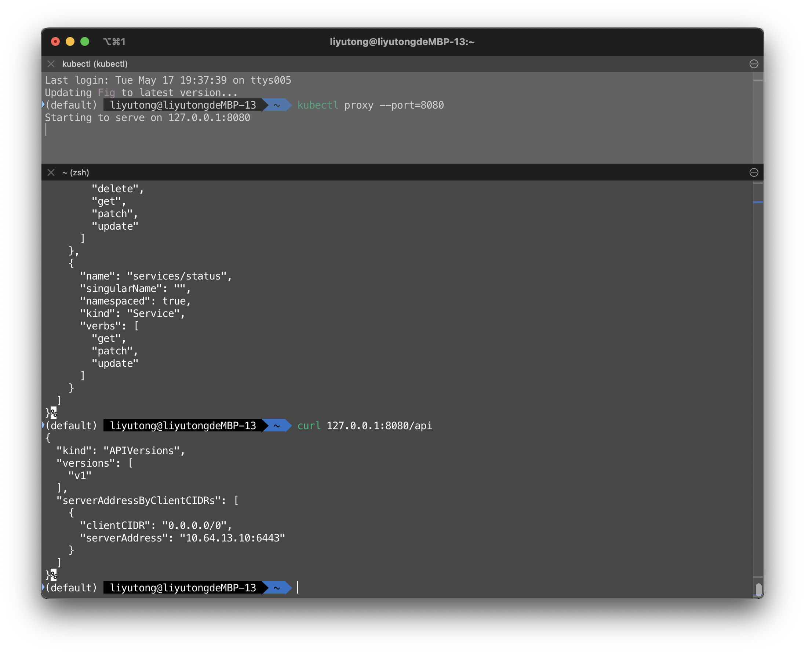
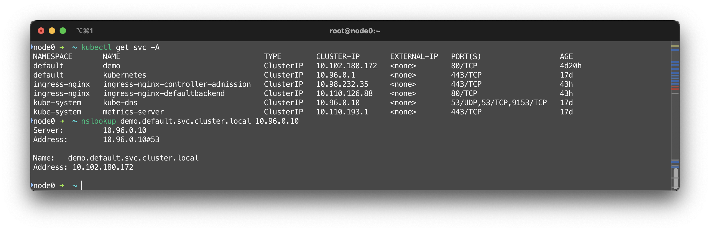
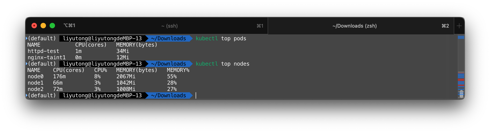
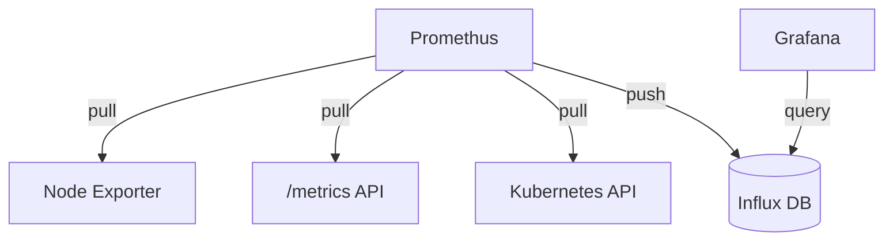
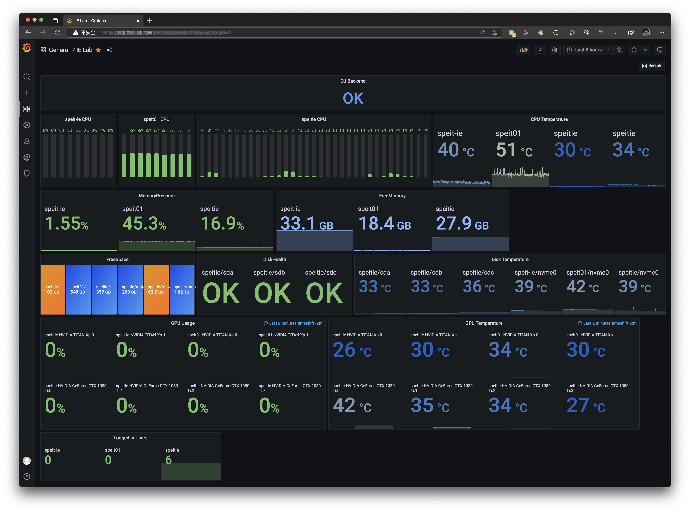
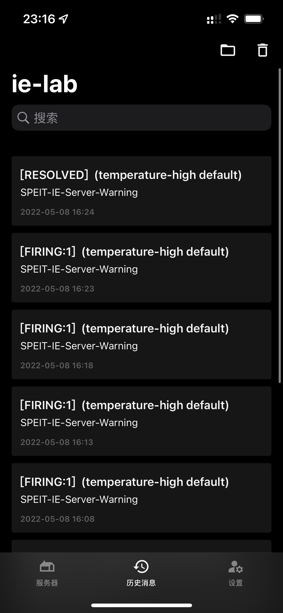

# Components

## kube-apiserver

使用curl调试K8SAPI是复杂的，因为这需要附加集群的认证信息。

在正确配置kubectl的context情况下。可以通过kubectl在本地创建一个远程API的代理。需要使用K8SAPI的本地应用就可以通过该代理免验证调用K8SAPI

```shell
kubectl proxy --port=8080
```

该命令将在本地的8080端口创建一个K8SAPI代理，并持续运行。关闭运行该命令的终端窗口或打断命令将关闭代理

!!! note
    `--port`参数指定了一个端口号

```shell
curl 127.0.0.1:8080/api
curl 127.0.0.1:8080/api/v1
curl 127.0.0.1:8080/api/v1/pods
```



## kube-dns

K8S种每一个Service都可以一个DNS名称。一般是`<SVC>.<NS>.svc.cluster.local`，其中SVC是Service名称，NS是Service所在的Namespace名称

```shell
kubectl get svc -A
nslookup demo.default.svc.cluster.local 10.96.0.10
```

可以看到，demo的解析名是`demo.default.svc.cluster.local`，该记录存在于`10.96.0.10`，即`kube-dns`中

  

可以对kube-dns进行配置

```yaml title="dns-configmap.yaml"
apiVersion: v1
kind: ConfigMap
metadata:
  name: kube-dns
  namespace: kube-system
data:
  stubDomains:
    aaa.bbb: ["1.2.3.4"] # aaa.bbb结尾的域名将交由DNS服务器1.2.3.4处理
  upstreamNameservers:
    - "114.114.114.114" # 指定上游DNS
```

- `stubDomains` 指定了怎样的domain应该由怎样的DNS处理
- `upstreamNameservers` 指定了上游DNS

## kubelet

目前，K8S正在向containerd转型，并将最终完全抛弃Docker。这是通过kubelet的CRI实现的。

## Metrics-server

总的来说，metrics-server 的正常运行依赖于：

1. Master节点和Metrics Server Pod能够互相联通（kubeadm默认满足）
2. APIServer 启用聚合支持（kubeadm默认启用）
3. 证书通过CA认证（开启serverTLSBootstrap）

```shell
wget https://github.com/kubernetes-sigs/metrics-server/releases/latest/download/components.yaml
kubectl apply -f components.yaml
```

!!! tip

    详见[Metrics-Server](./objects.md#monitor)，在此不做赘述。可能需要替换镜像为`bitnami/metrics-server`；可能需要增加`--kubelet-insecure-tls`参数。



## Promethus

Promethus 工作原理



可以在K8S集群上部署node-exporter导出数据，然后存进InfluxDB等数据库里。Grafana等面板/可视化软件可以利用这个数据库进行分析/告警

下图是IE Lab的服务器监控面板。该面板监控了三台位于IE Lab的服务器。方案是InfluxDB + Grafana。



该面板配置了报警系统: 当服务器的温度超过设定值一段时间后，就会向一个推送API告警。在一个案例中，该推送API被设置为由[Finb/Bark](https://github.com/Finb/Bark)的推送API，因此告警信息将经由Bark转发给Apple推送服务器并最终在设备上以推送通知的形式出现

{: style="width:400px"}
