# Container Experiment

[Lab Container](https://github.com/rebirthmonkey/k8s/tree/master/10_container){ .md-button }

## Basics - namespace

```shell
[speit@host] $ ls -l /proc/1/stat
[speit@host] $ docker inspect --format '{{.State.Pid}}' doc-server
453997
[speit@host] $ ls -alt /proc/453997/ns
```

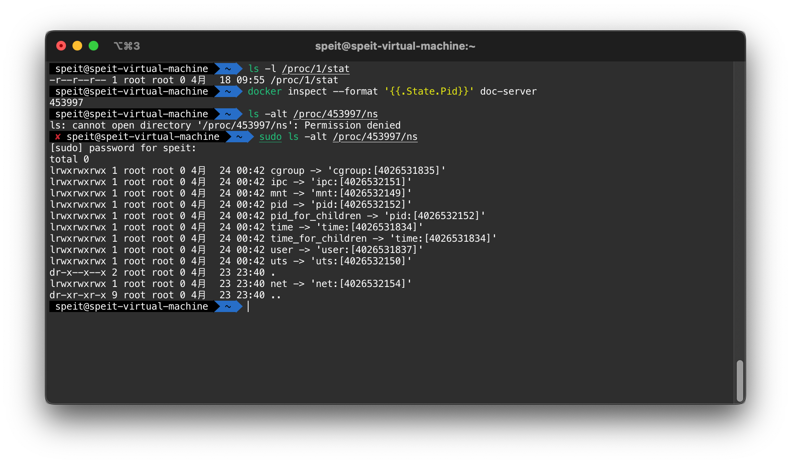

!!! note
    `'{{.State.Pid}}'` 指定了输出格式为pid。`docker`默认会输出json格式的字符串

    doc-server是容器的名称

!!! warning
    可能需要sudo或者root权限来执行命令`ls -alt /proc/`

将上述命令合二为一：

```shell
[speit@host] $ sudo ls -alt /proc/$(docker inspect --format '{{.State.Pid}}' doc-server)/ns
```

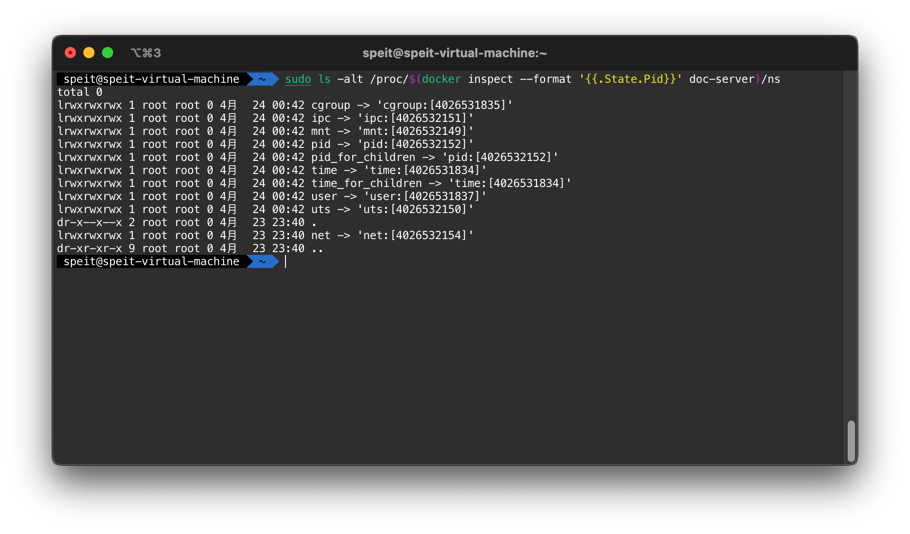

## Basic - cgroup

!!! note
    可能需要安装`cgroup-tools`

    ```shell
    [speit@host] $ sudo apt-get install cgroup-tools
    ```

### CPU 限制

首先，查看系统中的cgroup

```shell
[speit@host] $ ls /sys/fs/cgroup/cpu/test
```

使用`cgcreate`创建组

```shell
[speit@host] $ sudo cgcreate -g cpu:test
[speit@host] $ ls /sys/fs/cgroup/cpu/test
```

创建一个进程，该进程为死循环

```shell
[speit@host] $ while :; do :; done & echo $! > test.pid && cat test.pid
[speit@host] $ top -p $(cat test.pid) -n 1
```

!!! note
    使用echo $!可以显示上一条命令的pid，这命令旨在保存上一条命令的PID到`test.pid`中

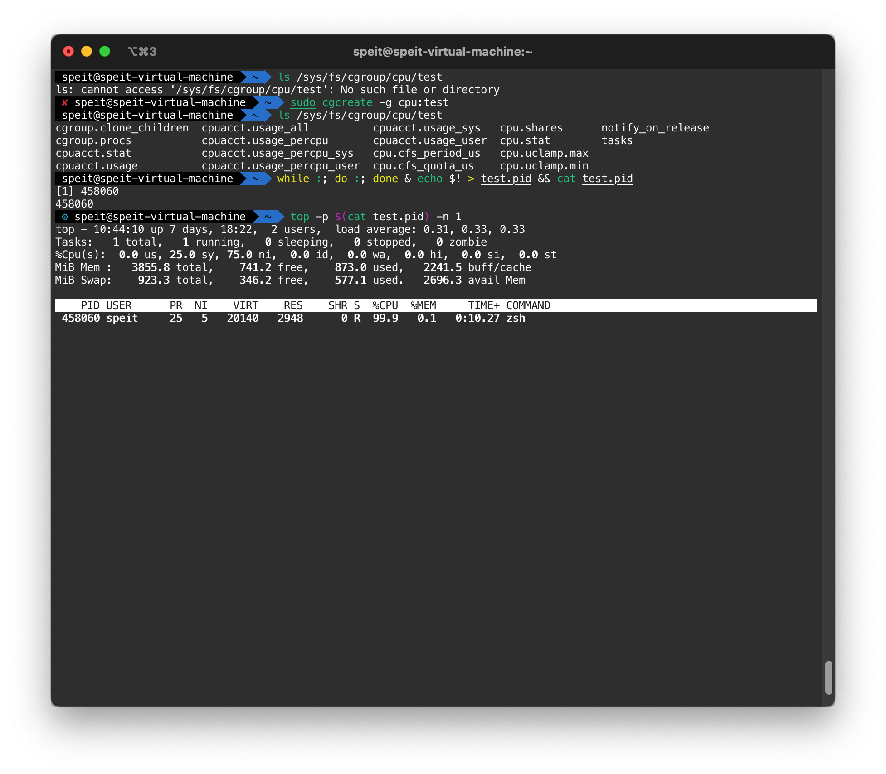

检查cgroup的各种限制

```shell
[speit@host] $ cat /sys/fs/cgroup/cpu/test/cpu.cfs_period_us
[speit@host] $ cat /sys/fs/cgroup/cpu/test/cpu.cfs_quota_us
[speit@host] $ cat /sys/fs/cgroup/cpu/test/tasks
```

限制CPU

```shell
[speit@host] $ echo 30000 | sudo tee /sys/fs/cgroup/cpu/test/cpu.cfs_quota_us
[speit@host] $ sudo cgclassify -g cpu:test $(cat test.pid)
```

!!! warning
    `/sys/fs/cgroup/cpu/test/cpu.cfs_quota_us`需要root权限才能修改，因此这里使用 `tee` 配合管道完成设置

确认CPU的限制

```shell
[speit@host] $ cat /sys/fs/cgroup/cpu/test/cpu.cfs_quota_us
[speit@host] $ cat /sys/fs/cgroup/cpu/test/tasks
[speit@host] $ top -p $(cat test.pid) -n 1
```

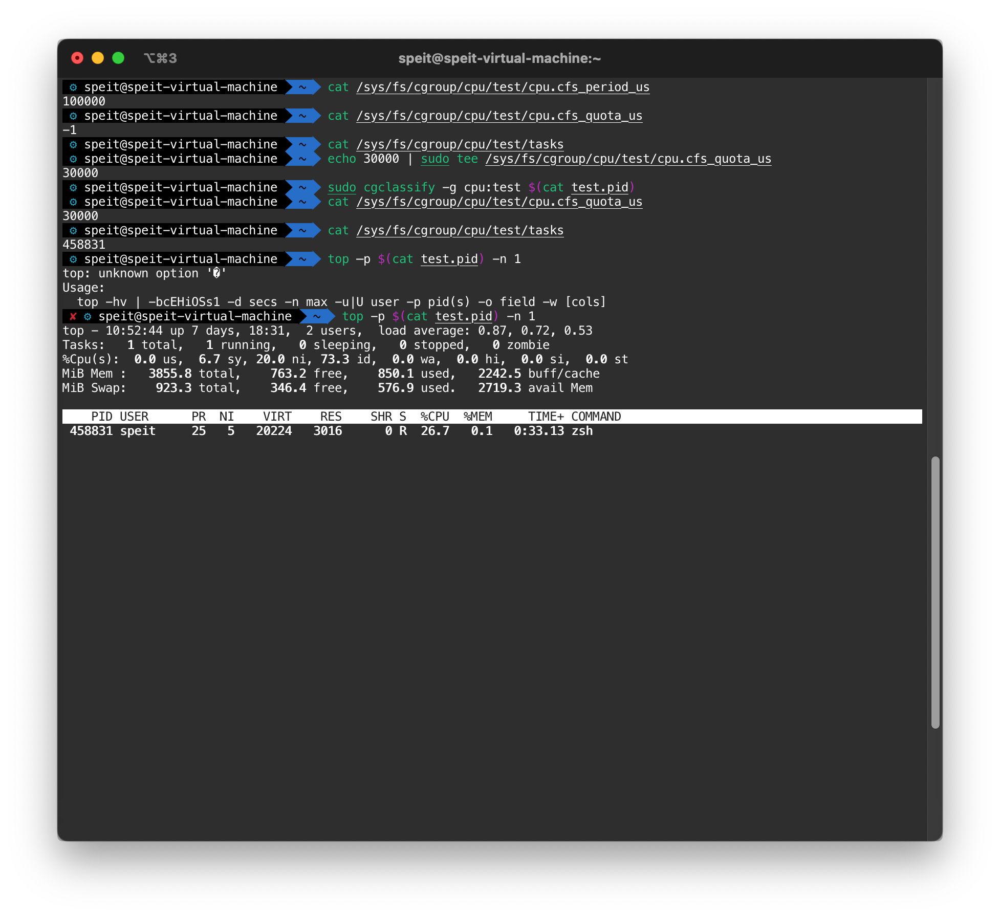  

删除cgroup，结束进程

```shell
[speit@host] $ sudo cgdelete cpu:test
[speit@host] $ kill -9 $(cat test.pid)
```

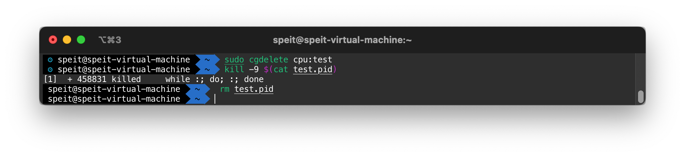

### IO 限制

首先切换到root账户，执行dd命令，保存该进程的PID到test.pid中

```shell
[speit@host] $ sudo -s
[root@host] $ dd if=/dev/sda of=/dev/null > dd.log 2>&1 & echo $! > test.pid
iotop
```

我们可以看到，硬盘的读取速度是很快的

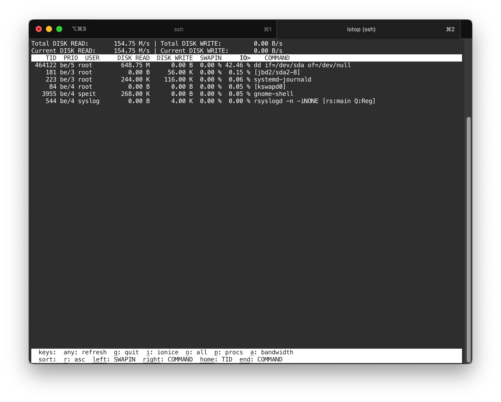

!!! note
    该命令从/dev/sda设备读取文件并写入/dev/null中。/dev/sdas是磁盘设备，/dev/null则是一个特殊的，代表空设备文件。它通常用于丢弃不需要的数据输出

创建`blkio:test`组

```shell
[root@host] $ mkdir /sys/fs/cgroup/blkio/test
```

!!! note
    该命令等价于`cgcreate -g blkio:test`

设置读写限制，单位为Byte/s，因此这里的限制是1MiB/s

```shell
[root@host] $ echo '8:0 1048576' | sudo tee /sys/fs/cgroup/blkio/test/blkio.throttle.read_bps_device
```

!!! note
    `8:0` 代表设备的编号，可以用`ls -l $DEVICE`查看

    ```shell
    ls -l /dev/sda
    brw-rw---- 1 root disk 8, 0 4月  16 15:37 /dev/sda
    ```

将进程的PID加入cgroup

```shell
[root@host] $ $(cat test.pid) | sudo tee -a /sys/fs/cgroup/blkio/test/tasks
sudo iotop -aod 0.1
```

我们可以看到，对设备/dev/sda的读取受到了限制

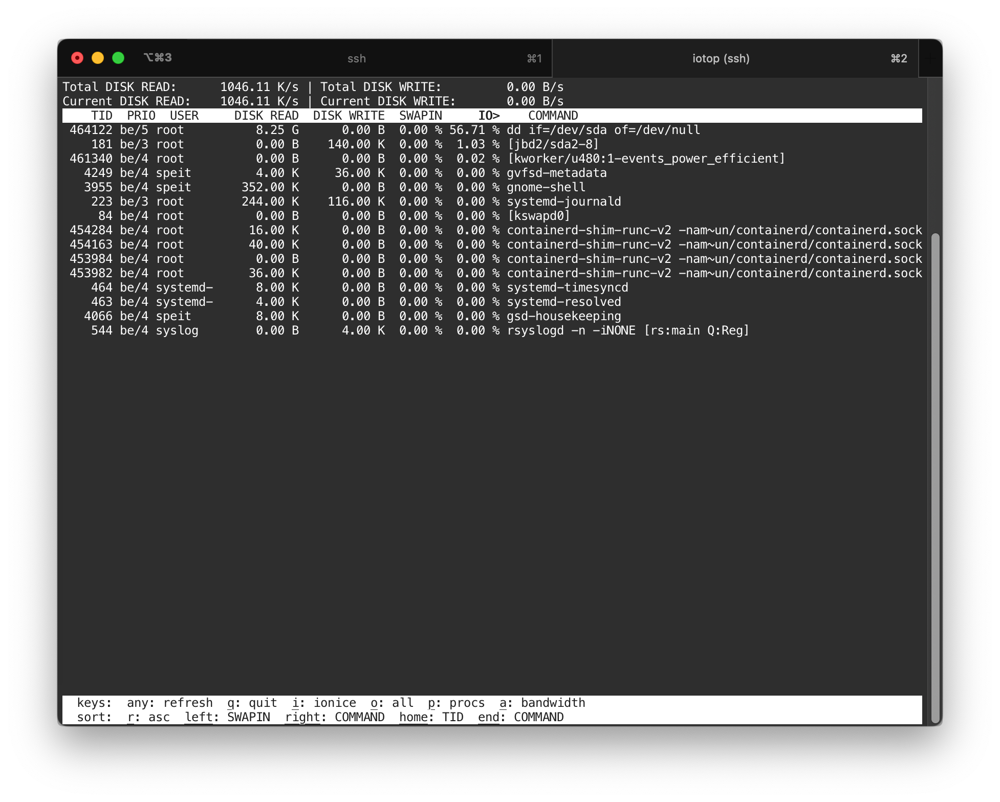  

全部的命令

  

删除cgroup，结束进程

```shell
[speit@host] $ cgdelete blkio:test
[speit@host] $ kill -9 $(cat test.pid)
```

## Basics - rootfs

确认aufs支持

```shell
[speit@host] $ grep aufs /proc/filesystems
nodev    aufs
```

创建一系列测试用的目录

```shell
[speit@host] $ mkdir test-aufs && cd test-aufs
[speit@host/test-aufs] $ mkdir aufs-mnt container-layer image-layer-high image-layer-low
[speit@host/test-aufs] $ echo "x.txt from image layer high." > image-layer-high/x.txt
[speit@host/test-aufs] $ echo "I am image layer high" > image-layer-high/image-layer-high.txt
[speit@host/test-aufs] $ echo "x.txt from image layer low." > image-layer-low/x.txt
[speit@host/test-aufs] $ echo "I am image layer low" > image-layer-low/image-layer-low.txt
[speit@host/test-aufs] $ tree .
.
├── aufs-mnt
├── container-layer
├── image-layer-high
│   ├── image-layer-high.txt
│   └── x.txt
└── image-layer-low
    ├── image-layer-low.txt
    └── x.txt

4 directories, 4 files
```

挂载aufs文件系统

```shell
[speit@host/test-aufs] $ sudo mount -t aufs -o dirs=./container-layer:./image-layer-high:./image-layer-low none ./aufs-mnt
```

检查aufs文件系统的所有挂载情况

```shell
[speit@host/test-aufs] $ mount -t aufs
none on /home/speit/test-aufs/aufs-mnt type aufs (rw,relatime,si=9618ff4d613a568a)
```

!!! note
    `9618ff4d613a568a`为当前挂载的SI

检查当前挂载的文件系统，注意`/sys/fs/aufs/si_9618ff4d613a568a/`中`9618ff4d613a568a`，需要视情况修改

```shell
[speit@host/test-aufs] $ cat /sys/fs/aufs/si_9618ff4d613a568a/*
/home/speit/test-aufs/container-layer=rw
/home/speit/test-aufs/image-layer-high=ro
/home/speit/test-aufs/image-layer-low=ro
64
65
66
/home/speit/test-aufs/container-layer/.aufs.xino
```

!!! warning
    注意这里只有`container-layer`有读写权限

检查挂载的`x.txt`内容

```shell
[speit@host/test-aufs] $ ls ./aufs-mnt
image-layer-high.txt  image-layer-low.txt  x.txt
[speit@host/test-aufs] $ cat ./aufs-mnt/x.txt
x.txt from image layer high.
```

high-layer的文件覆盖了low-layer的文件

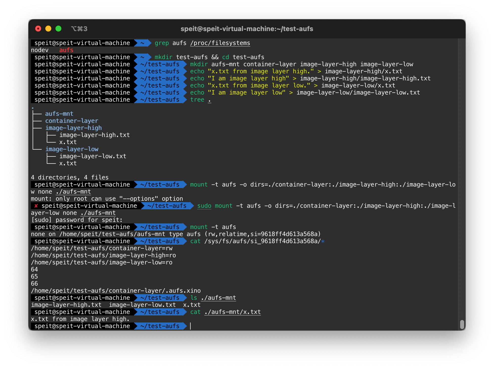

测试读写层

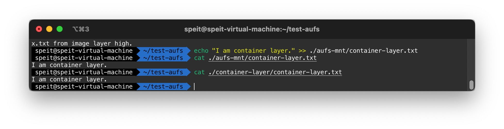  

测试写时拷贝

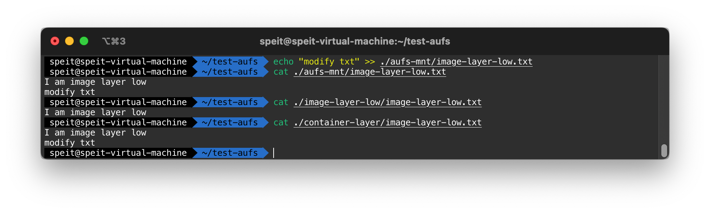  

测试whiteout删除

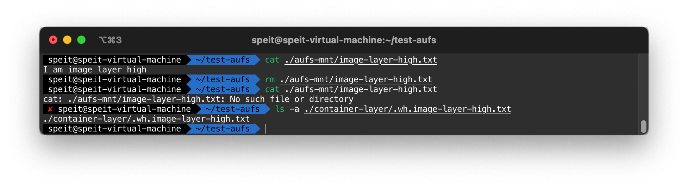  

全部的测试

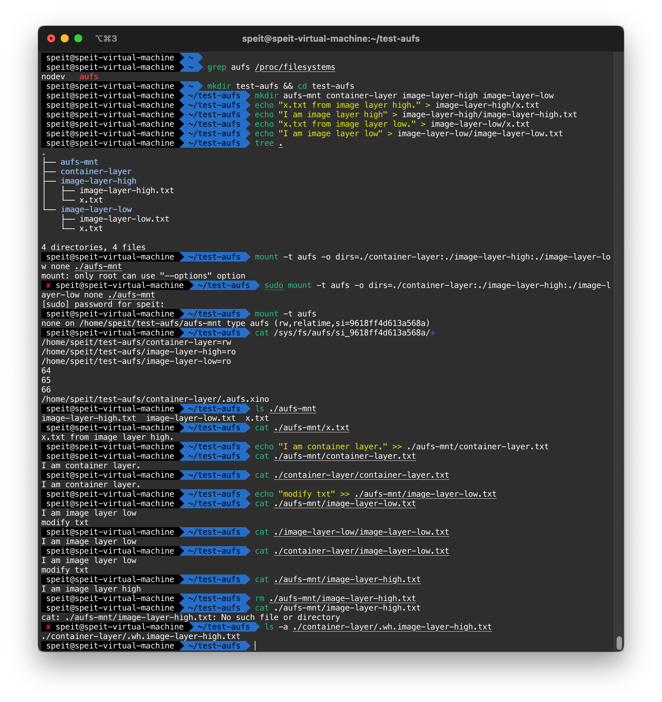

最后，使用umount命令停止挂载，可以发现container-layer中新增了`image-layer-low.txt`的拷贝

```shell
[speit@host/test-aufs] $ sudo umount ./aufs-mnt
```

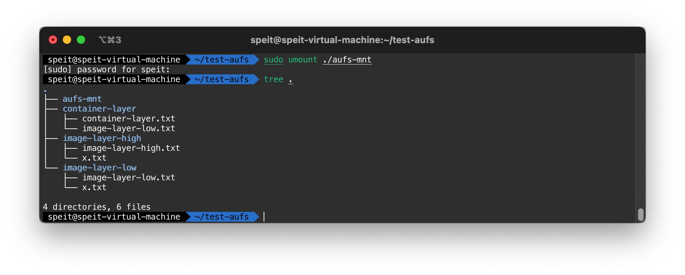

## Docker - image

以下命令允许我们查找并安装[`ubuntu:focal`](https://hub.docker.com/_/ubuntu/)镜像

```shell
[speit@host] $ docker image ls
[speit@host] $ docker search ubuntu:focal
[speit@host] $ docker pull ubuntu:focal
[speit@host] $ docker image ls | grep ubuntu
[speit@host] $ docker ps -a
```

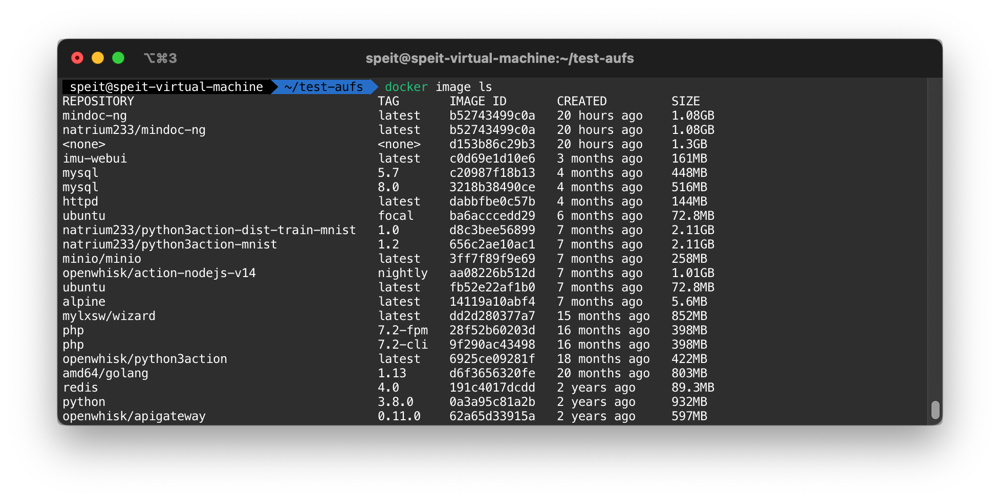
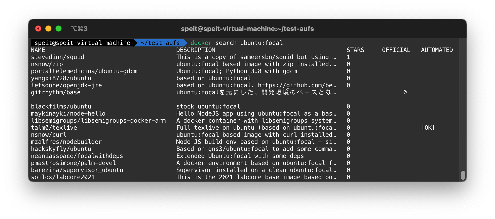
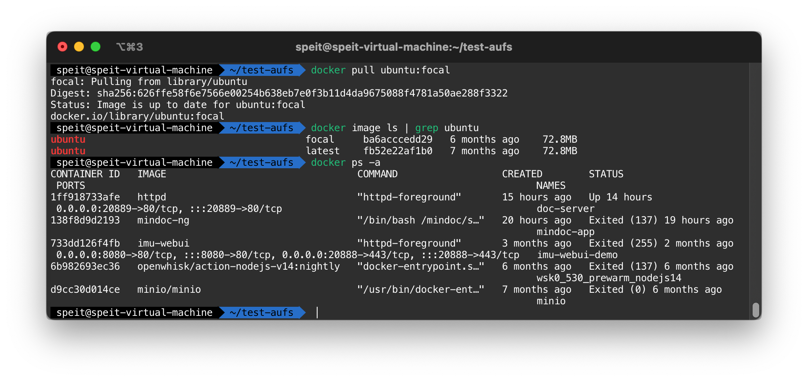

使用刚才下载的镜像启动容器，安装iputils-ping工具来使用`ping`命令

```bash
[speit@host] $ docker run -it --rm ubuntu:focal /bin/bash
[root@ct] $ ping 8.8.8.8 # it doesn't work since it doesn't have the ping tool
[root@ct] $ apt-get update >/dev/null && apt-get install -y iputils-ping iproute2 &> /dev/null
[root@ct] $ ping 8.8.8.8 # it works now!
```

!!! note
    `--rm`选项旨在当容器停止后删除容器

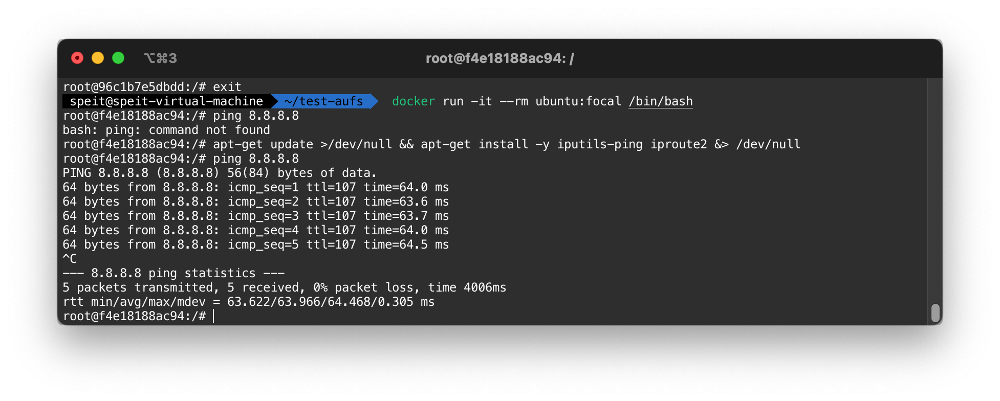

我们可以将该容器commit为一个新的镜像

```shell
[speit@host] $ docker ps -a | grep ubuntu
[speit@host] $ docker commit -m "focal with ping" -a "natrium233" f4e18188ac94 natrium233/focal:with-ping
[speit@host] $ docker login
[speit@host] $ docker image push natrium233/focal:with-ping
```

!!! note
    `natrium233` 为自己的用户名

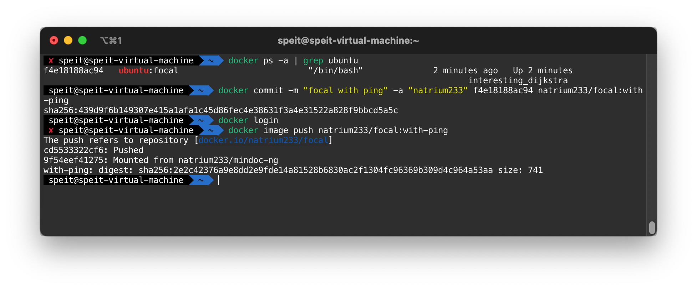

镜像以 [`natrium233/focal`](https://hub.docker.com/r/natrium233/focal)被push到了dockerhub

使用`docker image rm`删除本地镜像

```shell
[speit@host] $ docker image rm natrium233/focal:with-ping
```

## Docker - advanced

HTTP的docker registry不安全，所以我们部署支持HTTPS的registry

我们需要准备一些材料：

- 寻找/租借/购买一台具有公网IP的云主机
- 注册一个域名
- 申请一个免费的HTTPS证书

在这个实验中，这些材料是这样准备的：

- 主机：云主机是宿舍的服务器，有教育网公网IP
- 域名：域名是`ice6413p.space`，绑定了cloudflare的DNS，将[registry.ice6413p.space](registry.ice6413p.space)解析到主机上
- 证书：使用Let's Encrypt申请证书，并自动续签。因为教育网公网80/443端口被封锁，无法使用HTTP Challenge，因此改用DNS Challenge

首先，在主机上启动docker registry应用，该应用包括一个registry容器和一个反向代理容器。反向代理容器被用于提供HTTPS

```yaml title="docker-compose.yaml"
version: '3'
services:
  app:
    image: 'registry'
    container_name: registry-app
    restart: always
    networks:
      - default
    expose:
      - 5000

  proxy:
    image: 'jc21/nginx-proxy-manager:latest'
    container_name: registry-proxy
    restart: always
    ports:
      # - '15001:80'
      - '5000:443'
      - '8081:81'
    volumes:
      - ./proxy-data:/data
      - ./proxy-letsencrypt:/etc/letsencrypt
    networks:
      - default

```

```shell
[speit@host] $ docker-compose up -d
```

经过一些配置，我们让`registry-proxy`代理5000端口的HTTPS请求到`registry-app`

查看registry的状态

```shell
[speit@host] $ curl -X GET https://registry.ice6413p.space:5000/v2/_catalog
{"repositories":[]}
```

比如说，@davidliyutong在不久前修复了[mindoc](https://github.com/mindoc-org/mindoc)镜像中的一个[issue](https://github.com/mindoc-org/mindoc/issues/742)中提出的bug. 现在他想要将重新编译的镜像上传到这个服务器

```shell
[speit@host] $ docker login https://registry.ice6413p.space:5000
```

!!! warning
    因为registry没有配置认证，所以可以用任意账户密码登陆

打标签，推送

```shell
[speit@host] $ docker tag natrium233/mindoc-app-fix:latest registry.ice6413p.space:5000/mindoc-app-fix
[speit@host] $ docker push registry.ice6413p.space:5000/mindoc-app-fix
```

重新查看

```shell
[speit@host] $ curl -X GET https://registry.ice6413p.space:5000/v2/_catalog
{"repositories":["mindoc-app-fix"]}
```

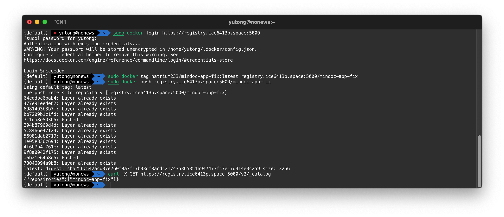

!!! warning
    这样的一个registry仍然是危险的：任何人都可以用任何凭据登陆。应当考虑使用[docker-registry-ldap-proxy](https://github.com/rhasselbaum/docker-registry-ldap-proxy)类似的方案加入认证机制

## Docker - runtime

我们使用docker提供的[`hello-world`](https://hub.docker.com/_/hello-world)镜像来测试Docker运行时

```shell
[speit@host] $ docker run hello-world
[speit@host] $ docker ps -a
```

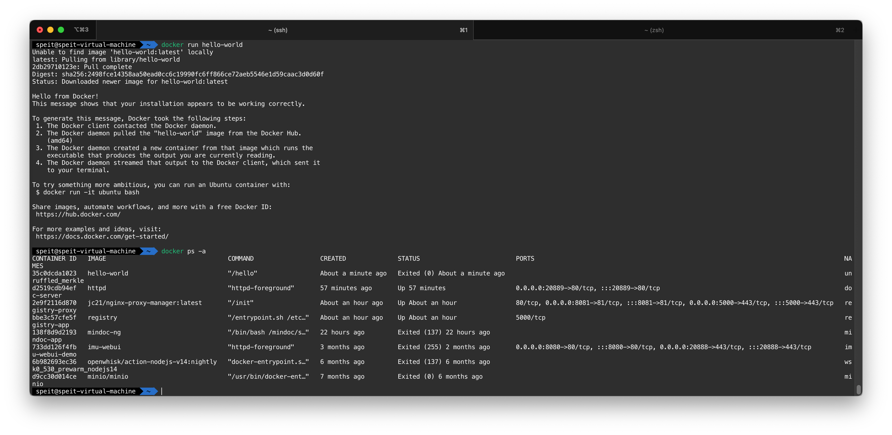

该容器运行后停止，因此`docker ps`无法查看其状态，需要添加`-a`参数

```shell
[speit@host] $ docker container run -it --rm -p 8888:80 ubuntu:focal
[root@ct] $ apt update && apt install -y apache2
[root@ct] $ echo "Index.html" > /var/www/html/index.html
[root@ct] $ apache2ctl -D FOREGROUND 
```

在另一终端运行`ps`查看：

```shell
[speit@host] $ ps -aux | grep ubuntu:focal
[speit@host] $ docker ps | grep ubuntu
```

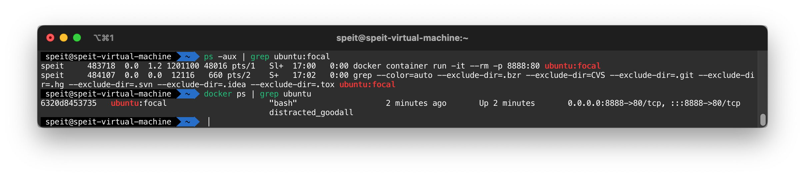  

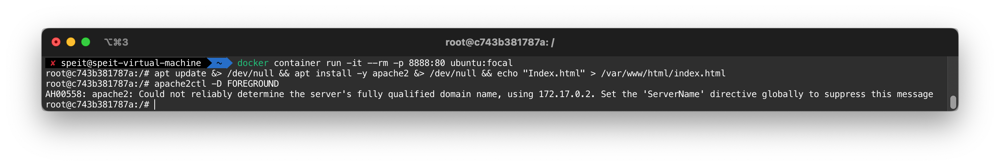

用curl拉取网页内容

```shell
[speit@host] $ curl localhost:8888
```

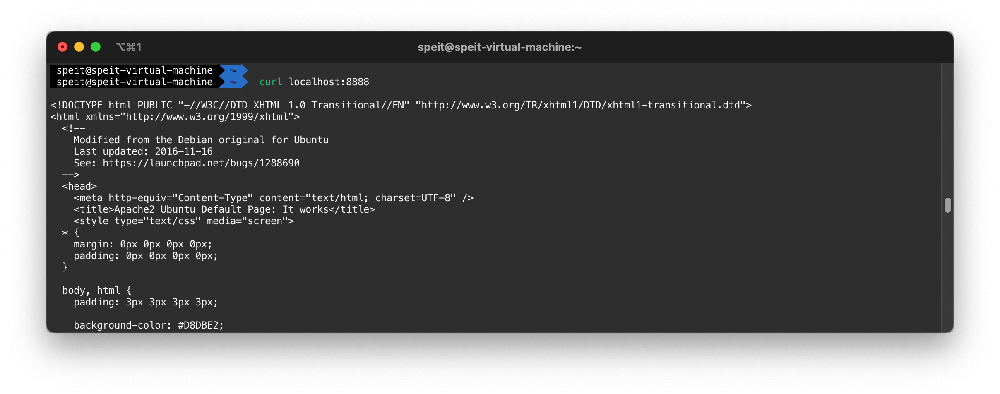

## Docker - volume

我们创建vol1的volume，并对其进行一系列操作

```shell
[speit@host] $ docker volume create vol1
vol1
[speit@host] $ docker run -it --rm -v vol1:/data ubuntu:focal /bin/bash
[root@ct] $ ls /data
[root@ct] $ touch /data/xxx
[root@ct] $ echo yyy > /data/xxx
```

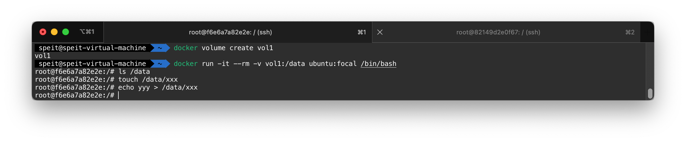

```shell
[speit@host] $ docker run -it --rm -v vol1:/data ubuntu:focal /bin/bash
[root@ct] $ cat /data/xxx
yyy
```

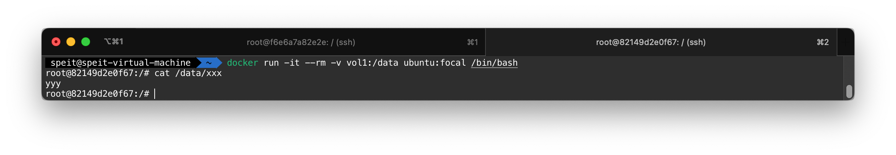

实验结束，删除volume

```shell
[speit@host] $ docker volume remove vol1
```

## docker - network

我们创建名为`net1`的网络进行实验

```shell
docker network create net1
[speit@host] $ docker run --name ct1 -it -d --net=net1 natrium233/focal:with-ping
[speit@host] $ docker run --name ct2 -it --net=net1 natrium233/focal:with-ping /bin/bash
```

```shell
[speit@ct2] $ ping
```

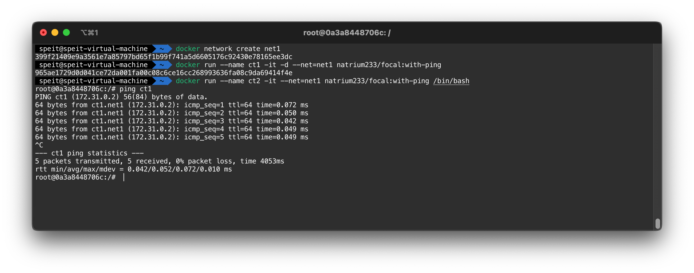

实验结束后删除容器和网络

```shell
[speit@host] $ docker stop ct1 ct2 && docker rm ct1 ct2 && docker network remove net1
```

## dockerfile

测试环境变量

```shell
[speit@host] $ docker build -t img1 -f Dockerfile-env .
[speit@host] $ docker run --name ct1 --rm img1
[speit@host] $ docker run --name ct2 --rm -e MSG=111 img1
```

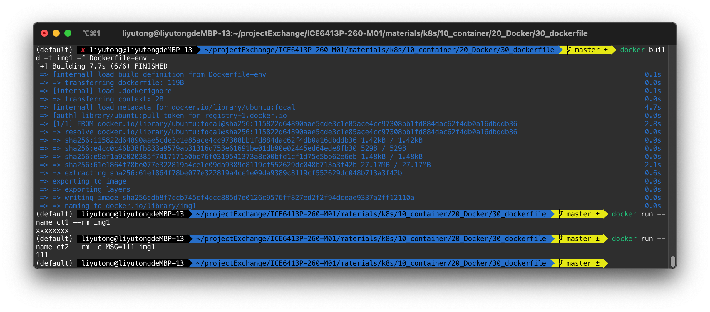

测试python镜像

```shell
[speit@host] $ docker build -t img1 -f Dockerfile-env-python .
[speit@host] $ docker run --name ct1 --rm img1 
[speit@host] $ docker run --name ct2 --rm -e MSG1=aaa -e MSG2=bbb img1
```

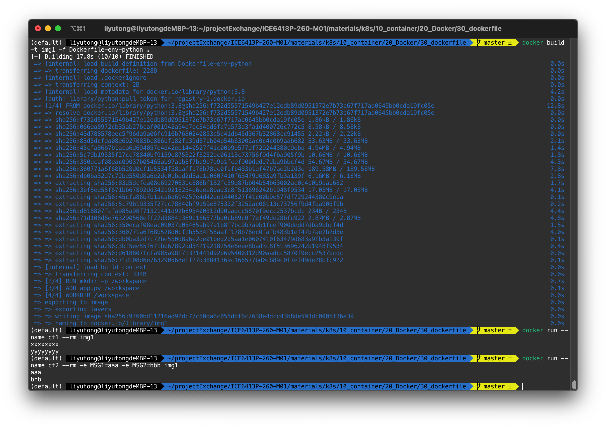

进阶测试

```shell
[speit@host] $ docker build -t img1 -f Dockerfile-env-python2 .
[speit@host] $ docker run --name ct2 --rm -v $(pwd):/workspace img1
[speit@host] $ docker run --name ct2 --rm -v $(pwd):/workspace -e APP=/workspace/app2.py img1
```

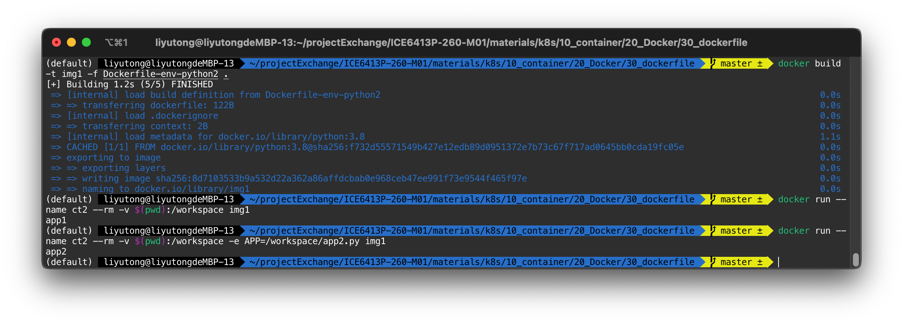

测试搭建Apache2 web服务

```shell
[speit@host] $ docker image build -t apache2-demo .
[speit@host] $ docker run -d -p 8885:80 apache2-demo
```

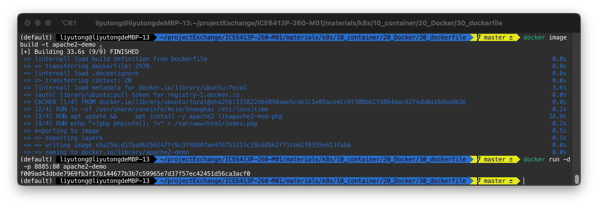  

浏览器访问[http://localhost:8885/index.php](http://localhost:8885/index.php)

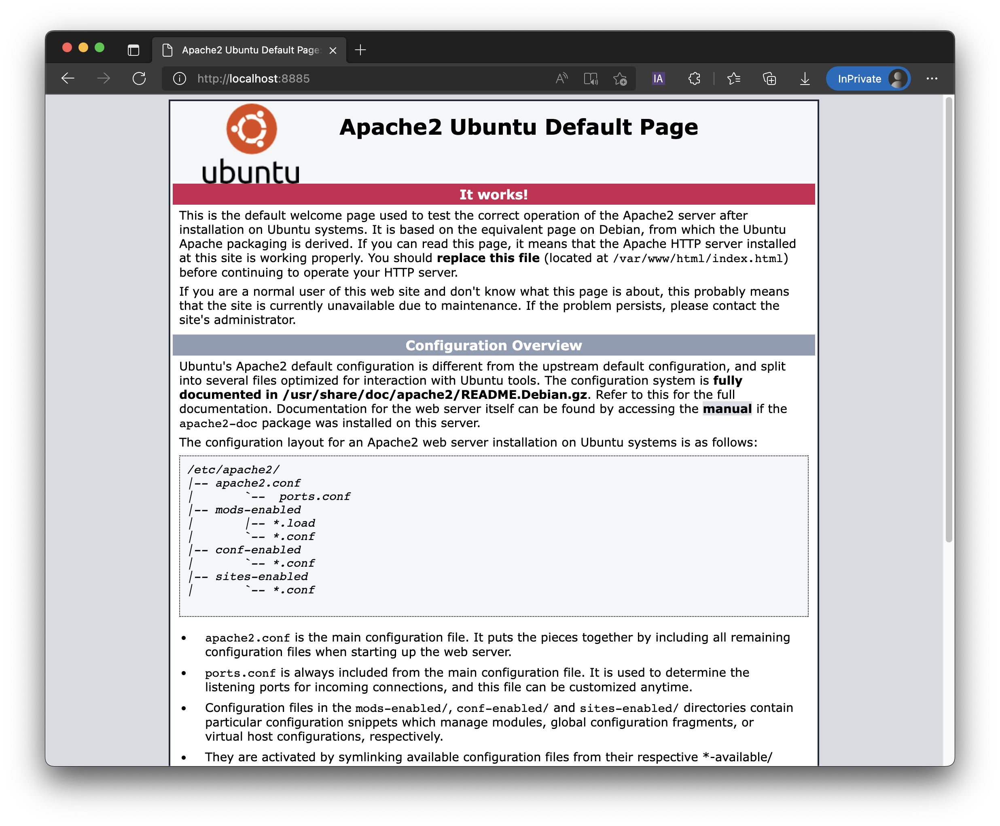

## docker - lab

### Wordpress

我们在一台云主机上部署wordpress应用

```shell
[speit@host] $ docker network create wordpress
[speit@host] $ docker volume create mysql wordpress
[speit@host] $ docker image pull wordpress:4.9.6 mysql:5.7
```

我们使用docker-compose部署，这样管理起来较为简便

```yaml title="docker-compose.yaml"
version: '3.3'

services:
  db:
    image: mysql:5.7
    container_name: wordpress-db
    volumes:
       - db:/var/lib/mysql
    restart: always
    networks:
      - default
    environment:
      MYSQL_ROOT_PASSWORD: P@ssw0rd
      MYSQL_DATABASE: wordpress

  app:
    depends_on:
       - db
    image: wordpress:5.9.3
    container_name: wordpress-app
    restart: always
    networks:
      - proxy_net
      - default
    environment:
      WORDPRESS_DB_HOST: wordpress-db
      WORDPRESS_DB_PASSWORD: P@ssw0rd
    volumes:
      - wordpress:/var/www/html

networks:
  - proxy_net:
      external: true

volumes:
    db:
    wordpress:
```

!!! note
    proxy_net 为nginx proxy所在的网络，我们通过nginx反向代理对外提供wordpress服务，在此不再赘述

    default为`docker-compose`创建的默认网络

搭建的站点预览如下

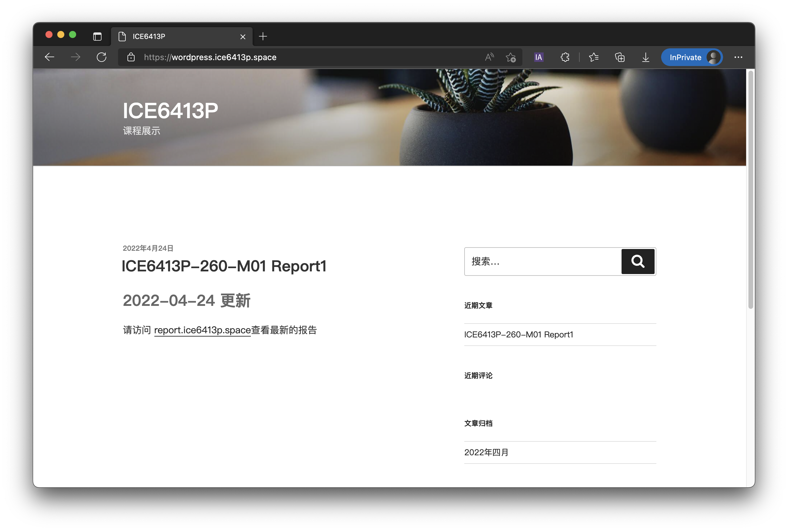

### Python server

```shell
[speit@host] $ docker network create python-server # create a backend network
[speit@host] $ docker volume create mysql # create a volume
[speit@host] $ docker image pull mysql:5.7 
[speit@host] $ docker container run --name mysql -d --net python-server -v mysql:/var/lib/mysql -e MYSQL_ROOT_PASSWORD=P@ssw0rd  mysql:5.7
```

!!! note
    通过`docker network inspect python-server | grep IPv4`，我们可以获取到`mysql`容器的地址为`192.168.32.2`，

    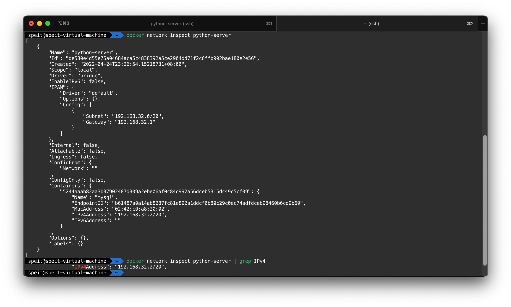

用数据库的地址连接数据库

```shell
[speit@host] $ mysql -h 192.168.32.2 -u root -p 
Password:
```

交互式地键入密码，然后连接MySQL数据库。

!!! warning
    有些情况下，需要在MySQL客户端执行两句MySQL查询将root@localhost授权，否则会报错

    ```mysql
    GRANT ALL PRIVILEGES ON *.* TO 'root'@'localhost';
    FLUSH PRIVILEGES;
    ```

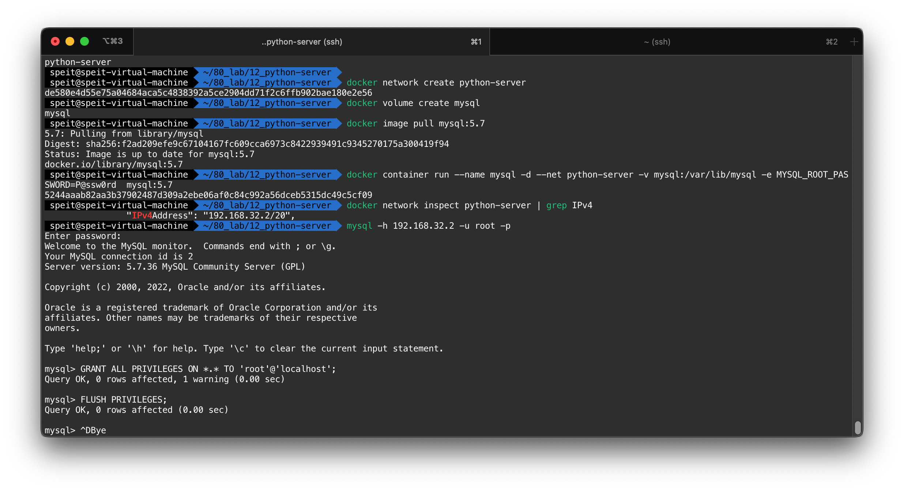

编译python-server镜像

```shell
cd docker
[speit@host] $ docker build -t python-server:0.1 . &> /dev/null
[speit@host] $ docker image ls | grep python-server
cd ..
```

!!! note
    我们通过`&> /deb/null`忽略输出

启动Python服务器

```shell
[speit@host] $ docker container run --name python-server -d --net python-server -p 6666:8888 -e MYSQL_HOST=mysql python-server:0.1
```

```shell
[speit@host] $ curl localhost:6666
```

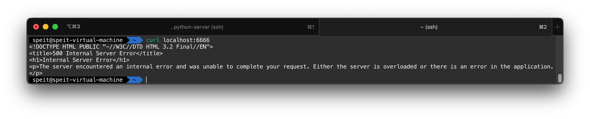

服务器内部错误，这是因为没有创建MySQL表。我们通过命令初始化表

```shell
[speit@host] $ mysql -u root -p -h 192.168.32.2 < db1_tbl1.sql
```

检查web server 的状态，发现其正常工作了

```shell
[speit@host] $ curl localhost:6666
```

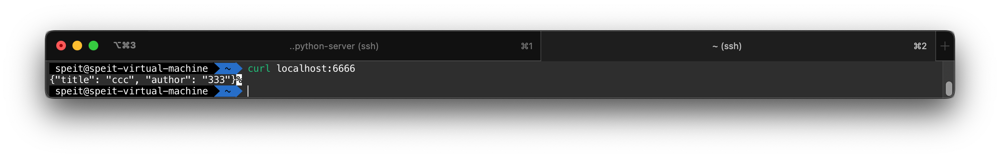

### Front/Back end

编译镜像

```shell
[speit@host] $ docker image build -t backend backend &>/dev/null
[speit@host] $ docker image build -t frontend frontend &>/dev/null
```

创建网络

```shell
[speit@host] $ docker network create frontbackend
```

启动容器

```shell
[speit@host] $ docker container run --name backend -d --net=frontbackend backend
[speit@host] $ docker container run --name frontend -d --net=frontbackend -p 6666:8888 frontend
```

访问前端

```shell
[speit@host] $ curl localhost:6666 # type twice
```

修改  `backend`中的`/data/input.txt` 文件:

```shell
[speit@host] $ curl localhost:6666 #  type twice to see the update
```

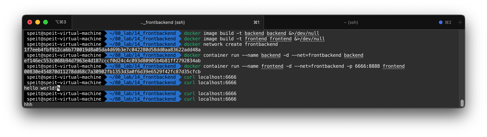

## Docker in docker

> 给出的例子有误，需要添加一行`RUN chmod +x /data/init.sh`

  ```shell
  FROM centos:7

  RUN yum update -y \
      && yum install -y iptables \
      && yum clean all

  RUN mkdir -p /data && groupadd docker
  ADD ["./files/docker.tar.xz", "/usr/local/bin/"]
  COPY ["./scripts/init.sh", "/data/init.sh"]
  RUN chmod +x /data/init.sh

  CMD ["/data/init.sh"]
  ```

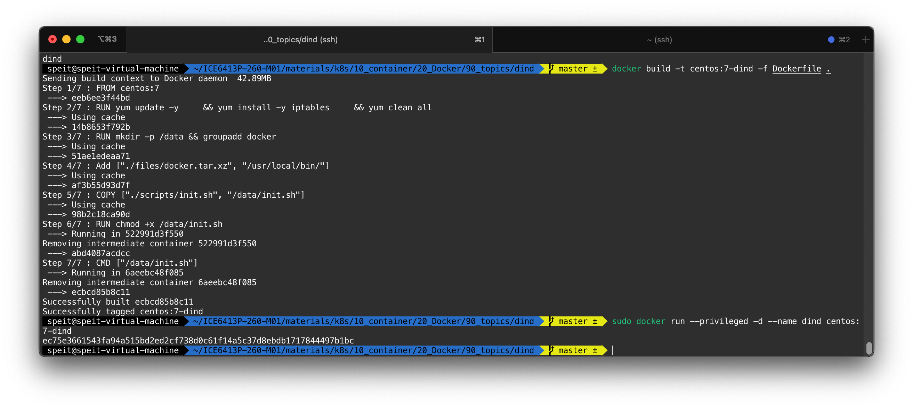

容器内的docker版本和宿主机的不同，并且可以执行docker命令

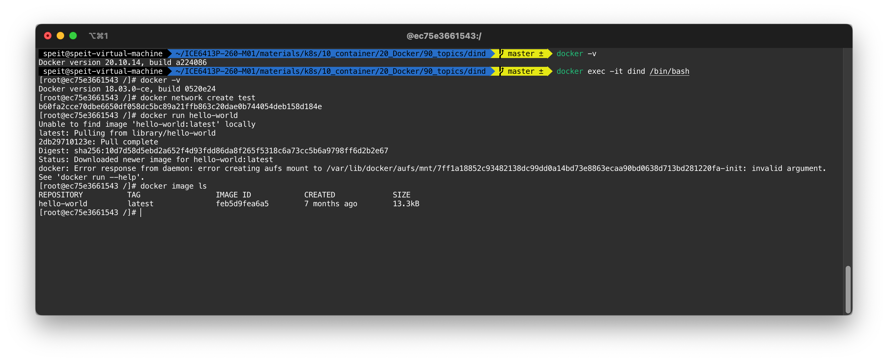

!!! note
    一般不推荐这样使用，除非是为了本地的持续集成，例如在jenkins容器内运行docker命令来构建镜像

!!! note
    Dood是更为推荐的做法：在容器内安装docker客户端，实际执行交给宿主机的docker-engine完成

## docker-compose

修改`docker-compose.yml`：

```yaml title="docker-compose.yaml"
version: '2'
services:
  redis:
    image: redis:alpine

  web:
    depends_on:
       - redis
    build: ./docker
    ports:
     - 8000:5000
```

!!! note
    5000端口被Docker Registry占用，这里改到8000端口

导航至`docker-compose.yml`所在目录，执行

```shell
[speit@host] $ docker-compose up --remove-orphans -d
```

检查 [http://localhost:8000](http://localhost:8000)

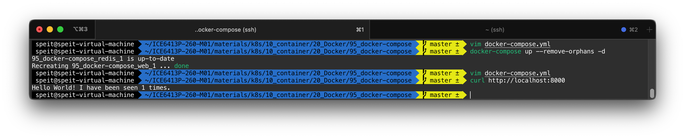
