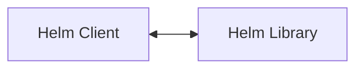
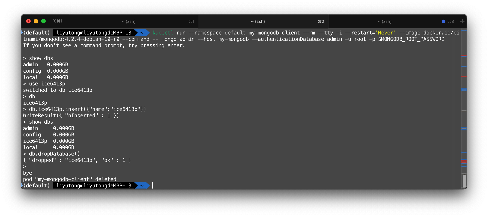
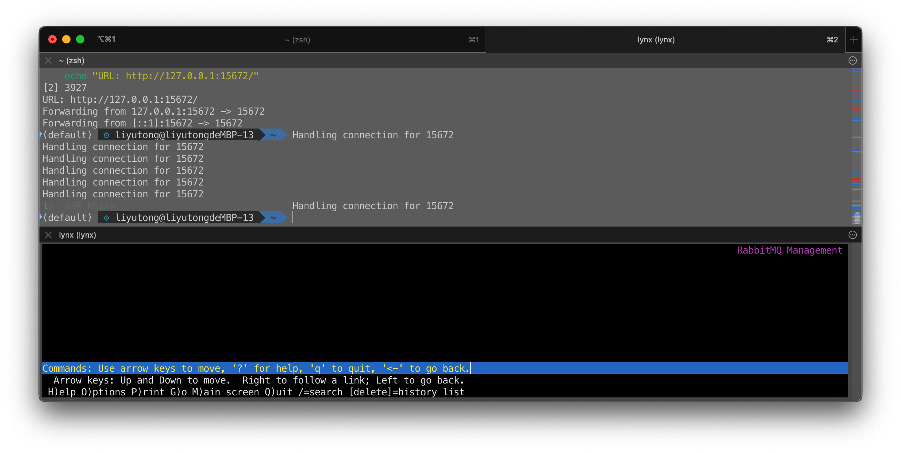
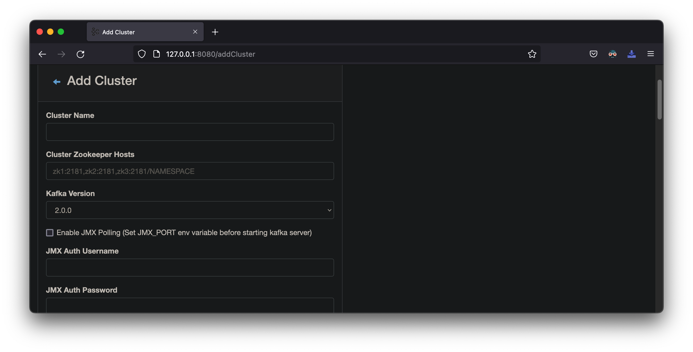
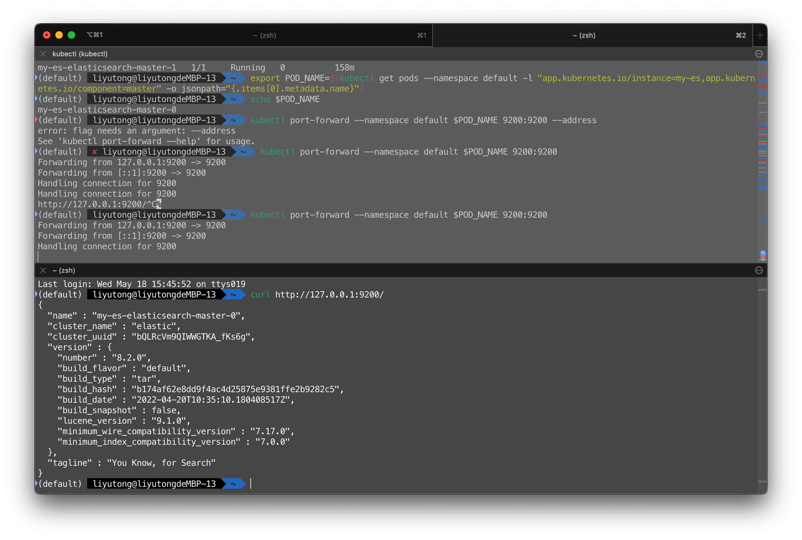
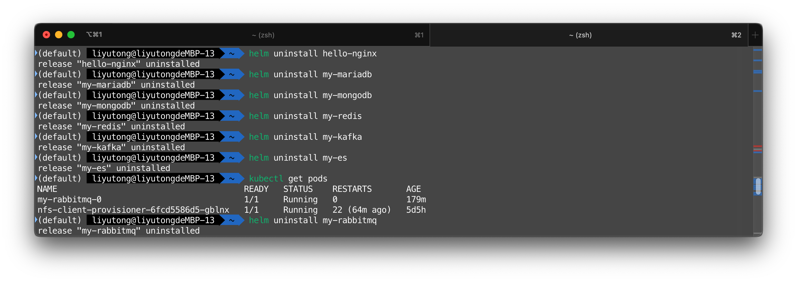

# Helm

Helm 是 k8s 的一个项目，相当于 CentOS 的 yum, Debian的apt。

## 原理

- chart：是 Helm 管理的安装包，里面包含需要部署的安装包资源。
- config：包含了可以合并到打包的 chart 中的配置信息，用于创建一个可发布的对象。
- release：是一个与特定 config 相结合的 chart 的运行实例，一个 chart 可以部署多个 release，即这个 chart 可以被安装多次。
- repository：chart 的仓库，用于发布和存储 chart。

Helm3 架构:



!!! note

    Helm3 最明显的变化是删除了 Tiller

## Repo操作

```shell
helm version
helm repo add stable https://mirror.azure.cn/kubernetes/charts/
helm repo add incubator https://mirror.azure.cn/kubernetes/charts-incubator/
helm repo add bitnami https://charts.bitnami.com/bitnami
helm repo update
helm search repo stable
```

> `stable`通道有[https://mirror.azure.cn/kubernetes/charts/](https://mirror.azure.cn/kubernetes/charts/)镜像可以替代

## 安装Charts

本小节会介绍一些常用Charts的安装方法

可以通过两种方式验证部署的情况

- K8S：可以在K8S上运行一个 Pod 作为客户端
- 本地：可以用`kubectl port-forward`将MySQL服务转发到本地

!!! note

    大部分数据库应用都会产生PVC。因此需要先准备一个storageClass，否则需要手动创建PV来回应PVC

!!! tip

    许多本地客户端接入命令会导致kubectl端口转发任务作为后台任务创建。可以用`jobs`命令列出用户的后台任务，然后使用`kill %[n]`等命令结束（`n`为后台任务的编号）

### MariaDB

MariaDB 是和MySQL兼容的关系型数据库

```shell
helm install my-mariadb --set global.storageClass=nfs-client bitnami/mariadb
helm uninstall my-mariadb
```

!!! note

    `helm uninstall`命令不会释放PVC，需要手动释放。（bitnami/mysql）

!!! warning
    `--set global.storageClass=nfs-client`指定了使用nfs-client作为storageClass
    `global.storageClass`的默认参数可以通过`helm inspect all stable/mysql`获得

可以通过`kubectl get secret`获取密码

```shell
export MARIADB_ROOT_PASSWORD=$(kubectl get secret --namespace default my-mariadb -o jsonpath="{.data.mariadb-root-password}" | base64 --decode)
echo $MARIADB_ROOT_PASSWORD
```

===  "Pod接入"

    ```shell
    kubectl run my-mariadb-client --rm --tty -i --restart='Never' --image  docker.io/bitnami/mariadb:10.6.7-debian-10-r70 --namespace default --command -- bash
    [pod] $ mysql -h my-mariadb -uroot -p
    Enter Password: 
    ```

===  "本地客户端接入"

    ```shell
    # 转发端口
    MARIADB_PORT=3307
    kubectl port-forward --namespace default svc/my-mysql 3307:3306
    ```

    ```shell
    #  在另一终端
    MARIADB_PORT=3307
    mysql -h 127.0.0.1 -P${MARIADB_PORT} -u root -p${MYSQL_ROOT_PASSWORD}
    Enter Password: 
    ```

验证

```sql
MariaDB [(none)]> show databases;
```


  

### MongoDB

MongoDB 是一个基于分布式文件存储的数据库

```shell
helm install my-mongodb --set persistence.storageClass=nfs-client stable/mongodb
helm uninstall my-mongodb
```

获取密码

```shell
export MONGODB_ROOT_PASSWORD=$(kubectl get secret --namespace default my-mongodb -o jsonpath="{.data.mongodb-root-password}" | base64 --decode)
```

===  "Pod接入"

    ```shell
    kubectl run --namespace default my-mongodb-client --rm --tty -i --restart='Never' --image docker.io/bitnami/mongodb:4.2.4-debian-10-r0 --command -- mongo admin --host my-mongodb --authenticationDatabase admin -u root -p $MONGODB_ROOT_PASSWORD
    ```

===  "本地客户端接入"

    ```shell
    kubectl port-forward --namespace default svc/my-mongodb 27017:27017 & mongo --host 127.0.0.1 --authenticationDatabase admin -p $MONGODB_ROOT_PASSWORD
    ```

验证

```shell
show dbs
use ice6413p # 创建db
db # 显示当前db
db.ice6413p.insert({"name":"ice6413p"}) # 插入一条数据
show dbs # 应该会多出一个ice6413p
db.dropDatabase() # 删除db
```



### Redis

Redis 是一个key-value 存储系统，是跨平台的非关系型数据库

```shell
helm install my-redis --set slave.persistence.storageClass=nfs-client,master.persistence.storageClass=nfs-client stable/redis
helm uninstall my-redis
```

!!! note

    `helm uninstall`命令不会释放PVC，需要手动释放。（stable/redis）

获取密码

```shell
export REDIS_PASSWORD=$(kubectl get secret --namespace default my-redis -o jsonpath="{.data.redis-password}" | base64 --decode) 
echo $REDIS_PASSWORD
```

===  "Pod接入"

    ```shell
    kubectl run --namespace default my-redis-client --rm --tty -i --restart='Never' --env REDIS_PASSWORD=$REDIS_PASSWORD --image docker.io/bitnami/redis:5.0.7-debian-10-r32 -- bash
    [pod] $ redis-cli -h my-redis-master -a $REDIS_PASSWORD # read/write operation
    [pod] $ redis-cli -h my-redis-slave -a $REDIS_PASSWORD # read-only operation
    ```

===  "本地客户端接入"

    ```shell
    kubectl port-forward --namespace default svc/my-redis-master 6379:6379 & 
    redis-cli -h 127.0.0.1 -p 6379 -a $REDIS_PASSWORD
    ```

验证

```shell
set aaa "xxx"
get aaa
```


### RabbitMQ

RabbitMQ是实现了高级消息队列协议（AMQP）的开源消息代理软件

```shell
helm install my-rabbitmq --set persistence.storageClass=nfs-client stable/rabbitmq
helm uninstall my-rabbitmq
```

!!! note

    `helm uninstall`命令不会释放PVC，需要手动释放。（stable/rabbitmq）

获取凭据

```shell
export RABBITMQ_USERNAME="user"
export RABBITMQ_PASSWORD=$(kubectl get secret --namespace default my-rabbitmq -o jsonpath="{.data.rabbitmq-password}" | base64 --decode)
export RABBITMQ_COOKIE=$(kubectl get secret --namespace default my-rabbitmq -o jsonpath="{.data.rabbitmq-erlang-cookie}" | base64 --decode)
```

===  "本地客户端接入"

    ```shell
    # AMQP
    kubectl port-forward --namespace default svc/my-rabbitmq 5672:5672 &
    echo "URL: amqp://127.0.0.1:5672/"
    ```

    ```shell
    # Management Interface
    kubectl port-forward --namespace default svc/my-rabbitmq 15672:15672 &
    echo "URL: http://127.0.0.1:15672/"
    ```

!!! tip

    上述的命令会导致端口转发任务作为后台任务创建

  


### Kafka

Kafka 是一种分布式的，基于发布 / 订阅的消息系统。主要设计目标如下： 以时间复杂度为 O(1) 的方式提供消息持久化能力

Kafka 不需要持久化

```shell
helm install my-kafka stable/kafka-manager
helm uninstall my-kafka
```

=== "本地客户端接入"

    ```shell
    export POD_NAME=$(kubectl get pods --namespace default -l "app=kafka-manager,release=my-kafka" -o jsonpath="{.items[0].metadata.name}")
    kubectl port-forward $POD_NAME 8080:9000
    ```

访问`http://127.0.0.1:8080/`




### ElasticSearch

Elasticsearch 是一个分布式、RESTful 风格的搜索和数据分析引擎，能够解决不断涌现出的各种用例

```shell
helm install my-es --set global.storageClass=nfs-client bitnami/elasticsearch
helm uninstall my-es
```

!!! warning

    根据[这里](https://www.elastic.co/guide/en/elasticsearch/reference/current/file-descriptors.html)和[这里](https://www.elastic.co/guide/en/elasticsearch/reference/current/vm-max-map-count.html)，ElasticSearch需要执行`sysctl -w vm.max_map_count=262144 && sysctl -w fs.file-max=65536`修改内核设置

=== "本地客户端接入"

    ```shell
    export POD_NAME=$(kubectl get pods --namespace default -l "app.kubernetes.io/instance=my-es,app.kubernetes.io/component=master" -o jsonpath="{.items[0].metadata.name}")
    kubectl port-forward --namespace default $POD_NAME 9200:9200 
    ```

执行`curl http://127.0.0.1:9200/`

  

## Custom Charts

可以自定义Charts。以下是一些常见的命令

### Release

- `helm create hello-svc`: 创建 Helm package
- `helm install --dry-run --debug ./`：验证模板和配置
- `helm install ./`：启动本chart的release
- `helm list`：列出 release
- `helm delete [release]` 删除特定的 release

### Custom Charts

举例说明

```shell
[node] $ docker pull nginx # Selective
helm create hello-helm
helm install hello-nginx ./hello-helm
export POD_NAME=$(kubectl get pods --namespace default -l "app.kubernetes.io/name=hello-helm" -o jsonpath="{.items[0].metadata.name}")
kubectl port-forward $POD_NAME 8080:80
helm uninstall hello-nginx 
```

访问 `http://127.0.0.1:8080` 来使用应用


实验完毕删除所有的Helm Release和PVC




