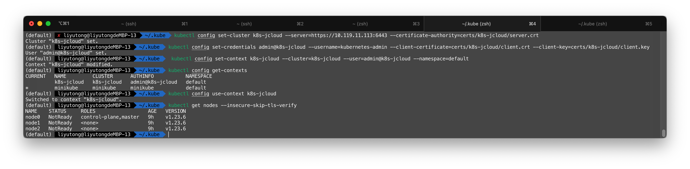
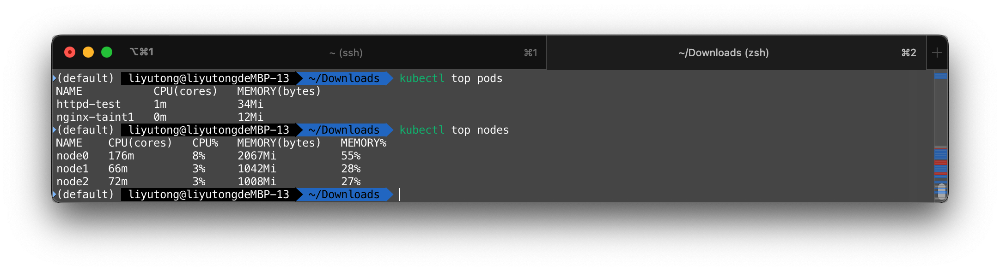
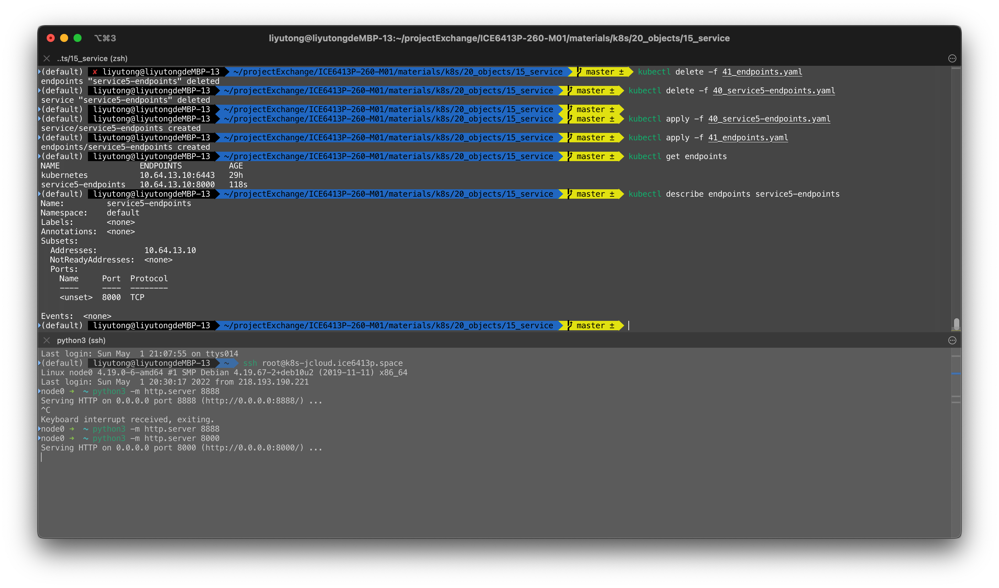

# Objects Experiment

[Lab API Objects](https://github.com/rebirthmonkey/k8s/tree/master/20_objects){ .md-button }

我们回顾一下cluster的配置

- 有`node0`，`node1`，`node2`三个节点
- `node0`是控制平面所在节点

## Config

### Context related

```shell
[node0] $ kubectl config view
```


查看本地context

```shell
[node0] $ kubectl config get-contexts
```

!!! note

    该操作查看的是本地记录的context，取决于当前用户目录下`.kube/config`的内容或者是KUBECONFIG变量定义的配置文件的内容


查看当前使用的Context

```shell
[node0] $ kubectl config current-context
```


使用`kubectl config --kubeconfig=${PATH_TO_CONFIG}`可以新增、修改配置文件。`${PATH_TO_CONFIG}`要被替换成配置文件的路径。如果该路径不存在则会被创建

- 添加一个cluster，名为`development`，地址是`https://1.2.3.4`，证书是`fake-ca-file`

    ```shell
    [node0] $ kubectl config --kubeconfig=config-demo set-cluster development --server=https://1.2.3.4 --certificate-authority=fake-ca-file
    ```

!!! note

    证书是PEM格式的
    ```pem
    -----BEGIN CERTIFICATE-----
    ...
    -----END CERTIFICATE-----
    ```

- 添加一个cluster，名为`development`，不验证证书

    ```shell
    [node0] $ kubectl config --kubeconfig=config-demo set-cluster scratch \
                             --server=https://5.6.7.8 \
                             --insecure-skip-tls-verify
    ```

- 添加一个credential，名为`developer`，使用公私钥认证

    ```shell
    [node0] $ kubectl config --kubeconfig=config-demo set-credentials \
                             developer \
                             --client-certificate=fake-cert-file \
                             --client-key=fake-key-seefile
    ```

- 添加一个credential，名为`experimenter`，使用用户名-密码认证

    ```shell
    [node0] $ kubectl config --kubeconfig=config-demo set-credentials \
                             experimenter \
                             --username=exp \
                             --password=some-password
    ```

- 添加一个context，名为`dev-frontend`，位于`frontend`命名空间下，使用用户`developer`和集群`development`

    ```shell
    [node0] $ kubectl config --kubeconfig=config-demo set-context \
                            dev-frontend \
                            --cluster=development \
                            --namespace=frontend \
                            --user=developer
    ```

- 添加一个context，名为`dev-storage`，位于`storage`命名空间下，使用用户`developer`和集群`development`

    ```shell
    [node0] $ kubectl config --kubeconfig=config-demo set-context \
                             dev-storage \
                             --cluster=development \
                             --namespace=storage \
                             --user=developer
    ```

- 添加一个context，名为`exp-scratch`，位于`default`命名空间下，使用用户`experimenter`和集群`scratch`

    ```shell
    [node0] $ kubectl config --kubeconfig=config-demo set-context \
                             exp-scratch \
                             --cluster=scratch \
                             --namespace=default \
                             --user=experimenter
    ```

我们可以看到，当第一行执行完后，目录下多出了一个config-demo文件，这是因为运行命令时指定了`config-demo`作为配置文件名


执行完所有命令后，`config-demo`中的内容会发生大幅改变


这里放一张图描述`Config`和k8s的关系


因此：

```bash
[node0] $ kubectl config --kubeconfig=config-demo use-context dev-frontend
```

应该被解释为：

- 修改`config-demo`
- `use-context`，使用一个context
- `dev-frontend` context名字是`dev-frontend`

!!! warning

    config文件的权限必须是`$USER.$GROUP:660`

!!! note

    个人认为`kubectl config`只是提供了更好的修改config文件的方法，完全可以通过手动修改config做到这一点

!!! warning

    `kubectl --insecure-skip-tls-verify` 选项可以跳过证书验证

#### 实践 - 远程控制K8S

假设我们意图从一台笔记本连接在JCloud上部署好的集群（使用`kubeadm`部署）。我们首先查看`/etc/kubernetes/admin.conf`的内容


我们可以看到，`certificate-authority-data`，`client-certificate-data`，`client-key-data`字段的值分别为服务器证书，用户证书和密钥

使用以下命令可以将证书、密钥数据转化为证书、密钥，并保存在文件中

```shell
[node0] $ kubectl config view --minify --raw --output 'jsonpath={..cluster.certificate-authority-data}' | base64 -d | openssl x509 -text -out - > server.crt
[node0] $ kubectl config view --minify --raw --output 'jsonpath={..user.client-certificate-data}' | base64 -d | openssl x509 -text -out - > client.crt
[node0] $ kubectl config view --minify --raw --output 'jsonpath={..user.client-key-data}' | base64 -d > client.key
```

我们将产生的`server.crt`，`client.crt`，`client.key`下载到本地，例如`~/.kube/certs/k8s-jcloud`目录，然后配置config

```shell
kubectl config set-cluster k8s-jcloud --server=https://10.119.11.113:6443 --certificate-authority=certs/k8s-jcloud/server.crt

kubectl config set-credentials admin@k8s-jcloud --username=kubernetes-admin --client-certificate=certs/k8s-jcloud/client.crt --client-key=certs/k8s-jcloud/client.key

kubectl config set-context k8s-jcloud --cluster=k8s-jcloud --user=admin@k8s-jcloud --namespace=default

kubectl config use-context k8s-jcloud
```

!!! tip

    也可以动将admin.conf的`user`，`cluster`部分配置粘贴进本地的config配置文件中

!!! note

    `https://10.119.11.113:6443`是K8S集群的地址:端口，`--certificate-authority=certs/k8s-jcloud/server.crt` 集群证书

    如果不想验证服务器的身份，则需要删除`--certificate`，并添加`--insecure-skip-tls-verify`

!!! note

    `admin@k8s-jcloud`是助记名称，`--username=kubernetes-admin` 是`kubeadm`初始化时设置的用户

!!! note

    `--client-key=`，`--client-certificate=`均填写相对`~/.kube`的路径，或者是绝对路径



得到的配置文件大概是这个样子

```yaml title=".kube/config"
apiVersion: v1
clusters:
- cluster:
    insecure-skip-tls-verify: true
    server: https://10.119.11.113:6443
  name: k8s-jcloud
contexts:
- context:
    cluster: k8s-jcloud
    namespace: default
    user: admin@k8s-jcloud
  name: k8s-jcloud
current-context: k8s-jcloud
kind: Config
preferences: {}
users:
- name: admin@k8s-jcloud
  user:
    client-certificate: certs/k8s-jcloud/client.crt
    client-key: certs/k8s-jcloud/client.key
    username: kubernetes-admin
```

这时候就可以用`kubectl config get-contexts`查看所有的contexts，并用`kubectl config use-context k8s-jcloud`命令选中改context

!!! warning

    如果用kubeadm初始化时，`--apiserver-advertise-address`没有设置正确，则需要使用`--insecure-skip-tls-verify`运行`kubectl`命令，或者设置跳过证书检查

#### 实践 - 新建用户并配置权限

创建新用户其实就是用Root CA签发新的证书。创建一个`create_user.sh`，内容如下

```shell title="create_user.sh"
ROOT_CA_CRT=/etc/kubernetes/pki/ca.crt
ROOT_CA_KEY=/etc/kubernetes/pki/ca.key

if [ $# -lt 1 ]; then
    echo "User name not provided"; exit;
fi
USER=$1
ORG=ice6413p
CN=$1
EXPIRATION=3650

openssl genrsa -out $USER.key 2048
openssl req -new -key $USER.key -out $USER.csr -subj "/O=$ORG/CN=$CN"
openssl x509 -req -in $USER.csr -CA $ROOT_CA_CRT -CAkey $ROOT_CA_KEY -CAcreateserial \
             -out $USER.crt -days $EXPIRATION
```

运行该脚本，将产生`test.csr`，`test.key`，`test.crt`三个文件，我们需要`test.key`, `test.crt`用于客户端认证

使用`kubectl config`工具，或直接编辑`~/.kube/config`文件，新增该用户和对应的Context。方法如上节所属

```yaml title=".kube/config"
- context:
    cluster: k8s-jcloud
    namespace: default
    user: test@k8s-jcloud
  name: k8s-jcloud-test
...
users:
- name: test@k8s-jcloud
  user:
    client-certificate: credentials/test/test.crt
    client-key: credentials/test/test.key
    username: test
...
```

!!! warning

    证书一旦发布则无法吊销，该用户将在证书有效期内获得访问集群的权限，因此需要加上额外的限制（e.g. RBAC权限管理）


此时test用户没有任何权限。一个最常见的做法是使用[RBAC鉴权](https://kubernetes.io/zh/docs/reference/access-authn-authz/rbac/)。以下命令将赋予一个test用户节点的管理员权限

```shell
[node0] kubectl create clusterrolebinding test-cluster-admin-binding --clusterrole=cluster-admin --user=test
```

!!! note

    `liyutong-cluster-admin-binding`会被创建在`rbac.authorization.k8s.io`空间下，需要全局唯一

以下命令将赋予test用户user.test空间下所有资源的权限

```shell
[node0] kubectl create rolebinding test-admin-binding --clusterrole=admin --user=test --namespace=user.test
```

> 参考[云容器引擎](https://support.huaweicloud.com/usermanual-cce/cce_01_0189.html)

#### 检查证书并续签

k8s 版本迭代很快，官方推荐一年之内至少用 kubeadm 更新一次 Kubernetes 版本，这时候会自动更新证书。

查看根 CA 证书的有效期

```shell
[node0] $ openssl x509 -text -in /etc/kubernetes/pki/ca.crt | grep "Not After"
```

查看当前证书有效期

```shell
[node0] $ kubeadm certs check-expiration
```

重新签发证书

```shell
[node0] $ kubeadm certs renew all
```

查看当前证书有效期

```shell
[node0] $ kubeadm certs check-expiration
```

重新签发证书:续签全部证书

```shell
[node0] $ kubeadm alpha certs renew all
```

#### 小结

一旦配置好集群后，我们就为实验用的用户生成证书，并下载到本地。这时候，我们就可以从**任何**一台能够与控制平面所在节点通讯的计算机控制集群，而**不必登陆**到该节点。因此在下文中所有的kubectl命令都可以看作是在一台任意的配置了kubectl的节点的机器上执行的。

### Cluster & Nodes

#### Node

使用`kubectl get`可以查看集群的各类，使用`kubectl describe`可以进一步详查

```shel
kubectl get nodes
kubectl describe nodes NODE_ID
```

  

!!! note

    nodes 不属于namespace（可以用`kubectl api-resources --namespaced=false`命令查看不属于namespace管辖的资源

#### Taint & Toleration

Taint 的语法是

```shell
kubectl taint node [node] key=value[effect]
```

!!! note

    当Node被打上Taint后，因为Pod追求“**完美**”，正常的Pod是不会被调度至有瑕疵的节点。如果Pod比较大度，可以容忍这些Taint，那么是可以调度到这个节点的。这也就是为什么只有key=value的pod才会调度到上面

    ```yaml title="spec.template.spec"
    tolerations:
    - key: "key"
      operator: "Equal"
      value: "value"
      effect: "NoSchedule"
    ```

!!! tip

    去除master节点的调度限制可以使用以下命令

    ```shell
    kubectl taint nodes --all node-role.kubernetes.io/master-
    ```

!!! tip

    `kubectl taint node [node] key=value[effect]-`可以用来移除对应的污点

给节点node1打上污点，并查看污点

```shell
kubectl taint node NODE_NAME taint1=test1:NoSchedule
kubectl describe nodes | grep Taints
```


!!! note

    注意这里默认的Taint

删除污点

```shell
$ kubectl taint node NODE_NAME taint1-
```

我们部署服务

```shell
$ kubectl apply -f 20_taint-pod.yaml
```

```yaml title="20_taint-pod.yaml"
apiVersion: v1
kind: Pod
metadata:
  name: nginx-taint1 # 可以自定义
  labels:
    app: nginx-taint1 # 可以自定义
spec:
  containers:
  - name: nginx-taint1 # 可以自定义
    image: nginx
    resources:
      limits:
        cpu: 30m
        memory: 20Mi
      requests:
        cpu: 20m
        memory: 10Mi
  tolerations: # 自定义调度规则容忍
  - key: taint1 # 容忍taint1:test2的瑕疵
    value: test2
    operator: Equal
    effect: NoSchedule
```

!!! note

    K8S中CPU使用量的计量周期为100ms，30m即30ms/100ms，也就是30%


```shell
kubectl cordon node1 # 节点进入维护模式
kubectl get nodes # 查看Node
kubectl drain node1 --ignore-daemonsets # 平滑迁移pod，忽略daemonsets管理的pod
kubectl uncordon node1 # 取消节点的维护模式
```


可以看到，进入维护模式的节点，调度将停止

!!! note

    `--ignore-daemonsets` 是为了防止和网络有关的Pod被调走

小结一下，节点维护的方法是，先将其置为维护模式停止调度，然后将节点上的Pod迁移到其他节点，随后就可以进行维护了。一旦维护结束，就取消节点的维护模式

## Label

为`get pods`操作增加Label显示

```shell
kubectl get pods --show-labels
```

为`$POD_NAME`的Pod添加`{key: value}`的Label

```shell
kubectl label pod $POD_NAME key=value
```

为`$POD_NAME`的Pod删除名称为`key`的Label

```shell
kubectl label pod $POD_NAME key-
```

!!! note

    `kubectl label node $NODE_NAME key=value` 可以对node做类似操作

使用`-l key=value`参数可以在`get pods`的时候过滤pods

```shell
kubectl get pods -l key-value
```

```shell
kubectl get pods --show-labels
kubectl label pod nginx-taint1 role=test
kubectl get pods -l role=test
kubectl label pod nginx-taint1 role-
```


## Namespaces

我们验证namespace操作命令

```shell
kubectl get namespaces
kubectl -n kube-system get pods
kubectl create namespaces test-ns
kubectl get namespaces
kubeclt delete namespaces test-ns
```

!!! note

    也可以用`kubectl apply -f namespace.yaml`应用namespace设置

    ```yaml title="namespace.yaml"
    apiVersion: v1
    kind: Namespace
    metadata:
        name: test
    ```

### Monitor

和`top` 命令一样，kubectl可以监控节点的状态

- `kubectl top node`
- `kubectl -n kube-system top pod` 添加`-n`参数可以限定作用域

!!! warning

    如果kubeadm部署，则**非常**可能需要手动安装metrics-server

    ```shell
    wget https://github.com/kubernetes-sigs/metrics-server/releases/latest/download/components.yaml
    ```
    修改其中的镜像为bitnami/metrics-server，注意tag的不同

    ```yaml
    apiVersion: apps/v1
    kind: Deployment
    metadata:
    spec:
    template:
        spec:
        containers:
        - args:
            #image: k8s.gcr.io/metrics-server/metrics-server:v0.6.1
            image: bitnami/metrics-server:0.6.1
    ```

    部署metrics-server

    ```shell
    kubectl apply -f components.yaml
    ```

    监控`kubectl get pods --all-namespaces`，直到`metrics-server-xxxxxxxxx-xxxx`Pod运行成功

!!! tip

    如果忘记修改镜像来源，第一次创建的Pod永远失败，就使用`kubectl delete deployment metrics-server -n kube-system`删除这次失败的部署，然后修改镜像源重新部署。

!!! note

    如果遇到metrics-server容器Running而无法Ready，容器日志中出现X509错误，则需要启用serverTLSBootstrap，参考[部署集群](../cluster.md).

    也可以在`template.containers.args`下添加`--kubelet-insecure-tls`参数忽略证书错误

总的来说，metrics-server 的正常运行依赖于：

  1. Master节点和Metrics Server Pod能够互相联通（kubeadm默认满足）
  2. APIServer 启用聚合支持（kubeadm默认启用）
  3. 证书通过CA认证（开启serverTLSBootstrap）



### Log

使用`kubectl logs`可以查看某一个resource的log

- `kubectl logs $RESOURCE_ID`: 查看默认命名空间（default）下的`$RESOURCE_ID`的资源的log
- `kubectl -n $NS logs $RESOURCE_ID`: 查看`$NS`命名空间下的`$RESOURCE_ID`的资源的log
- `kubectl get event` 获得K8S事件

!!! tip

     `kubectl get all`可以获取命名空间下所有resource，默认是default命名空间下

查看一个Pod的日志


查看集群发生的事件


## Pod

本章节主要是完成各种Pod部署并查看不同配置文件的内容对Pod/K8S集群的影响

### Pod with 1 Container

部署提供的`10_pod1.yaml`，该文件描述了一个名为pod1的busybox服务的部署。busybox是一个linux工具集合。它提供了300多个常用的linux命令，并采取复用代码的形式节约了很多空间。容器的入口是运行了`/bin/sh -c echo pod1 is running!`这条语句，因此容器将很快退出。但是由于其`restartPolicy=Always`，容器将反复重启。

```yaml title="10_pod1.yaml"
apiVersion: v1
kind: Pod
metadata:
  name: pod1
  labels:
    app: pod1
spec:
  restartPolicy: Always
  containers:
  - name: ct-busybox
    image: busybox:latest
    imagePullPolicy: IfNotPresent
    command: ['/bin/sh', '-c', 'echo pod1 is running!']
```

```shell
kubectl apply -f 10_pod1.yaml
kubectl logs pod1 # show the echo message
kubectl get pods 
kubectl describe pod pod1 # Back-off restarting failed containe
```

我们观察到，Pod状态会从 Completed 变为 CrashLoopBackOff，原因是 pod 结束后后，因为 RestartPolicy 为 Always，pod重新启动后再次退出，循环往复。


`11_pod1.yaml` 中，`restartPolicy`被设为了OnFailure

```shell
kubectl apply -f 11_pod1.yaml
kubectl logs pod1 # show the echo message
kubectl get pods # 状态会为 Completed
```


容器正常退出，因此不会被重启

!!! note

    如果遇到报错"pod updates may not change fields other than..."错误，则需要删除上一步创建的pod

    ```shell
    kubectl delete pod pod1
    ```

`12_pod1.yaml` 定义了`command: ['/bin/sh', '-c', 'echo pod1 is running! & sleep 3000']`，即先打印一句"pod1 is running!"，然后休眠3000秒，在此期间，容器将持续运行但不占用CPU

```shell
kubectl apply -f 12_pod1.yaml
kubectl get pods # 状态会为 Running
kubectl exec pod1 -- env # 打印环境变量，这是busybox提供的工具
kubectl exec -it pod1 -- /bin/sh
```

按下`Ctrl-D`退出`/bin/sh`

```shell
kubectl describe pod pod1 # get IP address
[node0] ping $POD1_IP # can ping pod1
```


可以看到，由于calico插件的作用，各个node都可以ping通该Pod。其中node1的延迟最小且稳定。

!!! note

    $POD1_IP 为`kubectl describe pod pod1`得到的Pod IP地址

!!! note
    如果节点没有配置NodePort/LoadBalancer而只有ClusterIP，那么是无法从集群外访问Pod的。这时候就必须登陆到集群才能Ping该Pod

!!! note

    由于该Pod执行的命令是`sleep 3000`，无法响应K8S给出的信号从而*优雅地退出*，因此删除容器将会等待较长时间

### Pod with 2 Containers and shared EmptyDir

该文件增加了一个nginx服务。两个服务通过`volumeMounts`挂载名称为`name`的数据卷。这个卷是空的

```yaml title="13_pod2.yaml"
apiVersion: v1
kind: Pod
metadata:
  name: pod2
spec:
  volumes:
    - name: data
      emptyDir: {}

  restartPolicy: Never
  containers:
  - name: ct-nginx
    image: nginx:latest
    imagePullPolicy: IfNotPresent
    volumeMounts:
    - name: data
      mountPath: /usr/share/nginx/html

  - name: ct-busybox
    image: busybox:latest
    imagePullPolicy: IfNotPresent
    volumeMounts:
    - name: data
      mountPath: /data
    command: ['/bin/sh', '-c', 'echo Hello from the pod2/ct-busybox > /data/index.html && sleep 3000']
```

```shell
kubectl create -f 13_pod2.yaml
kubectl exec -it pod2 -c ct-nginx -- /bin/bash
[ct-nginx] $ apt update && apt install curl && curl localhost 
# get the hello message
kubectl get pods -o wide | grep pod2 # get IP address
[node0] $ curl $POD2_IP # get the hello message
```

!!! note

    $POD2_IP 需要修改成Pod的实际IP

!!! tip

    `create -f`等价于`apply -f`。`kubectl create`命令可创建新资源。 因此，如果再次运行该命令，则会抛出错误，因为资源名称在名称空间中应该是唯一的。`kubectl apply`命令将配置应用于资源。 如果资源不在那里，那么它将被创建。 kubectl apply命令可以第二次运行.

我们接下来将修改网页的内容

```shell
kubectl exec -it pod2 -c ct-busybox -- /bin/sh
[ct-nginx] $ echo "Goodbye from the pod2" > /data/index.html
[node0] curl POD2_IP # get the new message
```

网页的内容发生了改变

  

### Pod with resource limitation

`15_pod3.yaml`启动了一个`stress --vm 1 --vm-bytes 250M --vm-hang 1`进程。`--vm 1`产生一个进程，才进程不断分配和释放内存，内存大小由`--vm-bytes 250M`定为250MB。`--vm-hang 1`指定每个消耗内存的进程在分配到内存后转入睡眠状态 1秒

这样的命令明显超出了配置文件中的限制，因此会被杀死.

```shell
kubectl apply -f 15_pod3.yaml 
# 这个 pod 状态变为 OOMKilled，因为它是内存不足所以显示容器被杀死
```


### Pod with Liveness Check

这一系列实验测试了K8S提供的容器监控手段。

#### Liveness CMD Check

`20_pod4-liveness-cmd.yaml`定义了`sh -c cat /tmp/healthy`作为监控手段

```shell
kubectl apply -f 20_pod4-liveness-cmd.yaml
kubectl get pods -w #
```

我们发现 liveness-exec 的 RESTARTS 在 20 秒后由于检测到不健康一直在重启


!!! note

    `kubectl get pods -w` 相当于使用watch命令持续检测

    容器的restart策略令其不断重启

    `kubectl delete pod pod4-liveness-cmd` 可以删除该Pod

#### Liveness HTTP Check

`21_pod5-liveness-http.yaml`定义了`POD_IP:8080/helthz`作为监控手段，并且规定了`httpHeader`。`initialDelaySeconds： 3`表示第一次查询等待3秒，`periodSeconds: 3`表示每次查询间隔3s

`k8s.gcr.io/liveness` 镜像会使 /healthz 服务时好时坏。配置文件中的`k8s.gcr.io/liveness`镜像国内几乎无法下载，可以更改为`registry.hub.docker.com/davidliyutong/liveness`

```shell
kubectl apply -f 21_pod5-liveness-http.yaml
kubectl get pods -w
[node0] $ curl $POD_IP:8080/healthz
```


可以看到，pod不时重启，curl得到的内容时而OK时而错误

!!! note

    - $POD_IP 要修改为可访问的IP
    - `initialDelaySeconds` 要合理设置
    - metrics-server 就采取了这种方法通告自己存活

#### Liveness TCP Check

TCP 存活检查的实现，和HTTP检查大同小异

```shell
kubectl apply -f 22_pod6-liveness-tcp.yaml
kubectl get pods
```


### Pod with NodeSelector

`30_pod7-nodeSelector.yaml`中定义的Pod没什么特别的，只是多了`nodeSelector.disktype: ssd`这一键值对。因此K8S在调度过程中就会寻找包含`{disktype: ssd}`这一标签的节点

```shell
kubectl label nodes node1 disktype=ssd
kubectl get nodes node1 --show-labels
kubectl apply -f 30_pod7-nodeSelector.yaml
kubectl get pod -o wide
```

!!! node

    - `node1` 需要替换成节点的名称
    - 可以用`kubectl label nodes node1 disktype-`清除标签
    - 可以用`kubectl label nodes node1 disktype=hdd --overwrite`覆盖标签

!!! warning

    如果没有节点有该标签，调度将会失败。Pod将会一直处于Pending的状态

如下图所示，由于没有节点有disktype=hdd标签，该Pod一直处于Pending状态


### InitContainer

`initContainers` 可以启动一个容器在主容器前做初始化工作。该容器执行完工作后将会退出，而且不会触发K8S的容器失败重启机制

```shell
kubectl apply -f 40_pod8-initcontainer.yaml 
# the init CT creates the file 'testfile'
kubectl exec pod8-initcontainer -- ls /storage/ 
# the testfile exists
```

### Static Pod

kubelet会自动启动`/etc/kubernetes/manifests/`下配置文件定义的 static pod

```shell
[node0] $ mv 42_pod9-static.yaml /etc/kubernetes/manifests/ 
kubectl get pod
kubectl delete pod pod8-static
kubectl get pod # 看到有删除该 pod，但是不会生效
```


!!! note

    设置stait pod的重点是将pod配置文件存放在控制平面节点的`/etc/kubernetes/manifests/`目录下。如果是远程访问节点，就需要将该文件通过scp等工具拷贝到相应目录：

    ```shell
    scp 42_pod9-static.yaml root@node0:/etc/kubernetes/manifests/
    ```

!!! note

    切不可删除`/etc/kubernetes/manifests/`目录来取消`42_pod8-static.yaml`配置文件的加载。这是因为该目录下还有很多其他关键的staitc pod

## Workload

### ReplicaSet

对`10_replicaset1.yaml`注解如下

```yaml title="10_replicaset1.yaml"
apiVersion: apps/v1
kind: ReplicaSet
metadata:
  name: replicaset1
  labels:
    label-rep: value-rep
spec:
  replicas: 2 # 两个副本
  selector: # 定义两个副本的策略的应用范围
    matchLabels: # 使用matchLabel策略
      label-pod: value-pod # 匹配spec.template.metadata.labbels
  template:
    metadata:
      labels:
        label-pod: value-pod # 和spec.selector.matchLabels保持一致
    spec:
      containers: # 创建了一个nginx容器
      - name: nginx
        image: nginx:1.9.0
        imagePullPolicy: IfNotPresent
        ports:
        - containerPort: 80
```

```shell
kubectl apply -t 10_replicaset1.yaml # create replicaset
kubectl get replicasets # list replicasets
kubectl delete replicasets replicaset1 # delete replicaset
```


!!! tip
    `kubectl delete replicasets replicaset1`或者`kubectl delete -f 10_replicaset1.yaml`可以撤销更改

对`12_replicaset2-node-selector.yaml`注解如下

```yaml title="12_replicaset2-node-selector.yaml"
apiVersion: apps/v1
kind: ReplicaSet
metadata:
  ...
spec:
  ...
  template:
    ...
    spec:
      ...
      nodeSelector:
        zone: xxx # 和之前的实验一样，限定这个ReplicaSet只选择带有zone=xxx标签的节点
```

```shell
kubectl label nodes $NODE_ID zone=xxx
kubectl apply -f 12_replicaset2-node-selector.yaml
kubectl label nodes $NODE_ID zone- # unlabel zone
kubectl label nodes $NODE_ID zone=yyy
kubectl delete -f 12_replicaset2-node-selector.yaml # re-deploy
kubectl apply -f 12_replicaset2-node-selector.yaml
# all the pods are pending since they cannot find a node
kubectl label nodes $NODE_ID zone- # unlabel zone
```


!!! note

    调度完成后，删除或者修改标签，都不会使得已经调度的Node重新变为Pending。此时如果重新应用配置，kubectl将不会做出更改（因为配置文件没变）。只有删除配置文件后修改Label，再重新部署配置，Pod才会因为找不到合适的Node而变为Pending状态

!!! note

    `$NODE_ID`要替换成集群中某一节点的实际ID
    `zone=xxx`是一个标记node属于哪一个区的手段，对应`12_replicaset2-node-selector.yaml`中的`spec.template.spec.nodeSelector`

### Deployment

#### by CMD

```shell
kubectl run dep-nginx --image=nginx:1.9.0 --image-pull-policy=IfNotPresent
```

  

可以看到，`kubectl run`只是启动了一个Pod

!!! warning

    K8S v1.18后，官方弃用了`--replicas=2`这一Flag，因此命令需要修改成

#### Scale & upgrade

```shell
kubectl apply -f 20_deployment1.yaml # create a deployment with 2 replicas
kubectl get deployment
kubectl get pods -o wide # get pod IP
[node0] $ curl 10.233.166.149 # check the Nginx server
```

!!! note

    `10.233.166.149`为Pod的ClusterIP，需要登陆集群访问


下列语句允许我们：

- 将该服务拓展到三个副本
- 升级服务的镜像（滚动更新）
- 对服务的部署进行回滚

```shell
kubectl scale deployment deployment1 --replicas=3 # scale out
kubectl set image deployment deployment1 nginx=nginx:stable --record 
# upgrade image
kubectl get pods -o wide
kubectl rollout history deployment deployment1 # 查看history
kubectl rollout history deployment deployment1 --revision=1 # 查看版本1细节
kubectl rollout undo deployment deployment1 --to-revision=1 # 退回到版本1
```


!!! note

    v1.23.6客户端提示`--record`已经被弃用了，并且会被一种新的机制取代。详见[PR#102873](https://github.com/kubernetes/kubernetes/pull/102873)
    `deployment1`为deployment的ID

#### Horizontal Pod Autoscaler(HPA)

Horizontal Pod Autoscaler(HPA) 是K8S的一种资源对象，能够根据某些指标对在statefulSet、replicaController、replicaSet等集合中的Pod数量进行动态伸缩，使运行在上面的服务对指标的变化有一定的自适应能力。

为了访问指标数据，需要安装**metric-server**，如果集群支持`kubectl top`命令，则该服务可能已经安装了

对`22_deployment2-hpa.yaml`解释如下：

```yaml title="22_deployment2-hpa.yaml"
apiVersion: v1
kind: Service
metadata:
  name: deployment2-hpa-service
  labels:
    app: nginx
spec:
  selector:
    app: nginx
  ports:
    - port: 80
```

和普通的Deployment相比，不仅添加了CPU/内存的限制，还新增了一个Service资源，将Pod包装成了服务。这样一来`kubectl autoscale`就可以对其操作，使其根据CPU指标进行放缩

```shell
kubectl apply -f 22_deployment2-hpa.yaml
kubectl autoscale deployments deployment2-hpa --min=1 --max=5 --cpu-percent=10
kubectl get hpa
kubectl run -it --rm load-generator --image=busybox /bin/sh
[ct] $ while true; do wget -q -O- http://deployment2-hpa-service; done
```


运行一段时间后，发现TARGET发生了变化


!!! tip

    `kubectl run --rm`可以看做`docker run`在集群上的表现。`kubectl --rm`可以在命令结束后删除Pod，正如`docker --rm`在命令结束后删除容器一样

### DaemonSet

DaemonSet保证每个节点上都有一个此类 Pod 运行。节点可能是所有集群节点也可能是通过 nodeSelector 选定的一些特定节点。典型的后台支撑型服务包括存储、日志和监控等在每个节点上支撑 K8s 集群运行的服务。

```shell
kubectl taint node node1 node-role.kubernetes.io/master=:NoSchedule 
kubectl describe node node1 | grep Taints
kubectl apply -f 20_deployment1.yaml # pod不会调度到node1上
kubectl apply -f 24_daemonset.yaml # pod可以调度到所有节点，忽略taint
kubectl get pods -o wide
```


### Job

Job 管理的 Pod根据用户的设置把任务成功完成就自动退出了，而长期伺服业务在用户不停止的情况下永远运行。

#### Lab - Simple Job

```shell
kubectl apply -f 30_job1.yaml
kubectl get jobs
kubectl get pods
kubectl logs job1-xxxx
kubectl apply -f 31_job2.yaml
kubectl get jobs
kubectl get pods
kubectl logs job2-xxxx
kubectl delete jobs --all
kubectl get jobs
kubectl get pods
```


!!! note

    `job1-xxxx`需要替换为为具体的Job ID
    `kubectl delete jobs.batch --all`可以删除所有的Jobs

#### Lab - Completion Job

Job 会启动多个 pod 完成completion

- completions：总共需要执行 job 的次数
- parallelism：并行执行 job 数

```shell
kubectl apply -f 32_job3-completion.yaml
kubectl get pod -w
kubectl get job
kubectl logs job3-xxx
```

  

#### Lab - Cronjob

CronJob 即定时任务，就类似于 Linux 系统的 crontab，在指定的时间周期运行指定的任务。

!!! note

    1.21版本以前使用 CronJob 需要开启batch/v2alpha1 API。1.21版本以后，CronJob被纳入了`batch/v1`中

- `.spec.schedule` 指定任务运行周期，格式同Cron 分  时  日  月  周
- `.spec.jobTemplate` 指定需要运行的任务，格式同Job
- `.spec.startingDeadlineSeconds` 指定任务开始的截止期限
- `.spec.concurrencyPolicy` 指定任务的并发策略，支持Allow、Forbid和Replace三个选项

```shell
kubectl apply -f 34_cronjob1.yaml
kubectl get cronjobs
kubectl get pod -w
kubectl logs cronjob1-xxxxxxxx-yyyyy
```


## Service

Service 的主要作用是作为 Pod 的代理入口，从而代替Pod对外暴露一个固定的网络地址

K8S集群Service类型有多种

- ClusterIP 分配一个集群内IP（默认）
- NodePort 绑定到一个Node的IP
- ExternalName 使用外部DNS
- LoadBalancer 使用外部负载均衡

### NodePort

一些解读：

```yaml title="10_service1-nodePort.yaml"
apiVersion: v1
kind: Service
metadata:
  name: service1-node-port
spec:
  selector:
    app: nginx # 选择了上文定义的带有app=nginx标签的Pod
  type: NodePort # 指定Type
  ports:
  - protocol: TCP # 转发TCP端口
    targetPort: 80 # Pod内的80
    port: 8888 # Node 的 8888
    nodePort: 30888 # 集群的出口的30888
```

!!! note

    为什么需要selector：因为service可以和pod分开配置。当分开配置的时候，就非常有必要制定service作用的Pod了。而这是通过selector完成的

```shell
kubectl apply -f 10_service1-nodePort.yaml
kubectl get svc -o wide  # get the random node_port
curl k8s-jcloud.ice6413p.space:30888 # it works, even with Docker-for-Desktop
```

!!! note

    k8s-jcloud.ice6413p.space解析到了集群节点的外部IP上


### ClusterIP

```yaml title="15_service2-clusterIP.yaml"
...
apiVersion: v1
kind: Service
metadata:
  name: service2-cluster-ip
spec:
  selector:
    app: nginx
  type: ClusterIP
  ports:
  - protocol: TCP
    targetPort: 80
    port: 8889
```

该配置文件没有在集群IP上创建端口

```shell
kubectl apply -f 15_service2-clusterIP.yaml
kubectl get svc -o wide # get the clusterIP and port of the service
kubectl get pods -o wide
```


可以看到该服务被分配了`10.109.180.174`的ServiceIP，并且被调度到了node2上。使用curl/ping测试可以发现

```shell
curl 10.119.11.125:8889
curl 10.119.11.103:8889
curl 10.119.11.113:8889
[node0] $ curl clusterIP:clusterPort  
[node0] $ curl node2:80
[node0] $ curl node2:8889
[node0] $ ping podIP
[node0] $ ping serviceIP(clusterIP)
```

!!! note

    clusterIP

    `10.119.11.125`、 `10.119.11.103`、 `10.119.11.113`为集群的外部IP地址


- 该服务的ClusterIP/ServiceIP只能在集群内部访问
- ClusterIP不同于NodeIP，并没有绑定到Node上，不能通过node的主机名访问
- 可以ping通ClusterIP（一般是不行的）
- 存在名为kubernetes的service，提供了10.96.0.1集群的DNS

**总结一下**

1. Cluster IP只能和K8S SVC这个对象绑定组成一个具体的通信接口。单独的Cluster IP不具备通信的基础，并且他们属于Kubernetes集群这样一个封闭的空间。
2. 如果K8S使用的是iptables，Cluster IP无法被ping，他没有一个“实体网络对象”来响应。但是如果K8S使用了IPVS，则该IP可以被ping，因为IPVS创建了一个虚拟的网卡。
3. 通过Cluster IP，不同SVC下的Pod节点在K8S集群间可以相互访问。

### Expose CMD

```shell
kubectl apply -f 20_service3-pod-cmd.yaml
kubectl expose pod pod-service3 --type=NodePort --target-port=80 --port=8888 
```

!!! note

    `kubectl expose`手动暴露了一个已经部署的Pod，类型是NodePort

我们试图用curl访问该服务，但是失败了

```shell
curl k8s-jcloud.ice6413p.space:8888
curl 10.119.11.125:8888
```

  

这是因为我们没有在expose命令中指定`--node-port`，因此K8S在node上随机选择了端口。我们使用`kubectl get svc -o wide` 查看详情

```shell
$ kubectl get svc -o wide
NAME           TYPE        CLUSTER-IP       EXTERNAL-IP   PORT(S)          AGE     SELECTOR
kubernetes     ClusterIP   10.96.0.1        <none>        443/TCP          28h     <none>
pod-service3   NodePort    10.104.185.204   <none>        8888:31297/TCP   6m50s   app=nginx
```

可以看到该服务`pod-service3`被转发到了node2的31297端口。测试之

```shell
curl 10.119.11.125:31297
[node0] $ curl 10.104.185.204:8888
```

!!! note

    `10.119.11.125`是node2的IP


发现其正常工作

!!! tip

    通过命令行指定--nodePort是很麻烦的，需要用到`--overrides`参数

    ```shell
    kubectl expose pod pod-service3 --type=NodePort --target-port=80 --port=8888 \
    --overrides '{ "apiVersion": "v1","spec":{"ports": [{"port":8888,"protocol":"TCP","targetPort":80,"nodePort":38888}]}}'
    ```

### Health Check

如果没有 health check，有些服务会报错

```shell
kubectl apply -f 30_service4-health-check.yaml
kubectl expose deployment service4-dep-health-check
kubectl get svc
[node0] $ curl 10.100.97.250:8080 # doesn't work with Docker-for-Desktop
kubectl get pods
```

!!! note

    `10.100.97.250` 为clusterIP


### External Service

Endpoint 可以将Service和一个集群外的服务链接。

```yaml title="40_service5-endpoint.yaml"
kind: Service
apiVersion: v1
metadata:
  name: service5-endpoints
spec:
  ports:
  - protocol: TCP
    targetPort: 30888
    port: 80
```

!!! note

    我们没有指定该Service的type，因此创建的是ClusterIP服务

    我们没有指定该Service的`selector`，因此该Service只能指向外部服务

```yaml title="41_endpoints.yaml"
apiVersion: v1
kind: Endpoints
metadata:
  name: service5-endpoints  # should be the same as the service name
subsets:
  - addresses:
    - ip: 10.64.13.10 # Node0的IP
    ports:
    - port: 8000
```

官方文档的说法是，Endpoint在一下几种情况下发挥作用：

1. 希望在生产环境中使用外部的数据库集群，但测试环境使用自己的数据库。
2. 希望服务指向另一个 名字空间（Namespace） 中或其它集群中的服务。
3. 你正在将工作负载迁移到 Kubernetes。 在评估该方法时，你仅在 Kubernetes 中运行一部分后端。

为了达到这几个目的，我们可以：

  1. 创建一个**抽象的**Service，约定该Service提供服务的IP和端口（clusterIP:clusterPort），供前端访问。
  2. 创建一个`Endpoint`，将这个Service转发到其他应用上去。通过修改Endpoint，我们可以更换这个被转发的应用。只需要修改Endpoint就可以从测试阶段转移到生产阶段，而无需修改Service。

自然的，Endpoint需要和Service建立联系。因此他们的metadata.name必须一致。我们可以发现，Endpoint处理的是服务的抽象和接口

!!! note

    Endpoint 中的name要和Service中的一样

由于我们是多节点的K8S集群，因此需要修改`41_endpoints.yaml`中的地址（一个有着多节点集群的本地回环地址是不明确的），填写一个确定的服务的IP地址。这个IP地址可以是一个ClusterIP服务的地址，也可以是一个NodePort服务的地址，甚至是集群外的地址。这里我们选择在node0（IP:10.64.13.10)）上启动一个python web server

```shell
kubectl apply -f 40_service5-endpoints.yaml
kubectl apply -f 41_endpoints.yaml
kubectl get endpoints # list
kubectl describe endpoints service5-endpoints # ep use the same name as svc
```



我们可以查看服务情况

```shell
$ kubectl get svc
NAME                 TYPE        CLUSTER-IP     EXTERNAL-IP   PORT(S)   AGE
kubernetes           ClusterIP   10.96.0.1      <none>        443/TCP   30h
service5-endpoints   ClusterIP   10.103.23.79   <none>        80/TCP    5m48s
```

service5-endpoints的ClusterIP为`10.103.23.79`，登陆集群的节点，然后测试该服务

```shell
[node0] $ curl 10.103.23.79:80
```

  

可以看到，我们为运行在`10.64.13.10:8000`上的python web server创建了`10.103.23.79:80`接口。在工程实践时，我们可以很快的设定一个Service的接口，然后分发给前端团队。他们可以在此基础上开发前端应用。

!!! tip

    - kubernets的DNS服务就是以这种形式存在的
    - 如果需要跟踪多个IP：

    ```yaml
     - addresses:
         - ip: <IP>
         - ip: <IP>
         - ip: <IP>
    ``` 

### Headless Service

有时不需要或不想要负载均衡，以及单独的 Service IP。 遇到这种情况，可以通过指定 Cluster IP（spec.clusterIP）的值为 "None" 来创建 Headless Service。客户端通过查询集群的DNS（默认是10.96.0.10）确定Pod的IP，而不分配服务IP。

!!! note

    这种Service依赖Label Selector来选择容器

观察配置文件。该文件定义了一个service，它将选择拥有`k8s-app=headless-nginx`的Pod。它还定义了一个Deployment，该Deployment将产生一个拥有两个副本的Nginx服务

```yaml title="50_svc-headless.yaml"
apiVersion: v1
kind: Service
metadata:
  name: svc-headless
spec:
  selector: # 匹配 spec.template.metadata
    k8s-app: headless-nginx 
  ports:
  - port: 80 # 代理端口
  clusterIP: None # 不分配clusterIP

---

apiVersion: apps/v1
kind: Deployment
metadata:
  name: svc-headless
spec:
  replicas: 2 # 两个副本
  selector:
    matchLabels: # 匹配 spec.template.metadata
      k8s-app: headless-nginx
  template:
    metadata:
      labels:
        k8s-app: headless-nginx # 匹配 spec.selector.matchLabels
    spec:
      containers: # 启动了一个ngixn容器
      - name: nginx
        image: nginx
        imagePullPolicy: IfNotPresent
        ports: 
        - containerPort: 80
        resources:
          limits:
            memory: "200Mi"
            cpu: "500m"
```

应用该配置文件。我们可以看到，K8S为该Service创建了两个Endpoint，分别指向两个副本

```shell
kubectl create -f 50_svc-headless.yaml
kubectl describe svc svc-headless
```

  

该Service将在K8S集群的DNS中产生一条新的解析`svc-headless.default.svc.cluster.local`。我们可以用nslookup工具查询该名称在K8S的DNS服务器（10.96.0.10）的解析结果

```shell
[node0] $ nslookup svc-headless.default.svc.cluster.local 10.96.0.10
```


可以看到DNS服务返回了两个IP地址

## Storage

一些名词的解释

- PersistentVolume（PV）: 持久卷
- PersistentVolumeClaim（PVC）: 持久化卷声明

### etcd-based Storage

主要有两种基于ETCD的存储

1. ConfigMap，保存配置文件等非敏感信息
2. Secret，保存敏感信息

#### ConfigMap

> ConfigMap is an API object used to store non-confidential data in key-value pairs

ConfigMap 是一个持久化的KV数据库，用来保存**非敏感信息**。Pod可以讲ConfigMap用于环境变量、命令行参数，也可以当作卷中的一个配置文件

创建ConfigMap的初中时讲配置数据和程序代码分开存放

!!! note

    ConfigMap保存的数据量不能超过1MiB

有两种使用ConfigMap的方法

- 变量 (key-value): 如果挂载ConfigMap，则卷中会多出以key为名称的文件，内容是value
- 文件: ConfigMap显示成一个完整的文件

!!! tip
    ConfigMap 常用`cm`代替

**实验**

1. 从yaml创建ConfigMap。首先是对`10_cm1-pod-env.yaml`的一些解读

    ```yaml title="10_cm1-pod-env.yaml"
    apiVersion: v1
    kind: ConfigMap
    metadata:
    name: cm1 # 名称，独一无二的
    data:
    special.how: very
    special.type: charm

    ---

    apiVersion: v1
    kind: Pod
    metadata:
    name: cm1-pod-env
    spec:
    restartPolicy: Never
    containers:
        - name: ct-debian
        image: debian:latest
        command: [ "/bin/sh", "-c", "env && sleep 3000" ] # 模拟一个持续运行的服务
        env: # 设定容器的环境变量
            - name: SPECIAL_LEVEL_KEY # 环境变量的名称
            valueFrom: # 值的来源
                configMapKeyRef:
                name: cm1 # 和ConfigMap的名字一样
                key: special.how # ConfigMap对应的键值
            - name: SPECIAL_TYPE_KEY
            valueFrom:
                configMapKeyRef:
                name: cm1
                key: special.type
    ```

    ```shell
    kubectl apply -f 10_cm1-pod-env.yaml 
    kubectl exec cm1-pod-env -- env # display the env variables
    kubectl delete -f 10_cm1-pod-env.yaml # 删除部署的Pod和ConfigMap
    ```

      

2. 从一个主机目录创建ConfigMap。`./configs`中的内容如下：

    ```shell
    $ tree .
    .
    ├── db.conf
    ├── key1
    └── key2
    ```

    ```conf title="./configs/db.conf
    key3=value3
    key4=value4
    ```

    ```text title="./configs/key1"
    value1
    ```

    ```text title="./configs/key2"
    value2
    ```

    创建命令你如下，其中`cm2`为ConfigMap的识别名称

    ```shell
    kubectl create configmap cm2 --from-file=./configs
    ```

    从该目录创建ConfigMap后，使用`kubectl describe cm cm2`可以得到ConfigMap的值

    ```shell
    kubectl describe cm cm2
    ```

    

3. 从文件创建ConfigMap同理

    ```shell
    kubectl create configmap cm3 --from-file=./configs/db.conf
    kubectl describe cm cm3
    ```

    

4. 从一个键值对创建ConfigMap

    ```shell
    kubectl create configmap cm4 --from-literal=key5=value5 
    kubectl describe cm cm4
    ```

    

5. 可以将ConfigMap的键值对映射成环境变量。对`12_cm1-pod2-env.yaml`的注解如下

    ```yaml title="12_cm1-pod2-env.yaml"
    apiVersion: v1
    kind: Pod
    metadata:
    name: cm1-pod2-env
    spec:
    restartPolicy: Never
    containers:
        - name: ct-busybox # 容器名称
        image: radial/busyboxplus:latest
        imagePullPolicy: IfNotPresent
        command: ["/bin/sh", "-c", "env && sleep 1000000"] 
        # 调用容器内的env命令输出环境变量，保存到输出
        envFrom: # 环境变量的来源
            - configMapRef: # 引用一个ConfigMap
                name: cm1 # ConfigMap的名称

    ```

    ```shell
    kubectl apply -f 12_cm1-pod2-env.yaml
    kubectl logs cm1-pod2-env # 查看容器的输出
    ```

    

    !!! note

        可以看到很多`KUBERNETES`开头的环境变量，这些变量可以让容器知道自己运行在K8S集群中，并且访问集群服务

6. 将ConfigMap等内容以环境变量的形式传递，可以选择传递哪些值、以怎样的名称传递。

    ```yaml title="14_cm1-pod3-env"
    apiVersion: v1
    kind: Pod
    metadata:
    name: cm1-pod3-env
    spec:
    restartPolicy: Never
    containers:
        - name: ct-busybox
        image: radial/busyboxplus:latest
        imagePullPolicy: IfNotPresent
        command: ["/bin/sh", "-c", "env && sleep 3000"]
        env:
            - name: SPECIAL_LEVEL_KEY # 环境变量名
            valueFrom:
                configMapKeyRef:
                name: cm1
                key: special.how
            - name: SPECIAL_TYPE_KEY
            valueFrom:
                configMapKeyRef:
                name: cm1
                key: special.type
    ```

    !!! note

        和`10_cm1-pod-env.yaml`中的配置大同小异，但是引用了先前创建的ConfigMap，而非同一个YAML配置文件中的ConfigMap

    ```shell
    kubectl create -f 14_cm1-pod3-env.yaml
    kubectl logs cm1-pod3-env
    ```

      

7. 将ConfigMap的内容以文件的形式传递, key-->文件名，value-->文件的内容

    ```yaml title="16_cm1-pod4-vol.yaml"
    apiVersion: v1
    kind: Pod
    metadata:
    name: cm1-pod4-vol
    spec:
    volumes:
        - name: config-vol # 新建卷的名字
        configMap: # 卷的内容由ConfigMap决定
            name: cm1 # 内容来自cm1

    restartPolicy: Never
    containers:
        - name: ct-busybox
        image: radial/busyboxplus:latest
        imagePullPolicy: IfNotPresent
        command: ["/bin/sh", "-c", "sleep 3000"]
        volumeMounts: # 创建了一个卷的挂载点
        - name: config-vol # 挂载的卷名称，和volume.name一致
            mountPath: /etc/config # 容器内的路径

    ```

    ```shell
    kubectl create -f 16_cm1-pod4-vol.yaml
    kubectl exec cm1-pod4-vol -- ls /etc/config
    ```

    

    使用`kubectl describe pods cm1-pod4-vol`可以看到该Pod包含一个Volume

    

#### Secret

Secret 是用来保存和传递密码、密钥、认证凭证这些敏感信息的对象。使用 Secret 的好处是可以避免把敏感信息明文写在配置文件（常常是用版本控制软件管理的，且其访问的权限设定的较为宽泛）里。而在配置文件中通过 Secret 对象引用这些敏感信息。kubeadm默认生成的admin.conf中，证书数据就是被base64编码过的

这种方式的好处包括：

1. 意图明确
2. 避免重复
3. 减少机密信息暴露机会

创建 Secret 时，K8S会用 base64 编码之后以与 ConfigMap 相同的方式存到 etcd Secret mount 到一个 Pod 时会先解密再挂载。

> Q: 为什么不写在配置文件里？A: 对于很多项目，配置文件。将Secret记录在配置文件中不是一个好想法

!!! tip

    Base64 编码/解码可以使用Linux自带的`base64`工具

    ```shell
    echo -n 'admin' | base64 # --> YWRtaW4=
    echo 'YWRtaW4=' | base64 --decode # --> admin
    ```

!!! warning

    这种编码只是起到一个混淆的作用，并没有真正的**加密**

    v1.13后，K8S引入了加密的Secrets

    ```mermaid
    graph LR
        S[Secretes] -- cleartext --> A[(kube-apiserver)]
        subgraph Master Node
            K[local key] -- encrypt with --> A
            A -- cipher --> E[etcd]
        end
    ```

    可以看到，加密是在Master节点上进行的。由此可见，此架构仅解决了etcd数据泄露风险。但攻破Master节点后，可以在本地拿到key，仍然意味着可以接管整个集群的数据

**实验**

对几个配置文件的注解如下

```yaml title="20_secret1.yaml"
apiVersion: v1
kind: Secret
metadata:
  name: secret1
type: "kubernetes.io/rbd" # Generic type
data:
  key: QVFBOWF3dFg1UjlPRkJBQWhrbzZPNGxJRGVTTndLeFo4dUNkUHc9PQ==
```

!!! note

    该文件是为了挂载Ceph RBD创建的，储存的是Ceph的Secret。详见[Ceph Storage Class](https://kubernetes.io/zh/docs/concepts/storage/storage-classes/)

```yaml title="22_secret2-pod-env.yaml"
apiVersion: v1
kind: Secret
metadata:
name: secret2
type: Opaque # 默认类型
data:
username: YWRtaW4= # Base64 编码后的值（原始值是admin）
password: MWYyZDFlMmU2N2Rm # Base64 编码后的值（原始值是1f2d1e2e67df）

---
apiVersion: v1
kind: Pod
metadata:
name: secret2-pod-env
spec:
containers:
  - name: ct-busybox
  image: radial/busyboxplus
  imagePullPolicy: IfNotPresent
  command: [ "/bin/sh", "-c", "env && sleep 1000000"]
  env:
    - name: SECRET_USERNAME # 环境变量名称
    valueFrom:
      secretKeyRef: # 引用了Secret
      name: secret2 # 需要指定Secret的名称，和secret.name相同
      key: username # 需要指定secret存储中的一个key
    - name: SECRET_PASSWORD
    valueFrom:
      secretKeyRef:
      name: secret2
      key: password
```

```yaml title="24_secret3-pod-volume.yaml"
apiVersion: v1
kind: Pod
metadata:
name: secret3-pod-volume
spec:
  containers:
    - name: ct-busybox
    image: radial/busyboxplus
    imagePullPolicy: IfNotPresent
    command: ["/bin/sh", "-c", "ls /xxx && sleep 1000000"]
    volumeMounts: # 挂载secret2-vol 卷，见下方定义
      - name: secret2-vol
      mountPath: "/xxx"
      readOnly: true
  volumes: # 创建secret2-vol卷
    - name: secret2-vol
    secret:
      secretName: secret2
```

我们可以看到，Secret可以作为环境变量，也可以作为Pod的Volume传入Pod

```shell
kubectl apply -f 20_secret1.yaml
kubectl get secret
kubectl apply -f 22_secret2-pod-env.yaml
kubectl logs secret2-pod-env # username, password decoded already
kubectl apply -f 24_secret3-pod-volume.yaml
kubectl exec secret3-pod-volume -- cat /xxx/username
```

  

### Volume-based

> PV 和 PVC 使得 K8s 集群具备了存储的逻辑抽象能力，使得在*配置 Pod 的逻辑里可以忽略对实际后台存储技术的配置，而把这项配置的工作交给 PV 的配置者，即集群的管理者*。存储的 PV 和 PVC 的这种关系，跟计算的 Node 和 Pod 的关系是非常类似的：PV 和 Node 是资源的**提供者**，根据集群的基础设施变化而变化，由 K8s **集群管理员**配置；而 PVC 和 Pod 是资源的**使用者**，根据业务服务的需求变化而变化，由 K8s 集群的使用者即**服务的管理员**来配置。

#### Pod Volume

必须在定义Pod的时候同时定义Pod Volume，其与Pod同生共死，因此生命周期是Pod中所有对象中最长的。

!!! warning

    Pod Volume会在Pod结束后销毁，正如Docker容器的Volume那样。

1. emptyDir - 创建一个空的目录作为卷

    配置文件创建了一个emptyDir卷，挂载到了容器内

    ```shell
    kubectl apply -f 30_vol1-pod-emptydir.yaml
    kubectl exec vol1-emptydir -- ls /data
    ```

2. hostPath - 挂载一个Node上存在的目录

    ```yaml title=""
    apiVersion: v1
    kind: Pod
    metadata:
      name: vol2-pod-hostpath
    spec:
      volumes:
      - name: vol-data # 卷名称vol-data
        hostPath: # 类型是hostPath
          path: /tmp # 需要修改成一个存在的目录
          type: Directory # 除了挂载Directory，还可以挂载单个文件
    
      restartPolicy: Never
      containers:
      - name: ct-busybox
        image: busybox:latest
        imagePullPolicy: IfNotPresent
        volumeMounts:
        - name: vol-data
          mountPath: /data
        command: ["/bin/sh", "-c", "ls /data & sleep 3000"]
    ```

    !!! note

        `spec.volumes.hostPah.path` 需要存在

    ```shell
    kubectl apply -f 32_vol2-pod-hostpath.yaml
    kubectl exec vol2-pod-hostpath -- ls /data 
    ```

    

    !!! note

        考虑到容器会在节点间被迁移/驱逐，挂载Node上的一个目录对于并非总是个很好的主意。但对于有些容器，hostPath可以让容器能够与Node通过文件套接字沟通（例如/var/lib/docker.sock）

### Persistent Volume

Persistent Volume包括PV和PVC两部分

#### Persistent Volume (PV)

PV对底层共享存储的抽象。它于Pod独立，与K8S集群同寿。其从属于整个集群

根据服务的不同，PV有三种访问模式：

1. ReadWriteOnce (RWO) – 单node的读写
2. ReadOnlyMany  (ROM) – 多node的只读
3. ReadWriteMany (RWM) – 多node的读写

用户删除PVC后，PV回收策略有

1. Retain 保留策略  - 允许人工处理保留的数据。（默认）
2. Delete 删除策略  - 将删除pv和外部关联的存储资源，需要插件支持。
3. Recycle 回收策略 - 将执行清除操作，之后可以被新的PVC使用，需要插件支持。

总体来说PV有以下几种状态

1. Available – 资源尚未被claim使用
2. Bound     – 卷已经被绑定到claim了
3. Released  – claim被删除，卷处于释放状态，但未被集群回收。
4. Failed    – 卷自动回收失败

一般PV的常用配置参数有

- `Capaciity` PV的存储能力
- `Access Modes` 读写权限
- `storageClassName` 存储类别
- `persistentVolumeReclaimPolicy` 回收策略

!!! note

    PV 可以设定其存储的类别，通过 `storageClassName` 参数指定一个 ``StorageClass`` 资源对象的名称。具有特定类别的 `PV` 只能与请求了该类别的 `PVC` 进行绑定。未设定类别的 `PV` 则只能与不请求任何类别的 `PVC` 进行绑定。

**实验**

```yaml title="40_pv1.yaml"
apiVersion: v1
kind: PersistentVolume
metadata:
  name: pv1 # 独一无二的名称
  labels:
    type: local 本地
spec:
  storageClassName: manual # 该名称将用于将 PVC 请求绑定到此
  capacity:
    storage: 2Gi # 大小2G
  accessModes:
    - ReadWriteOnce # 单个容器读写
  hostPath:
    path: "/tmp/storage/pv1" # 存放目录
```

```shell
kubectl apply -f 40_pv1.yaml
kubectl get pv
```


该命令创建了一个`2GiB`大小的PV，类型是`manual`，策略是`ReadWriteOnce`。**记住这一点**

#### PersistentVolumeClaim (PVC)

用户对于存储资源的申请被称为PVC

**实验**

以下一些解读。该配置文件分为两部分，第一部分：

```yaml title="42_pvc1-pod.yaml"
apiVersion: v1
kind: PersistentVolumeClaim
metadata:
  name: pvc1 # Claim的名称
spec:
  storageClassName: manual # K8S将寻找此类型的PV进行绑定，要和40_pv1.yaml中相同
  accessModes:
    - ReadWriteOnce # 单节点读写，同样的K8S将寻找此类型的PV绑定
  resources:
    requests: # 向PV请求1G
      storage: 1Gi
```

可以看到，这部分创建了一个PVC，类型是`manual`，容量需求是`1GiB`，权限是`ReadWriteOnce`。由于类型和权限都**匹配**`pv1`，因此`pv1`这个PV，将用于服务`pvc1`。

第二部分：

```yaml title="42_pvc1-pod.yaml"
apiVersion: v1
kind: Pod
metadata:
  name: pvc1-pod
spec:
  volumes: # Pod Volume
    - name: vol-data # 自定义名称
      persistentVolumeClaim: # Volume的存储后端来自PVC
        claimName: pvc1 # PVC的名称
  containers:
    - name: ct-busybox
      image: busybox:latest
      imagePullPolicy: IfNotPresent
      command: ["/bin/sh", "-c", "touch /data/xxx & sleep 60000"] 
      # 在Data下创建xxx文件
      volumeMounts:
        - name: vol-data # 把卷挂载到/data
          mountPath: /data
          readOnly: false
```

第二部分创建了一个Pod，该Pod配置文件定义了一个Pod Volume. 这个Volume需要`pvc1`提供存储。

我们可以发现，K8S服务用户**不需要**考虑PV是怎么实现的。用户只需要提出PVC，然后用这些PVC为定义的卷提供存储能力。至于安排这些PVC，用户也只需要为它们贴上`storageClass`、`accessModes`等标签，然后依靠集群进行调度。

```shell
kubectl apply -f 42_pvc1-pod.yaml 
# create a PVC which will bound to the PV1, and create a pod
kubectl exec pvc1-pod -- ls /data
kubectl get pvc
kubectl get pv
```


可以看到，这个2GiB的PV变成了Bond状态，PVC的容量变成了2GiB。这表明其已经与PVC绑定。K8S不允许一个PV绑定多个PVC，因此该PV**不能**和更多的PVC绑定了（能力的浪费？）。其他的PVC只有等待该PV变成Available的时候才能和它绑定

!!! warning

    如果PVC里面设置的容量超过PV里面定义的容量，那么PVC是创建不成功的，会一直处于Pending状态。

我们登陆`pvc1-pod`所在的节点查看一下

```shell
kubectl get pods -o wide # 查看Pod被调度到了哪个节点（答案：node2）
[node2] $ ls /tmp/storage/pv1/
xxx
```


可以看到PV的存储能力由node2节点的本地存储提供。

现在，我们删除PVC后，再次查看PV的状态

```shell
$ kubectl delete -f 42_pvc1-pod.yaml
persistentvolumeclaim "pvc1" deleted
pod "pvc1-pod" deleted
$ kubectl get pv
NAME   CAPACITY   ACCESS MODES   RECLAIM POLICY   STATUS     CLAIM          STORAGECLASS   REASON   AGE
pv1    2Gi        RWO            Retain           Released   default/pvc1   manual                  26m
```

发现其状态为`Released`. 我们必须将该PV回复成`Available`状态，才能再次绑定PVC到该PV。

!!! tip
    `kubectl patch pv <pv-name> -p '{"spec":{"claimRef": null}}'`命令可以将一个Release状态的PV恢复可用

#### Storage Class

PV 和 PVC 模式需要运维人员先创建好 PV，然后开发人员定义 PVC 进行Bond,维护成本很高。K8s 提供一种自动创建 PV 的机制，叫 StorageClass，它的作用就是创建 PV 的模板。

具体来说，StorageClass 会定义一下两部分：

1. PV 的属性 ：比如存储的大小、类型等；
2. 创建这种 PV 需要用到的存储插件：比如 Ceph 等；

有了这两部分信息，K8s 就能根据用户提交的 PVC 找到对应的 StorageClass，然后 K8s 就会调用 StorageClass 声明的存储插件创建需要的 PV。

**实验**

```yaml title="50_sc1-hostpath.yaml"
apiVersion: storage.k8s.io/v1 # 使用storage.k8s.io API
kind: StorageClass # 定义了一个StorageClass
metadata:
  name: hostpath2 # 名称
# 存储能力的提供方是docker.io/hostpath，自动存在于DockerDesktopc创建的集群中
provisioner: docker.io/hostpath
reclaimPolicy: Delete
```

```yaml title="52_sc1-pvc-pod.yaml"
apiVersion: v1
kind: PersistentVolumeClaim # 普通地申请了1GiB大容量
metadata:
  name: storage-sc
spec:
  storageClassName: hostpath2
  accessModes:
    - ReadWriteOnce
  resources:
    requests:
      storage: 1Gi

---
apiVersion: v1
kind: Pod
metadata:
  name: storage-pvc-sc
spec:
  volumes:
    - name: data-vol
      persistentVolumeClaim:
        claimName: storage-sc
  containers:
    - name: busybox-pvc-sc
      image: busybox
      command: ["/bin/sh", "-c", "sleep 60000"]
      volumeMounts:
        - name: data-vol
          mountPath: /usr/share/busybox # 卷被挂载的路径
          readOnly: false
```

```shell
kubectl apply -f 50_sc1-hostpath.yaml # create a default storage class
kubectl get storageClass # a new class should appear
kubectl apply -f 52_sc1-pvc-pod.yaml # create a PVC and a pod
kubectl get pv
kubectl get pvc
```

理论上，应该有一个PV被自动创建。实际上，没有PV被创建，Pod没有被部署，PVC停在了ExternalProvisioning阶段。这是因为kubeadm创建的集群中不存在`docker.io/hostpath`这个provisioner

因此下方的实验注定是失败的

```shell
kubectl exec -it storage-pvc-sc -- /bin/sh 
# access to the pod and test the storage
```

在kubeadm部署的集群上，需要自定义一个host-path provisioner才能进行实验。可以参考[这个项目](https://github.com/samisalkosuo/k8s-dynamic-hostpath-provisioner)

### Third-party Drivers

假设说我们要使用NFS，我们就需要一个nfs-client的自动装载程序，我们称之为Provisioner，这个程序会使用我们已经配置好的NFS服务器自动创建持久卷，也就是自动帮我们创建PV。

#### Custom

> 把大象放进冰箱需要三步：1. 把冰箱打开；2. 把大象放进去；3. 把冰箱门关上

创建一个自定义的Provisioner也需要三步

首先，创建一个rbac权限绑定，对`ServiceAccount: hostpath-provisioner-account`授予`hostpath-provisioner-rule`权限，主要是允许该账户创建PV

```yaml title="rbac.yaml"
kind: ClusterRole
apiVersion: rbac.authorization.k8s.io/v1
metadata:
  name: VAR-provisioner-rule # 规则名称，可定制
rules:
  - apiGroups: [""] # 给予创建PV的权利
    resources: ["persistentvolumes"]
    verbs: ["get", "list", "watch", "create", "delete"]

  - apiGroups: [""] # 给予监控、修改PVC的权利
    resources: ["persistentvolumeclaims"]
    verbs: ["get", "list", "watch", "update"]

  - apiGroups: ["storage.k8s.io"] # 给予获取storageClasses的权利
    resources: ["storageclasses"]
    verbs: ["get", "list", "watch"]

  - apiGroups: [""] # 给予监控事件的权利
    resources: ["events"]
    verbs: ["list", "watch", "create", "update", "patch"]

---
kind: ClusterRoleBinding
apiVersion: rbac.authorization.k8s.io/v1
metadata:
  name: VAR-provisioner-binding # binding的名称，可定制
roleRef:
  apiGroup: rbac.authorization.k8s.io
  kind: ClusterRole
  name: VAR-provisioner-rule # 引用上面的规则，不能更改
subjects:
- kind: ServiceAccount # 创建的是ServiceAccount
  name: VAR-provisioner-account # ServiceAcount的名称
  namespace: kube-system # 命名空间选择系统命名空间，因为这属于运维范畴
```

然后需要创建一个自定义的storageClass，名称和provissioner名称可以定义

```yaml title="storageclass.yaml"
kind: StorageClass
apiVersion: storage.k8s.io/v1
metadata:
  name: VAR # 自定义的storageClass名称
  annotations:
    #是否为默认的storageClass
    storageclass.kubernetes.io/is-default-class: "false"
provisioner: DOMAIN/VAR-PROVISIONER  # 自定义的provisioner名称
reclaimPolicy: Retain # 自定义策略
parameters:
    key: value # 一些其他参数 

apiVersion: extensions/v1beta1
kind: Deployment
metadata:
  name:  VAR-provisioner # 自定义名称
  namespace: kube-system
spec:
  replicas: 1 # 保持一个副本
  selector:
    matchLabels:
      app: VAR-provisioner # 自定义的label，和spec.template.metadata.labels匹配
  strategy:
    type: Recreate # 这个Pod是无状态的，Recreate就完事了
  template:
    metadata:
      labels:
        app:  VAR-provisioner# 和spec.selector.matchLabels匹配
    spec:
      serviceAccountName: VAR-provisioner-account # ServiceAcount的名称
      containers:
      - name: VAR-provisioner # 自定义名称
        image: DOMAIN/VAR-PROVISIONER # 和storageClass中的provisioner匹配
        securityContext: # 允许特权执行
          privileged: true
        volumeMounts: ...
        resources: ...
      volumes: ...
```

你设计的这个容器接受的参数是

- K8S集群的状态、实践
- StorageClass传入的参数
- 你定义的其他存储资源（快存储、本地映射的volume、NFS端点）

你的容器需要完成的工作是

- 监听PVC的创建
- 在自己管理的存储资源中，根据PVC的请求为PVC保留资源
- 操作K8S集群，使用为该PVC保留的资源创建PV
- 将PVC与PV相绑定
- 监听PVC的回收
- 根据回收策略，释放存储资源

#### NFS

NFS是非常常见的网络存储协议。Kubernetes 不包含内部 NFS 驱动。你需要使用外部驱动为 NFS 创建 StorageClass.

[kubernets-sigs/nfs-subdir-external-provisioner](https://github.com/kubernetes-sigs/nfs-subdir-external-provisioner)是一个流行的为K8S集群提供NFS的项目

首先，需要创建一个有NFS能力的节点。这里我们选择创建一台独立的节点用于提供NFS服务。该节点的主机名为`storage0`。我们需要在`storage0`节点上安装`nfs-common`, `nfs-kernel-server`套件

```shell
[speit@storage0] $ sudo apt-get install nfs-common nfs-kernel-server
```

该节点还需要配置`/etc/exports`，添加以下选项：

```text
/path/to/server_data  [cidr]([rw|ro],sync) # 注意(,)没有空格
```

例如

```text
/data 10.64.13.0/24(rw,sync)
```

!!! note
    该命令将会允许来自`[cidr]`的客户端以`rw`或者`ro`的方式访问`/path/to/server_data`目录。`CIDR`即形如`192.168.1.0/24`的无类域间路由描述

!!! warning
    `/path/to/server_data`必须手动创建，并且赋予"NFS映射的用户"读写权限。一般来说NFS会把用户映射到root组的other，因此需要使用`chmod go+w /path/to/server_data`修改权限

!!! tip
    `nfs-kernel-server` 受`systemd`管理

所有的K8S节点都是NFS客户端，需要安装`nfs-common`组件。客户端挂载NFS存储有两种方式

- 单次挂载
  
  ```shell
  mount -tnfs server_ip:/path/to/server_data /path/to/client_data
  ```

  其中`server_ip`是NFS服务器IP(`storage0`节点IP)，`/path/to/server_data`为NFS服务器的共享路径。`/path/to/client_data`为本地挂载路径

- 开机启动挂载
  
  需要修改`/etc/fstab`，添加挂载配置

  ```text
  server_ip:/path/to/server_data  /path/to/client_data nfs rsize=8192,wsize=8192,timeo=14,intr
  ```

!!! warning
    使用`/etc/fstab`挂载方法时，非常有必要用`charttr +i /path/to/client_data`命令为`/path/to/client_data`添加不可变选项。防止其意外产生读写行为

!!! tip
    `mount -a`可以挂载所有的挂载点

首先将该项目克隆到本地

```shell
git clone https://github.com/kubernetes-sigs/nfs-subdir-external-provisioner
cd nfs-subdir-external-provisioner
git checkout nfs-subdir-external-provisioner-4.0.16 # 使用4.0.16
```

根据官网的提示，修改并创建对应的rbac角色

```shell
NS=$(kubectl config get-contexts|grep -e "^\*" |awk '{print $5}')
NAMESPACE=${NS:-default}
sed -i '' "s/namespace:.*/namespace: $NAMESPACE/g" ./deploy/rbac.yaml ./deploy/deployment.yaml
kubectl create -f deploy/rbac.yaml
```

然后修改`deploy/deployment.yaml`和`class.yaml`，添加NFS服务器的地址和目录

```yaml title="deployment.yaml"
apiVersion: apps/v1
kind: Deployment
metadata:
  name: nfs-client-provisioner
  labels:
    app: nfs-client-provisioner
  # replace with namespace where provisioner is deployed
  namespace: <YOUR_NAMESPACE>  # provisioner 的 namespace, 默认为default
spec:
  replicas: 1
  strategy:
    type: Recreate
  selector:
    matchLabels:
      app: nfs-client-provisioner
  template:
    metadata:
      labels:
        app: nfs-client-provisioner
    spec:
      serviceAccountName: nfs-client-provisioner
      containers:
        - name: nfs-client-provisioner
          image: k8s.gcr.io/sig-storage/nfs-subdir-external-provisioner:v4.0.2 
          # 可能需要换一个镜像
          volumeMounts:
            - name: nfs-client-root
              mountPath: /persistentvolumes
          env:
            - name: PROVISIONER_NAME
              value: k8s-sigs.io/nfs-subdir-external-provisioner # 或者Storage class的provisioner匹配
            - name: NFS_SERVER
              value: <YOUR NFS SERVER HOSTNAME> # NFS 地址
            - name: NFS_PATH
              value: <YOUR NFS SERVER PATH> # NFS 目录
      volumes:
        - name: nfs-client-root
          nfs:
            server: <YOUR NFS SERVER HOSTNAME> # NFS 地址
            path: <YOUR NFS SERVER PATH> # NFS 目录
```

!!! tip
    `k8s.gcr.io/sig-storage/nfs-subdir-external-provisioner`镜像可能无法轻松下载。可以用`registry.hub.docker.com/davidliyutong/nfs-subdir-external-provisioner`替代

```yaml title="class.yaml"
apiVersion: storage.k8s.io/v1
kind: StorageClass
metadata:
  name: nfs-client
provisioner: k8s-sigs.io/nfs-subdir-external-provisioner 
# 匹配 deployment's env PROVISIONER_NAME
parameters:
  # pathPattern: "${.PVC.namespace}-${.PVC.name}" 
  # waits for nfs.io/storage-path annotation, default is empty string.
  # onDelete: delete
  # archiveOnDelete: false
```

| Name            | Description                                                                                           |
| --------------- | ----------------------------------------------------------------------------------------------------- |
| onDelete        | `delete` 在PVC删除后删除数据, `retain`在PVC删除后保留数据；默认是保存在`archived-<volume.Name>`目录下 |
| archiveOnDelete | `false` 在PVC删除后删除数据, 否则进行归档。如果有`onDelete`，`archiveOnDelete` 将会被忽略。           |
| pathPattern     | 卷目录的命名方式，例如 `${.PVC.namespace}-${.PVC.name}`可以创建`<pvc-namespace>-<pvc-name>`           |

对修改后的配置进行应用

```shell
kubectl apply -f deploy/deployment.yaml
kubectl apply -f deploy/class.yaml
```

!!! tip

    设置一个storageClass为默认

    ```shell
    kubectl patch storageclass <storageClass> -p '{"metadata": {"annotations":{"storageclass.kubernetes.io/is-default-class":"true"}}}'
    ```

    取消一个storageClass的默认设置

    ```shell
    kubectl patch storageclass <storageClass> -p '{"metadata": {"annotations":{"storageclass.kubernetes.io/is-default-class":"false"}}}'
    ```

`nfs-subdir-external-provisioner`项目提供了一个测试用例。该测试用例由`test-claim.yaml`和`test-pod.yaml`构成

```yaml title="test-claim.yaml"
kind: PersistentVolumeClaim
apiVersion: v1
metadata:
  name: test-claim
spec:
  storageClassName: nfs-client
  accessModes:
    - ReadWriteMany
  resources:
    requests:
      storage: 1Mi
```

```yaml title="test-pod.yaml"
kind: Pod
apiVersion: v1
metadata:
  name: test-pod
spec:
  containers:
  - name: test-pod
    image: busybox:stable
    command:
      - "/bin/sh"
    args:
      - "-c"
      - "touch /mnt/SUCCESS && exit 0 || exit 1"
    volumeMounts:
      - name: nfs-pvc
        mountPath: "/mnt"
  restartPolicy: "Never"
  volumes:
    - name: nfs-pvc
      persistentVolumeClaim:
        claimName: test-claim
```

解释:

该测试用例将申请一个容量为1MiB的PVC，并且在这个PVC挂载到容器的`/mnt`中。容器将尝试在`/mnt`中创建一个`SUCCESS`文件

```shell
kubectl apply -f deploy/test-claim.yaml -f deploy/test-pod.yaml
```


当容器运行完毕后，我们应该能在NFS目录中看到新创建的文件

当我们删除测试用例的时候，PVC和PV将一并删除（因为`storageClass.yaml`中的`onDelete`设置为了`delete`）

```shell
kubectl delete -f deploy/test-claim.yaml -f deploy/test-pod.yaml
```

#### Ceph

!!! todo
    这一部分的实验有待改进

Ceph是一个统一的分布式存储系统，设计初衷是提供较好的性能、可靠性和可扩展性。K8S通过cephfs支持Ceph。

如果要部署Ceph，可以参考官方的教程[Ceph](https://docs.ceph.com/en/quincy/cephadm/services/mds/#orchestrator-cli-cephfs)

Ceph的部署思路基本上是

1. 首先在单主机上引导一个Ceph集群，只有一个节点
2. 随后将其他节点加入集群
3. 节点和节点之间用SSH免密码管理

一些Ceph的概念

- `MON` Monitor，Ceph守护进程，所有节点都向Monitor报告。一个集群中应该有3-5个`MON`
- `RBD` Ceph对外提供的块存储服务（Block Storage）
- `RGW` Ceph对外提供的对象存储服务，兼容Amazon S3和OpenStac Swift （Object Storage）
- `MDS` 元数据服务器
- `OSD` Object Storage Device，提供存储能力的设备
- `RADOS``MON`,`OSD` 的集合

[Ceph RBD](https://kubernetes.io/zh/docs/concepts/storage/storage-classes/)介绍了管理员应该如何为K8S添加Ceph


首先创建一些虚拟存储设备并且将它们挂载到虚拟机（storage0）中。Ceph只能利用满足以下条件的设备：

1. 没有文件系统
2. 没有分区
3. 设备没有被mount
4. 设备没有LVM状态
5. 设备大于5GB
6. 设备不能包括Ceph BlueStore OSD

因此我们不需要格式化这些存储设备。本次试验使用了3块10G的虚拟硬盘，他们分别是`storage:/dev/vdb`、`storage:/dev/vdc`和`storage:/dev/vdd`。


!!! tip

    `fdisk -l`命令可以查看计算机上的存储设备
    

配置Ceph节点，完成以下设置

1. 设置hostname和/etc/hosts。本机的主机名也需要添加到/etc/hosts中
2. 设置SSH免密码登陆
3. 关闭selinux。iptables放行ceph-monitor和ceph-osd的端口（6800-7300）
4. 节点配置NTP时间同步并获取一致的时间。Ceph是分布式集群，对时间很敏感，如果时间不正确可能会导致集群崩溃。
5. 节点安装Docker, Python3

如果是多节点的集群，需要在每个节点上重复配置。处于节约成本的考虑，本次实验只使用一个节点挂载多个磁盘。

```shell
curl --silent --remote-name --location https://github.com/ceph/ceph/raw/octopus/src/cephadm/cephadm
sudo install cephadm /usr/local/bin/cephadm
```

现在，应该可以在终端中使用`cephadm`命令。我们使用`cephadm`引导集群

```shell
export IP=10.64.13.100
export ADMIN_USER=admin
export ADMIN_PASSWD=admin
sudo cephadm bootstrap --mon-ip $IP --initial-dashboard-user $ADMIN_USER --initial-dashboard-password $ADMIN_PASSWD --dashboard-password-noupdate --skip-mon-network
```

!!! note
    `$IP`为第一个mon节点的IP，`ADMIN_USER`，`ADMIN_PASSWD`为初始用户名和密码

!!! note

    This command will:

    - Create a monitor and manager daemon for the new cluster on the local host.
    - Generate a new SSH key for the Ceph cluster and add it to the root user’s /root/.ssh/authorized_keys file.
    - Write a copy of the public key to /etc/ceph/ceph.pub.
    - Write a minimal configuration file to /etc/ceph/ceph.conf. This file is needed to communicate with the new cluster.
    - Write a copy of the client.admin administrative (privileged!) secret key to /etc/ceph/ceph.client.admin.keyring.
    - Add the _admin label to the bootstrap host. By default, any host with this label will (also) get a copy of /etc/ceph/ceph.conf and /etc/ceph/ceph.client.admin.keyring.


如图所示，成功启动集群后，我们就可以通过Web面板查看集群状态。

由于采用了容器化的理念。Ceph不在主机上安装Ceph工具，而是使用Docker容器提供管理用的工具：

```shell
sudo cephadm shell
```

该命令将会启动一个Docker容器来使用ceph工具。

我们略过添加mon节点的部分，因为这个Ceph集群只有一个mon节点。我们需要将创建的3块硬盘添加进Ceph集群

```shell
[ceph] $ ceph orch device ls
[ceph] $ ceph orch daemon add osd storage0:/dev/vdb
[ceph] $ ceph orch daemon add osd storage0:/dev/vdc
[ceph] $ ceph orch daemon add osd storage0:/dev/vdd
[ceph] $ ceph status
```


我们可以发现，Ceph集群的状态变成了HEALTH_OK

!!! tip
    [这篇文章](https://www.cnblogs.com/sanduzxcvbnm/p/14842496.html)介绍了如何用Rook在K8S集群上部署Ceph。它支持从K8S集群节点上的磁盘设备组成Ceph集群

我们需要为K8S创建一个OSD池，命名为`kube`，以及一个client认证，命名为`client.kube`

```shell
[ceph] $ ceph osd pool create rbd # rbd 默认pool
[ceph] $ ceph osd pool create kube 128
pool 'kube' created
[ceph] $ ceph auth get-or-create client.kube mon 'allow r' osd 'allow class-read object_prefix rbd_children, allow rwx pool=kube' -o ceph.client.kube.keyring
[ceph] $ ceph auth get-key client.admin | base64
QVFDOTRZRmlCa00rTHhBQUxrUGpnQjZLOERGR1lxeHNQRU5NbWc9PQ==
[ceph] $ ceph auth get-key client.kube | base64
QVFBbDdZRmlJRjB5TFJBQStWK1ZTbjBzWUtNZ2U5Y1dnNk5TY3c9PQ==
```

!!! note
    `128` 为PlaceGroup（PG）数量，建议设置为为2的整数幂。该值上限取决于存储能力

!!! tip
    若要删除pool，须先开启删除选项后才可删除

      ```shell
      [ceph] $ ceph config set mon mon_allow_pool_delete true
      [ceph] $ ceph osd pool delete kube kube --yes-i-really-really-mean-it
      ```

!!! tip
    Ceph默认Pool的size是3，最小值是2，这意味着每个pool都会分布在三台节点上。我们只有一个OSD节点，因此需要将pool的size设置成1

    ```shell
    [ceph] $ ceph config set mon mon_allow_pool_size_one true
    [ceph] $ ceph osd pool set <pool> size 1 --yes-i-really-mean-it
    ```
    以设置pool的size为1

若要让K8S集群能够挂载Ceph存储，需要在所有的节点上安装`ceph-common`软件包

```shell
[all] $ apt-get update && apt-get install -y ceph-common
```

我们将上一步创建的Ceph密钥添加进K8S的Secret存储区中。可以通过配置文件或命令做到这一点

=== "配置文件"

    ```yamll title="ceph-secret.yaml"
    apiVersion: v1
    kind: Secret
    metadata:
      name: ceph-secret
      namespace: kube-system
    data:
      key: QVFDOTRZRmlCa00rTHhBQUxrUGpnQjZLOERGR1lxeHNQRU5NbWc9PQ==
    type:
      kubernetes.io/rbd
    ---
    apiVersion: v1
    kind: Secret
    metadata:
      name: ceph-secret-user
      namespace: default
    data:
      key: QVFBbDdZRmlJRjB5TFJBQStWK1ZTbjBzWUtNZ2U5Y1dnNk5TY3c9PQ==
    type:
      kubernetes.io/rbd
    ```
=== "命令"

    ```shell
    kubectl create secret generic ceph-secret --type="kubernetes.io/rbd" \
    --from-literal=key='QVFDOTRZRmlCa00rTHhBQUxrUGpnQjZLOERGR1lxeHNQRU5NbWc9PQ==' \
    --namespace=kube-system
    kubectl create secret generic ceph-secret-user --type="kubernetes.io/rbd" \
    --from-literal=key='QVFBbDdZRmlJRjB5TFJBQStWK1ZTbjBzWUtNZ2U5Y1dnNk5TY3c9PQ==' \
    --namespace=default
    ```

!!! note
    需要替换具体的Key

K8S自带的容器不包含ceph客户端，因此即使在所有的节点上都安装了`ceph-common`，K8S也无法和Ceph集群通讯。此时可以手动在Ceph集群中使用`rbd create <image>`，然后手动创建PV/PVC给Pod使用，但是绝无可能实现StorageClass.

!!! warning
    ceph-common的版本最好和Ceph集群的版本匹配

!!! note
    需要从cephadm创建的集群拷贝`/etc/ceph/ceph.conf`和`/etc/ceph/ceph.client.admin.keyring`到K8S集群各个节点对应目录

我们创建一个测试用例

```yaml title="test-pv-pvc.yaml"
apiVersion: v1
kind: PersistentVolume
metadata:
  name: ceph-pv
spec:
  capacity:
    storage: 100M
  accessModes:
    - ReadWriteOnce
  rbd:
    monitors:
      - 10.64.13.100:6789
    pool: kube
    image: test-pv
    user: admin
    secretRef:
      name: ceph-secret-user
    fsType: ext4
    readOnly: false
  persistentVolumeReclaimPolicy: Recycle
---
kind: PersistentVolumeClaim
apiVersion: v1
metadata:
  name: ceph-pvc
spec:
  accessModes:
    - ReadWriteOnce
  resources:
    requests:
      storage: 100M
```


PVC成功绑定

!!! note

    在使用StorageClass的过程中，有可能会出现PVC一直Pending，rbd-provisioner日志输出"unexpected error getting claim reference: selfLink was empty, can't make reference"。这时候需要修改K8S主节点的`/etc/kubernetes/manifests/kube-apiserver.yaml`。添加`--feature-gates=RemoveSelfLink=false`参数。最后应用`kubectl apply -f /etc/kubernetes/manifests/kube-apiserver.yaml`
    [Ref](https://github.com/kubernetes-sigs/nfs-subdir-external-provisioner/issues/25)

## Network

k8s的网络模型特点如下：

1. 每个 Pod 都拥有一个独立 IP 地址。Pod 内所有容器共享一个网络命名空间
2. 扁平网络：集群内所有 Pod 都在一个直接连通的扁平网络中，可通过 IP 直接访问。这意味着：
     - 所有容器实现了基于iptables的无 NAT 访问
     - 所有 Node 和所有容器之间的无 NAT 访问
    !!! note
        这意味着容器自己看到的 IP 跟其他容器看到的一样
3. 内网分离。Service/Cluster IP 只可以在集群内部访问(实现 LB)。外部请求需要通过 NodePort（无LB)、LoadBalance（云厂商实现LB） 或者 Ingress（插件实现LB) 来访问

大部分有关网络的概念都在Service章节中提到了，本部分进行了一些补充实验

### hostPort

hostPort 相当于`docker run -p <hsotPort>:<containerPort>`，为容器在主机上做个 NAT 映射，不用创建 SVC，因此端口只在容器运行的Node上监听，其无法负载多Pod。

```shell
kubectl apply -f 10_pod1-host-pod.yaml
```

我们需要定位到该Pod调度的节点

```shell
$ kubectl get pods -o wide | grep pod1-host
pod1-host-port 0/1  ContainerCreating  0 4s <none> node2 <none>  <none>
```

因此，我们登陆集群，然后用curl测试该Pod的访问性

```shell
[node0] $ curl node2:30890
```


!!! note
    Docker-Desktop 搭建的集群无法在宿主机上使用这种方法测试，而是需要Attach到对应的容器中

### hostNetwork

hostNetwork相当于 `docker run --net=host`，与主机共享 network 网络栈，不用创建SVC，因此端口只在容器运行的node上监听。

```shell
kubectl apply -f 12_pod2-host-network.yaml
```

Pod的80端口被映射到了主机。我们可以用`http://node2:80`访问该服务


### nodePort

在nodePort下，由 kube-proxy 操控为所有节点统一配置 iptables 规则。因此，SVC 上的 nodePort 会监听在所有的节点上。即使只有 1 个 Pod/服务副本，用户也可以通过访问任意节点的 nodePort 使用到这个服务。

```shell
kubectl apply -f 20_service1-node-port.yaml
```

我们可以尝试在外部直接访问该服务

```shell
curl 10.119.11.103:30888
```

!!! note

    `10.119.11.103`是node0的外部IP


### externalIP

nodeport会监听在所有的节点上，有时候我们不想要这样。这时候可以通过SVC来实现pod间的负载，实现只监听某台指定node上的节点。

```yaml title="22_service2-external-ip.yaml"
apiVersion: apps/v1
kind: Deployment
metadata:
  name: service1-dep-external-ip
  labels:
    app: nginx
spec:
  replicas: 2 # 创建了两个副本
  selector:
    matchLabels:
      app: nginx
  template:
    metadata:
      labels:
        app: nginx
    spec:
      containers:
        - name: nginx
          image: nginx:1.9.0
          imagePullPolicy: IfNotPresent
          ports:
            - containerPort: 80
---
apiVersion: v1
kind: Service
metadata:
  name: service2-external-ip
spec:
  selector:
    app: nginx
  ports:
    - protocol: TCP
      port: 80
  externalIPs:
    - <YOUR_NODE_IP> # 需要替换成一个Node的IP
```

!!! note
    `<YOUR_NODE_IP>`部分需要替换成Node的外部IP（即从集群外访问Node使用的IP）这个IP是为了设置iptables用的。如果使用了内部IP，则来自外部的通讯会被iptables拒绝，服务就只能在集群内访问了。
    另一方面如果`<YOUR_NODE_IP>`被设置成了集群节点网卡获得的IP，而Replica数量又大于1，最终导致多个Pod调度到了同一个节点。则会发生重复绑定的问题。如果它们没有调度到一个节点，就会出现不在改网卡节点的Pod无法启动的问题。
    因此，我们需要将`<YOUR_NODE_IP>`替换成一个外部浮动IP

我们将该地址设置为`node2`的外部浮动IP，即`10.119.11.125`

```shell
kubectl apply -f 22_service2-external-ip.yaml
```

在集群外，通过`10.119.11.125`访问失败。这可能是因为我们节点托管的云主机在浮动IP的处理上的问题。

  

在集群内，我们使用`10.64.13.12`访问该服务失败，但是通过`10.119.11.125`访问成功。


### Ingress Controller

> [Ingress](https://ingress.fandom.com/wiki/Ingress) is **also** an augmented reality massively multiplayer online role-playing location-based game created by Niantic Labs.

Ingress Controller首先是一种特殊的、独立的Pod资源，而不是和DaemonSet 、Deployment等同的概念。一般来说，Ingress Controller就是一个运行着有七层代理能力或调度能力的应用，比如：[NGINX](https://nginx.org/en)、[HAproxy](https://www.haproxy.org)、[Traefik](https://traefik.io)、[Envoy](https://www.envoyproxy.io)。Ingress应该使用DaemonSet部署在每一个节点上，并且位于kube-system命名空间


Serviced的缺陷是它的工作基于iptables或ipvs的，**只是工作在TCP/IP协议栈**。Service是无法调度外部的HTTPS请求到内部的HTTP服务，并实现负载均衡（证书和私钥的配置问题）。另一个例子是SSO认证问题。外部DNS解析一般是基于域名解析，解析到的地址也是负载均衡调度器的地址。而SSO会话是微服务的后端服务器建立的连接，因此需要每一台后端服务器都配置证书，增大开销。如果我们认为内部网络是安全的，就可以在接入层卸载SSO会话。这时候，集群外部使用HTTPS通信，内部使用HTTP通信。调度器Pod运行一个**七层的应用代理**。当用户请求时，先到达这个独特的调度器，而不是直接到达后端的Pod，Pod和Pod之间由于是在同一网段可以直接通信，无需经过Service。这个Pod就叫做Ingress Controller。

Ingress则是K8S对象的一员，它负责生命Ingress需求。例如

```yaml
apiVersion: extensions/v1beta1
kind: Ingress
metadata:
  name: test
spec:
  rules:
  - host: foo.bar.com
    http:
      paths:
      - path: /foo # 可以省略代表`/`根路径
        backend:
          serviceName: s1
          servicePort: 80
      - path: /bar
        backend:
          serviceName: s2
          servicePort: 80
```

就定义了两条Path（`/foo`, `/bar`）的Ingress需求

我们主要实验Ingress的集中较为常见的使用场景：

- 外部HTTPS流量进入集群后，卸载为HTTP流量
- 外部HTTPS流量，在Ingress Controller卸载，然后重新加密为SSL
- 外部HTTPS流量，不进行卸载，直接定向到后端

HTTPS需要证书。我们可以用openssl工具生成一个

```shell
openssl req -x509 -nodes -days 365 -newkey rsa:2048 \ 
                  -keyout <KEY_FILENAME> -out <CERT_FILENAME> \
                  -subj "/CN=*.xxx.com/O=xxx.com"
```

!!! note
    `-days` 是证书的有效期
    `CN=*.xxx.com`代表一个通配符证书，`O=xxx.com`是组织名。`/`分割。还有很多其他的信息可以附加到这个参数重
    `<KEY_FILENAME>`是密钥的输出路径
    `<CERT_FILENAME>` 是证书的输出路径

在测试Ingress的时候，我们需要让客户端的请求带上合适的请求头`curl -H`可以做到这一点

```shell
curl -H "Host:svc.xxx.com"
```

会让请求报头指定的服务器的域名设置为`svc.xxx.com`，这就模拟了通过域名浏览的行为，而不必真正购买域名设置解析。

#### 实验 - 安装ingress-nginx

Ingress Controller需要安装在集群上。推荐的方法是通过Helm安装，但不完全通过Helm安装

!!! tip
    可以通过[Helm-Install](https://helm.sh/zh/docs/intro/install/)获取安装Helm安装的方法。

Helm安装K8S应用有如下阶段

1. 向Helm添加Repo。一个Repo就像是一个静态的站点
2. Helm从Report下载Charts（tgz格式）
3. Helm解压Charts，根据Charts部署APP

由于网络原因，我们显然需要对这个过程加以改动:

1. 使用代理下载Charts
2. 修改Charts中引用的镜像，替换成可以下载的

执行以下命令

```shell
helm repo add ingress-nginx https://kubernetes.github.io/ingress-nginx # 添加Repo
helm repo update
helm fetch ingress-nginx/ingress-nginx
tar -xvf ingress-nginx-x.xx.x.tgz
```

!!! tip
    `x.xx.x`为下载的ingress-nginx版本

将会把ingress-nginx的Charts解压到当前目录的ingress-nginx子目录下。我们需要修改其中的`values.yaml`以适应我们的集群。我们的集群有如下特点：

1. 没有外部的LB设施
2. 没有安装内部的LB设施（例如MetalLB）
3. 存在多个出口节点
4. `k8s.gcr.io/ingress-nginx/kube-webhook-certgen`和`k8s.gcr.io/ingress-nginx/controller`镜像可能会无法下载，因此需要替换

修改values.yaml如下

```yaml title="values.yaml"
# values-prod.yaml
controller:
  name: controller
  image:
    registry: registry.hub.docker.com
    image: davidliyutong/ingress-nginx-controller # 镜像替换
    digest: # 需要把digest清零或者修改成正确的值

  dnsPolicy: ClusterFirstWithHostNet # 使用K8S的DNS
  
  extraArgs: # SSL-Passthrough 实验中需要的功能
    enable-ssl-passthrough:

  hostNetwork: true # 使用宿主网络，这将会占用所有出口的80/443端口

  publishService:  
  # hostNetwork 模式下设置为false，通过节点IP地址上报ingress status数据，不创建服务
    enabled: false

  kind: DaemonSet

  nodeSelector: 
    role: lb # 如果添加该选项，则只有存在role=lb的节点上才会有Pod

  service:  # HostNetwork 模式不需要创建service
    enabled: false
  
  admissionWebhooks:
    patch:
      enabled: true
      image:
        registry: registry.hub.docker.com
        image: davidliyutong/ingress-nginx-kube-webhook-certgen # 镜像替换
        digest: 
        
defaultBackend: # 路由没有命中时候的404页面提供方
  enabled: true
  name: defaultbackend
  image:
    registry: registry.hub.docker.com
    image: davidliyutong/ingress-nginx-defaultbackend-amd64  # 镜像替换
    digest: 
```

我们需要创建一个ingress-nginx的命名空间，然后在该命名空间内安装`ingress-nginx`。这样的好处是卸载的时候只需要删除该命名空间，就可以删除所有的安装。

```shell
kubectl create ns ingress-nginx
```

最后，手动安装ingrex-nginx

```shell
helm install --namespace ingress-nginx ingress-nginx ./ingress-nginx \
             -f ./ingress-nginx/values.yaml
```

所有Controller都READY标志着部署成功

```shell
$ kubectl get pods -n ingress-nginx -o wide
NAME                                            READY   STATUS    RESTARTS   AGE   IP               NODE    NOMINATED NODE   READINESS GATES
ingress-nginx-controller-sht2v                  1/1     Running   0          22m   10.64.13.11      node1   <none>           <none>
ingress-nginx-controller-wjb5j                  1/1     Running   0          22m   10.64.13.12      node2   <none>           <none>
ingress-nginx-defaultbackend-8657d58dfc-hvx7s   1/1     Running   0          22m   10.233.166.150   node1   <none>           <none>
```

!!! tip
    `helm uninstall ingress-nginx` 可以反安装
    `kubectl delete namespace ingress-nginx` 也可以，这是因为所有的ingress-nginx组件都安装在`ingress-nginx`命名空间下

#### 实验 - 编译镜像

我们首先创建一系列的自签名证书

```bash title="bootstrap_keys.sh"
#!/bin/bash
cd 12_svc2/
openssl genrsa -out ca.key 1024
openssl req -new -key ca.key -out ca.csr \
            -subj "/C=CN/ST=Zhejiang/L=Hangzhou/O=My\ CA/CN=localhost" # 替换
openssl x509 -req -in ca.csr -signkey ca.key -out ca.crt
openssl genrsa -out server.key 1024
openssl req -new -key server.key -out server.csr \
            -subj "/C=CN/ST=Zhejiang/L=Hangzhou/O=My\ CA/CN=localhost" # 替换
openssl x509 -req -CA ca.crt -CAkey ca.key -CAcreateserial \
             -in server.csr -out server.crt
rm ca.csr ca.srl server.csr
mv server.key ./src/
mv server.crt ./src/
cd ..

openssl req -x509 -nodes -days 365 -newkey rsa:2048 -keyout 14_svc3/ic.key \
            -out 14_svc3/ic.crt -subj "/CN=*.xxx.com/O=xxx.com"

openssl req -x509 -nodes -days 365 -newkey rsa:2048 -keyout 16_svc4/ic.key \
            -out 16_svc4/ic.crt -subj "/CN=*.xxx.com/O=xxx.com"

openssl req -x509 -nodes -days 365 -newkey rsa:2048 -keyout 18_svc5/ic.key \
            -out 18_svc5/ic.crt -subj "/CN=*.xxx.com/O=xxx.com"
```

编译Ingress实验中使用的Docker镜像并且打标签。我们使用一个脚本来交互式地完成这项过程

```bash title="build_images.sh"
#!/bin/bash
read -r -p "Input your docker username:" DOCKER_USERNAME

if [ ! $DOCKER_USERNAME]; then
echo "Username not provided"
exit 1;
fi

cd 10_svc1/src
docker build -t $DOCKER_USERNAME/nginx-ingress-demo-svc1:0.1 .
cd ../..

cd 12_svc2/src
docker build -t $DOCKER_USERNAME/nginx-ingress-demo-svc2:0.1 .
cd ../..

cd 14_svc3/src
docker build -t $DOCKER_USERNAME/nginx-ingress-demo-svc3:0.1 .
cd ../..

cd 16_svc4/src
docker build -t $DOCKER_USERNAME/nginx-ingress-demo-svc4:0.1 .
cd ../..

cd 18_svc5/src
docker build -t $DOCKER_USERNAME/nginx-ingress-demo-svc5:0.1 .
cd ../..

cd svc6/src
docker build -t $DOCKER_USERNAME/nginx-ingress-demo-svc6:0.1 .
cd ../..

read -r -p "Push images ? [y/N]:" PUSH

case $PUSH in 
    [yY][eE][sS]|[yY])
        docker login
        docker push $DOCKER_USERNAME/nginx-ingress-demo-svc1:0.1
        docker push $DOCKER_USERNAME/nginx-ingress-demo-svc2:0.1
        docker push $DOCKER_USERNAME/nginx-ingress-demo-svc3:0.1
        docker push $DOCKER_USERNAME/nginx-ingress-demo-svc4:0.1
        docker push $DOCKER_USERNAME/nginx-ingress-demo-svc5:0.1
        docker push $DOCKER_USERNAME/nginx-ingress-demo-svc6:0.1
        echo "Done"
        ;;

    [nN][oO]|[nN])
        echo "Done"
           ;;

    *)
        echo "Invalid input..."
        exit 1
        ;;
esac
```

!!! note

    该脚本需要在`25_network/30_ingress`目录下执行。脚本首先询问需要使用的Docker用户名，然后将其打上相应的TAG。最后，脚本会询问用户要不要将镜像PUSH到Docker Registry上

#### HTTP-Ingress-HTTP

我们首先分析这个配置文件

```yaml title="10_svc1/ingress.yaml"
apiVersion: apps/v1
kind: Deployment
metadata:
  name: svc1-deployment
  labels:
    app: nginx-ingress-demo # 和Service.spec.selector匹配
spec:
  replicas: 2
  selector:
    matchLabels: # 和spec.template.metadata.labels匹配
      app: nginx-ingress-demo
  template:
    metadata:
      labels:
        app: nginx-ingress-demo # 和spec.selector.matchLabels匹配
    spec:
      containers:
        - name: ct-go-server
          image: wukongsun/nginx-ingress-demo-svc1:0.1
          imagePullPolicy: IfNotPresent
          ports:
            - containerPort: 8080
```

第一部分，启动了一个Go语言编写的服务器

```go title="main.go"
package main

import (
    "fmt"
    "log"
    "net/http"
)

func handler(w http.ResponseWriter, r *http.Request) {
    log.Println("receive a request")
    fmt.Fprintf(w, "Hello, I am svc1 for ingress-controller demo!")
}

func main() {
    http.HandleFunc("/", handler)
    http.ListenAndServe(":8080", nil)
}
```

这个服务器是一个普通的HTTP服务器，运行在8080端口

第二部分，定义了一个服务。该服务类型是ClusterIP，只能在集群内部访问。服务的端口是8888。

```yaml title="10_svc1/ingress.yaml"
apiVersion: v1
kind: Service
metadata:
  name: svc1-cluster-ip
spec:
  selector:
    app: nginx-ingress-demo # 和Deployment.metadata.labels匹配
  type: ClusterIP
  ports:
    - protocol: TCP
      targetPort: 8080
      port: 8888

```

第三部分定义了一个Ingress

```yaml title="10_svc1/ingress.yaml"
apiVersion: networking.k8s.io/v1
kind: Ingress
metadata:
  name: svc1-ingress
  annotations:
    kubernetes.io/ingress.class: nginx
spec:
  rules:
    - host: svc1.xxx.com
      http:
        paths:
          - path: /
            pathType: Prefix
            backend:
              service:
                name: svc1-cluster-ip
                port: 
                  number: 8888
```

```shell
kubectl apply -f 10_svc1/ingress.yaml # launch ingress, service and deployment
```

我们现在可以通过集群的任意一个节点的IP来访问该服务

```shell
curl -H 'Host:svc1.xxx.com' http://10.64.13.11:80
curl -H 'Host:svc1.xxx.com' http://10.64.13.12:80
curl -H 'Host:svc1.xxx.com' http://10.119.11.103:80
curl -H 'Host:svc1.xxx.com' http://10.119.11.125:80
```


!!! note
    我们设置了不允许Pod调度到master节点（node0:10.64.13.10:10.119.11.12），因此无法通过该节点访问ingress-nginx

删除

```shell
kubectl delete -f 10_svc1/ingress.yaml
```

#### 实验 - HTTP-Ingress-HTTPS

```shell
kubectl apply -f ./12_svc2/ingress.yaml # launch ingress, service and deployment
curl -H 'Host:svc2.xxx.com' http://10.119.11.125:80
kubectl delete -f ./12_svc2/ingress.yaml
```

!!! note
    `10.119.11.125`为集群出口之一的IP


#### 实验 - HTTPS-Ingress-HTTP

证书的生成已经在`bootstrap_keys.sh`中完成了

```shell
openssl req -x509 -nodes -days 365 -newkey rsa:2048 -keyout 14_svc3/ic.key \
            -out 14_svc3/ic.crt -subj "/CN=*.xxx.com/O=xxx.com" \
            -addext "subjectAltName = DNS:*.xxx.com"
```

!!! note
    `-addext`是新版GO对证书的要求（必须含有subjectAltName）

```shell
kubectl create secret tls secret-tls-svc3 \
        --key 14_svc3/ic.key --cert 14_svc3/ic.crt # create k8s secret
kubectl apply -f ./14_svc3/ingress.yaml # launch ingress, service and deployment
```

我们忽略证书校验来访问服务

```shell
curl -H "Host:svc3.xxx.com" https://10.119.11.125 -k # curl insecure mode
```

接下来，我们尝试让curl正确验证证书后访问服务。curl 使用证书的时候需要把key和cert合并。可以使用cat命令做到这一点

```shell
cat 14_svc3/ic.key >> 14_svc3/ic.crt # Merge key and cert
curl --cert 14_svc3/ic.crt -H "host:svc3.xxx.com" https://10.119.11.125 
# doesn't work since the signer isn't authorized
```

可以发现，这时候curl**仍然无法正常工作**。深入研究后发现，要想让curl能够正常验证服务器的自签名证书，服务器的证书必须构成一条完整的信任链。这意味需要满足以下两点之中的一个：

1. 服务器使用购买的证书。该证书是证书机构颁发的
2. 自己在本地搭建证书服务，创建CA证书后用该证书签发中间证书，然后再签发服务器证书（`ic.crt`/`ic.key`。最后在curl命令中添加`--cacert`选项使用自己的证书链验证服务器证书（需要将CA根证书和中间证书合并到同一个文件中

!!! tip
    阅读以下机制以了解更多:

    - [Creating Kubernetes Secrets Using TLS/SSL as an Example](https://shocksolution.com/2018/12/14/creating-kubernetes-secrets-using-tls-ssl-as-an-example/)
    - [curl or libcurl: SSL certificate problem: unable to get local issuer certificate](https://shocksolution.com/2020/03/10/curl-or-libcurl-ssl-unable-to-get-local-issuer-certificate/)
    - [Why does curl need both root and intermediate certificates in order to securely connect to an HTTP server?](https://crypto.stackexchange.com/questions/63907/why-does-curl-need-both-root-and-intermediate-certificates-in-order-to-securely)
    - [在Linux下使用openssl创建根证书，中间证书和服务端证书](https://www.digac.cc/2020/06/use_openssl_to_create_root_certificate_intermediate_certificate_and_server_certificate.html)
    - [curl: (60) SSL certificate problem: unable to get local issuer certificate](https://stackoverflow.com/questions/24611640/curl-60-ssl-certificate-problem-unable-to-get-local-issuer-certificate)
    - [How to create own self-signed root certificate and intermediate CA to be imported in Java keystore?](https://stackoverflow.com/questions/26759550/how-to-create-own-self-signed-root-certificate-and-intermediate-ca-to-be-importe)


删除资源

```shell
kubectl delete -f ./14_svc3/ingress.yaml
kubectl delete secret secret-tls-svc3
```

#### 实验 - HTTPS-Ingress-HTTPS (ssl-termination)

`16_svc4/src` 中存储了一对证书`server.crt`/`server.key`用于加密Ingress和后端间通讯的流量

```shell
kubectl create secret tls secret-tls-svc4 \
        --key 16_svc4/ic.key --cert 16_svc4/ic.crt # create secret
kubectl apply -f ./16_svc4/ingress.yaml # launch ingress, service and deployment
curl -H 'Host:svc4.xxx.com' https://10.119.11.125:443 -k
```

curl同样需要忽略SSL错误


删除资源

```shell
kubectl delete -f ./16_svc4/ingress.yaml
kubectl delete secret secret-tls-svc4
```

#### 实验 - HTTPS-Ingress-HTTPS (ssl-passthrough)(tmp)

`18_svc5/src` 中存储了一对证书`server.crt`/`server.key`用于加密客户端和后端间通讯的流量。

```shell
kubectl create secret tls secret-tls-svc5 \
        --key 18_svc5/ic.key --cert 18_svc5/ic.crt # create secret
kubectl apply -f ./18_svc5/ingress.yaml # launch ingress, service and deployment
curl -H 'Host:svc5.xxx.com' https://10.119.11.125 -k
```


删除资源

```shell
kubectl delete -f ./18_svc5/ingress.yaml
kubectl delete secret secret-tls-svc5
```

!!! note
    需要修改Helm安装ingress-nginx的配置以启用`enable-ssl-passthrough`参数
