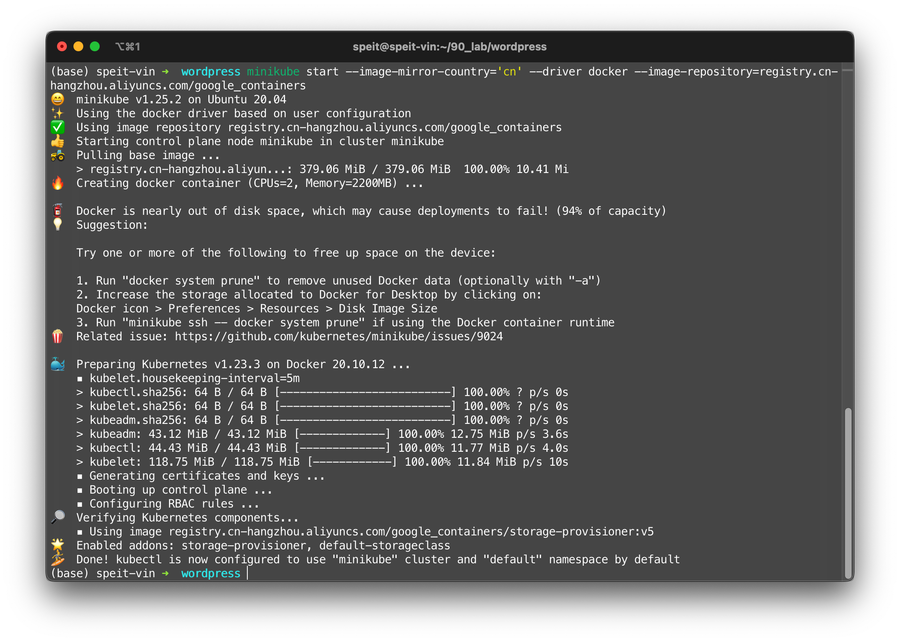
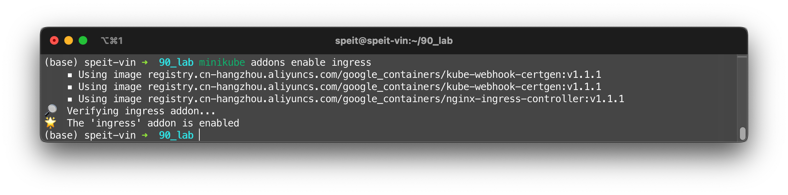
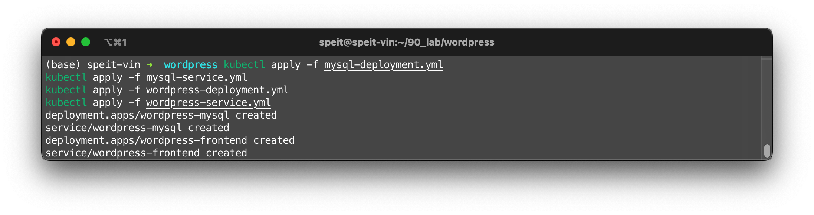
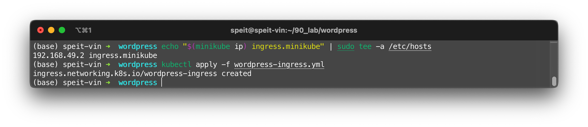
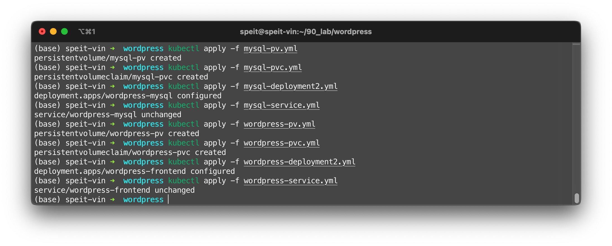
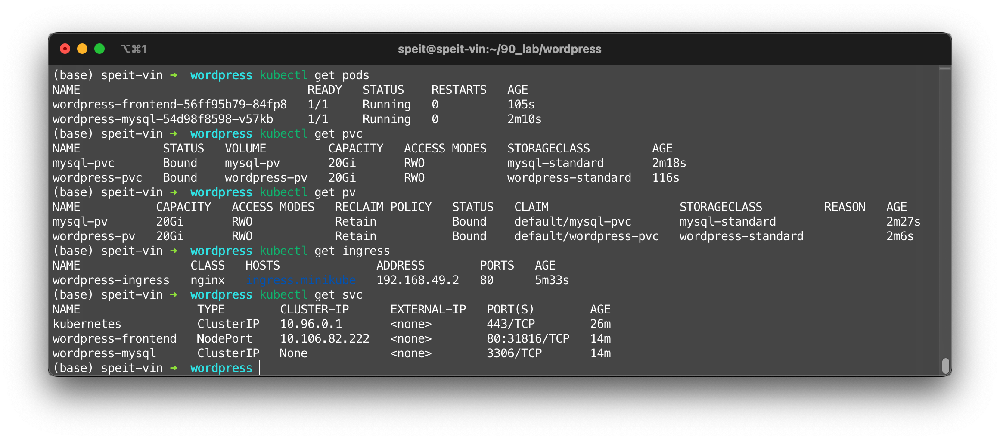
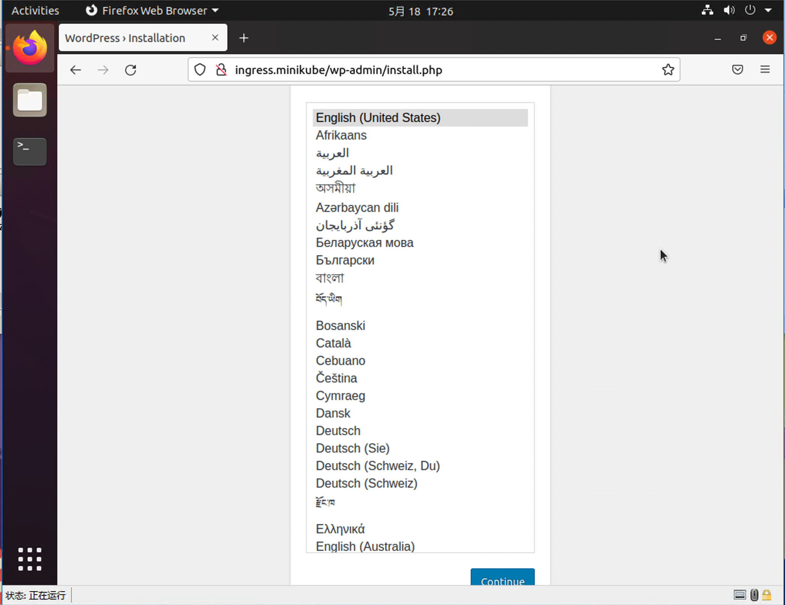

# Wordpress

我们选择Minikube实验环境完成Wordpress实验。这是因为实验要求的操作步骤中包括了`minikube addons enable ingress`指令，而且也进行了足够多的K8S多节点集群实验



开启Ingress功能，这将会启用nginx-ingress-controller

```shell
minikube addons enable ingress #install ingress
```

  

## Create Pods

```shell
kubectl apply -f mysql-deployment.yml
kubectl apply -f mysql-service.yml
kubectl apply -f wordpress-deployment.yml
kubectl apply -f wordpress-service.yml
```

  

## Create Ingress

首先需要添加正确的主机名

```yaml title="wordpress-ingress.yaml"
apiVersion: networking.k8s.io/v1
kind: Ingress
metadata:
  name: wordpress-ingress
  labels:
    app: wordpress
spec:
  rules:
    - host: ingress.minikube
      http:
        paths:
          - path: /
            pathType: Prefix
            backend:
              service:
                name: wordpress-frontend
                port:
                  number: 80
```

```shell
echo "$(minikube ip) ingress.minikube" | sudo tee -a /etc/hosts # add host name to /etc/hosts
kubectl apply -f wordpress-ingress.yml # create ingress
```



> 前提是minikube，kubeadm搭建的集群情况比较复杂

## Create 2 PVs

为了持久化我们的数据，我们需要创建两个PV和对应的PVC，然后修改部署MySQL和Wordpress的方法以使用这些持久化卷

```shell
# /var/lib/mysql for MySQL deployment
kubectl apply -f mysql-pv.yml
kubectl apply -f mysql-pvc.yml
kubectl apply -f mysql-deployment2.yml
kubectl apply -f mysql-service.yml
# /var/www/html for Wordpress deployment
kubectl apply -f wordpress-pv.yml
kubectl apply -f wordpress-pvc.yml
kubectl apply -f wordpress-deployment2.yml
kubectl apply -f wordpress-service.yml
```



我们用一系列命令检查安装情况

- `kubectl get pods`
- `kubectl get pvc`
- `kubectl get pv`
- `kubectl get ingress`
- `kubectl get svc`



在Minikube运行的主机上打开浏览器，在地址栏中输入`http://ingress.minikube`，即可跳转到Wordpress的安装界面。



如果要访问这个Ingress代理的Wordpress，客户端需要在本地设置正确的DNS解析，将`ingress.minikube`指向Minikube主机。不仅如此，Minikube主机上还需要配置正确的IP转发规则，将外部流量引导到Minikube的IP`192.168.49.2`。然而，`ingress.minikube`域名我们并不持有，Minikube主机在NAT后。我们搭建的Wordpress只能自娱自乐。
